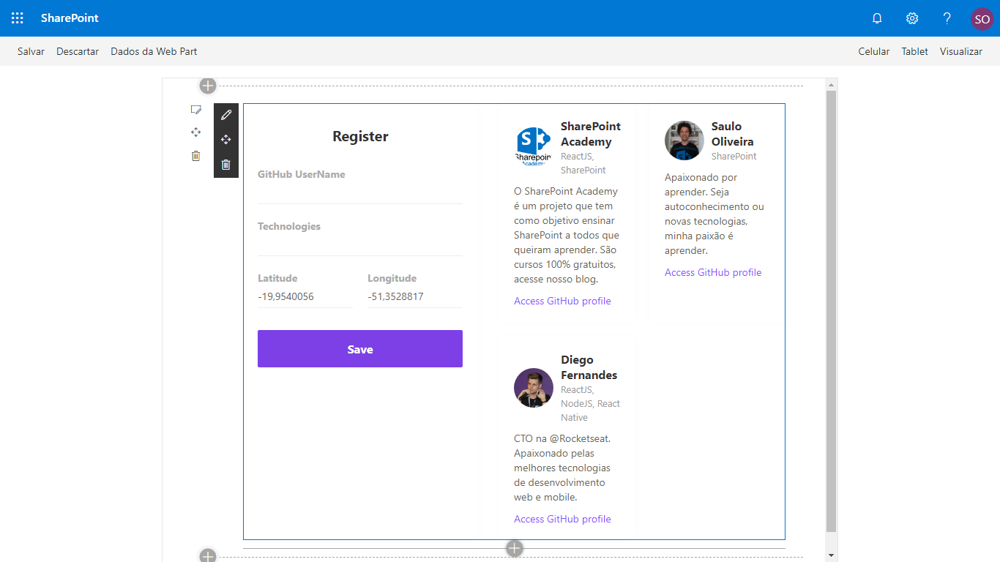

# Dev-Radar for SharePoint Online

## Summary

One way to find devs from the same stack near you.

## Screen 



## Compatibility

 
 


-Incompatible-red.svg "SharePoint Server 2016 Feature Pack 2 requires SPFx 1.1")


## Applies to

* [SharePoint Online](https://docs.microsoft.com/sharepoint/dev/spfx/sharepoint-framework-overview)


## Solution
The web part Use PnPjs library and Axios

Create a list Devs with fields
```
Field               Type
---------------------------
name                single line 
githubUsername      single line 
techs               single line 
avatarUrl           single line 
bio                 multiline 
latitude            single line 
longitude           single line 
```

Solution|Author(s)
--------|---------
Dev Radar  Web Part|Saulo Oliveira

## Version history

Version|Date|Comments
-------|----|--------
1.0.0|March 01, 2020|Initial release

## Minimal Path to Awesome

- Clone this repository
- in the command line run:
  - `npm install`
  - `gulp build`
  - `gulp bundle --ship`
  - `gulp package-solution --ship`
  - Add to AppCatalog and deploy

>  This sample can also be opened with [VS Code Remote Development](https://code.visualstudio.com/docs/remote/remote-overview). Visit https://aka.ms/spfx-devcontainer for further instructions.

  
## Help

We do not support samples, but we this community is always willing to help, and we want to improve these samples. We use GitHub to track issues, which makes it easy for  community members to volunteer their time and help resolve issues.

If you're having issues building the solution, please run [spfx doctor](https://pnp.github.io/cli-microsoft365/cmd/spfx/spfx-doctor/) from within the solution folder to diagnose incompatibility issues with your environment.

You can try looking at [issues related to this sample](https://github.com/pnp/sp-dev-fx-webparts/issues?q=label%3A%22sample%3A%20react-dev-radar") to see if anybody else is having the same issues.

You can also try looking at [discussions related to this sample](https://github.com/pnp/sp-dev-fx-webparts/discussions?discussions_q=react-dev-radar) and see what the community is saying.

If you encounter any issues while using this sample, [create a new issue](https://github.com/pnp/sp-dev-fx-webparts/issues/new?assignees=&labels=Needs%3A+Triage+%3Amag%3A%2Ctype%3Abug-suspected%2Csample%3A%20react-dev-radar&template=bug-report.yml&sample=react-dev-radar&authors=@sauslash&title=react-dev-radar%20-%20).

For questions regarding this sample, [create a new question](https://github.com/pnp/sp-dev-fx-webparts/issues/new?assignees=&labels=Needs%3A+Triage+%3Amag%3A%2Ctype%3Aquestion%2Csample%3A%20react-dev-radar&template=question.yml&sample=react-dev-radar&authors=@sauslash&title=react-dev-radar%20-%20).

Finally, if you have an idea for improvement, [make a suggestion](https://github.com/pnp/sp-dev-fx-webparts/issues/new?assignees=&labels=Needs%3A+Triage+%3Amag%3A%2Ctype%3Aenhancement%2Csample%3A%20react-dev-radar&template=question.yml&sample=react-dev-radar&authors=@sauslash&title=react-dev-radar%20-%20).

## Disclaimer

**THIS CODE IS PROVIDED *AS IS* WITHOUT WARRANTY OF ANY KIND, EITHER EXPRESS OR IMPLIED, INCLUDING ANY IMPLIED WARRANTIES OF FITNESS FOR A PARTICULAR PURPOSE, MERCHANTABILITY, OR NON-INFRINGEMENT.**


