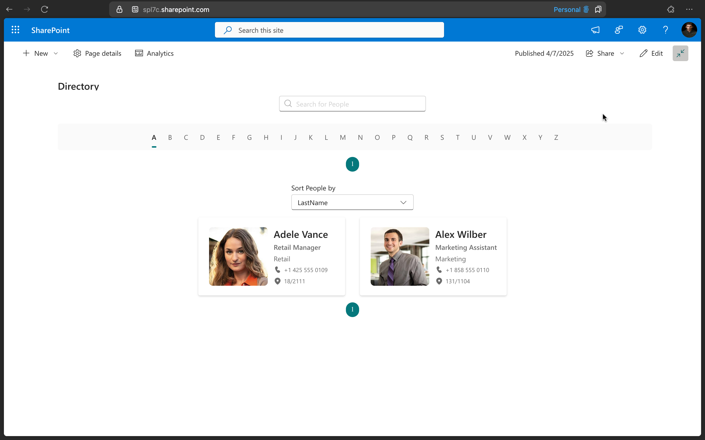

# Organization Directory

## Summary

 Search People from Organization Directory and show live persona card on hover.


##  
 

 

 

 

 

 

 

 

 

 

 

 

## Compatibility

 
 
 
 


## Applies to

* [SharePoint Online](https://docs.microsoft.com/sharepoint/dev/spfx/sharepoint-framework-overview)
* [Microsoft Teams](https://products.office.com/en-US/microsoft-teams/group-chat-software)
* [Office 365 tenant](https://docs.microsoft.com/sharepoint/dev/spfx/set-up-your-development-environment)


## WebPart Properties
 
Property |Type|Required| comments
--------------------|----|--------|----------
Title | Text| No|WebPart Title
searchFirstName | boolean|No| Lastname or Firstname search query
Properties to search | text | No | By default **FirstName,LastName,WorkEmail,Department** are used for search. You can add custom properties separated by comma.
Properties to sent as clear text | text | No | By default if the search key has empty spaces, its replaced with **+** before sending it to the search query. The search properties mentioned here will be sent without the empty space replacemnt.
Results per page | number | Yes | Number of people result to be displayed per page. Max of **20** is allowed, default of **10** is set. 

## Solution

The web part use PnPjs library, Office-ui-fabric-react components

Solution|Author(s)
--------|---------
Directory Web Part|João Mendes
Directory Web Part| Peter Paul Kirschner ([@petkir_at](https://twitter.com/petkir_at))
Directory Web Part| Sudharsan K ([@sudharsank](https://twitter.com/sudharsank))
Directory Web Part| Abderahman Moujahid

## Version history

Version|Date|Comments
-------|----|--------
1.0.0|July 29, 2019|Initial release
1.0.1|July 19, 2020|Bugfix and mock-service for workbench (```LivePersonaCard``` not supported in workbench)
2.0.0|Sep 18 2020|React hooks, paging, dynamic search props, result alignment using office ui fabric stack.
3.0.0|Oct 17 2020|Minor fixes and add the additional web part property.
3.0.1|March 4 2021|Bugfix 'Sort People by'


## Disclaimer
**THIS CODE IS PROVIDED *AS IS* WITHOUT WARRANTY OF ANY KIND, EITHER EXPRESS OR IMPLIED, INCLUDING ANY IMPLIED WARRANTIES OF FITNESS FOR A PARTICULAR PURPOSE, MERCHANTABILITY, OR NON-INFRINGEMENT.**

---

## Minimal Path to Awesome

- Clone this repository
- in the command line run:
  - `npm install`
  - `gulp build`
  - `gulp bundle --ship`
  - `gulp package-solution --ship`
  - `Add to AppCatalog and deploy`


