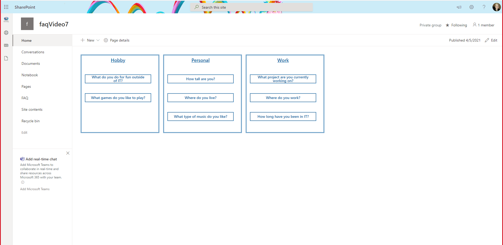

# FAQ Document Card

React FAQ Document Card Web Part

## Summary

For detailed instructions on how to build this web part and the needed list please watch: https://www.youtube.com/watch?v=oIr-rgGvUUk

## Compatibility

 
 

-Incompatible-red.svg "SharePoint Server 2016 Feature Pack 2 requires SPFx 1.1")

## Applies to

* [SharePoint Framework](https://docs.microsoft.com/sharepoint/dev/spfx/sharepoint-framework-overview)

## Prerequisites

1. Build a SharePoint Online list named **FAQ**
2. Rename **Title** column to **Question**
3. Add 3 additional columns:

    - **Multiple lines of text** column, toggle **Use rich text** to yes, name **Answer**
    - **Choice** column, Options `Work`, `Personal`, and `Hobby`, name **Category**
    - **Yes/No** column, set default to `No`, name **Featured**
4. Add items to your list making sure to set some to `yes` in the **Featured** column
5. Navigate to your sites workbench (https://<tenant>.sharepoint.com/sites/<your site>/_layouts/15/workbench.aspx)

## Solution

Solution|Author(s)
--------|---------
react-doccard-faq | [Sam Collins](https://github.com/SamC148) ([@samc148](https://twitter.com/samc148))

## Version history

Version|Date|Comments
-------|----|--------
1.0|April 5, 2021|Initial release

## Minimal Path to Awesome

* Clone this repository
* in the command line run:
  * `npm install`
  * `gulp serve`

>  This sample can also be opened with [VS Code Remote Development](https://code.visualstudio.com/docs/remote/remote-overview). Visit https://aka.ms/spfx-devcontainer for further instructions.

## Features

DefaultButton,
Modal,
DetailsList,
IColumn,
from office-ui-fabric-react

IPropertyPaneDropdownOption 
 from @microsoft/sp-property-pane

RichText,
Accessible Accordion 
from @pnp/spfx-controls-react

## Help

We do not support samples, but we this community is always willing to help, and we want to improve these samples. We use GitHub to track issues, which makes it easy for  community members to volunteer their time and help resolve issues.

If you're having issues building the solution, please run [spfx doctor](https://pnp.github.io/cli-microsoft365/cmd/spfx/spfx-doctor/) from within the solution folder to diagnose incompatibility issues with your environment.

You can try looking at [issues related to this sample](https://github.com/pnp/sp-dev-fx-webparts/issues?q=label%3A%22sample%3A%20react-doccard-faq") to see if anybody else is having the same issues.

You can also try looking at [discussions related to this sample](https://github.com/pnp/sp-dev-fx-webparts/discussions?discussions_q=react-doccard-faq) and see what the community is saying.

If you encounter any issues while using this sample, [create a new issue](https://github.com/pnp/sp-dev-fx-webparts/issues/new?assignees=&labels=Needs%3A+Triage+%3Amag%3A%2Ctype%3Abug-suspected%2Csample%3A%20react-doccard-faq&template=bug-report.yml&sample=react-doccard-faq&authors=@SamC148&title=react-doccard-faq%20-%20).

For questions regarding this sample, [create a new question](https://github.com/pnp/sp-dev-fx-webparts/issues/new?assignees=&labels=Needs%3A+Triage+%3Amag%3A%2Ctype%3Aquestion%2Csample%3A%20react-doccard-faq&template=question.yml&sample=react-doccard-faq&authors=@SamC148&title=react-doccard-faq%20-%20).

Finally, if you have an idea for improvement, [make a suggestion](https://github.com/pnp/sp-dev-fx-webparts/issues/new?assignees=&labels=Needs%3A+Triage+%3Amag%3A%2Ctype%3Aenhancement%2Csample%3A%20react-doccard-faq&template=question.yml&sample=react-doccard-faq&authors=@SamC148&title=react-doccard-faq%20-%20).

## Disclaimer

**THIS CODE IS PROVIDED *AS IS* WITHOUT WARRANTY OF ANY KIND, EITHER EXPRESS OR IMPLIED, INCLUDING ANY IMPLIED WARRANTIES OF FITNESS FOR A PARTICULAR PURPOSE, MERCHANTABILITY, OR NON-INFRINGEMENT.**

