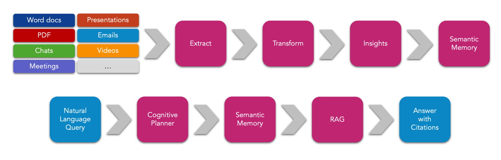
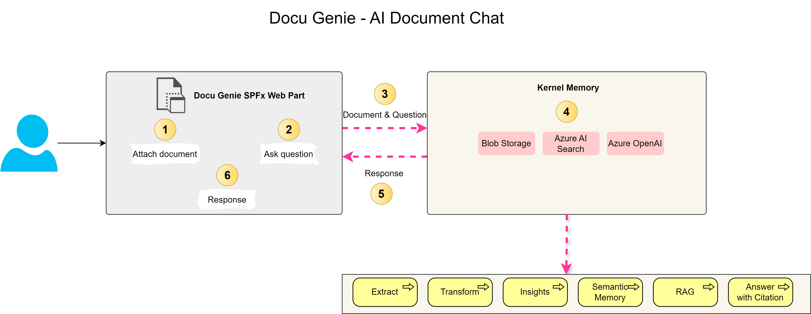
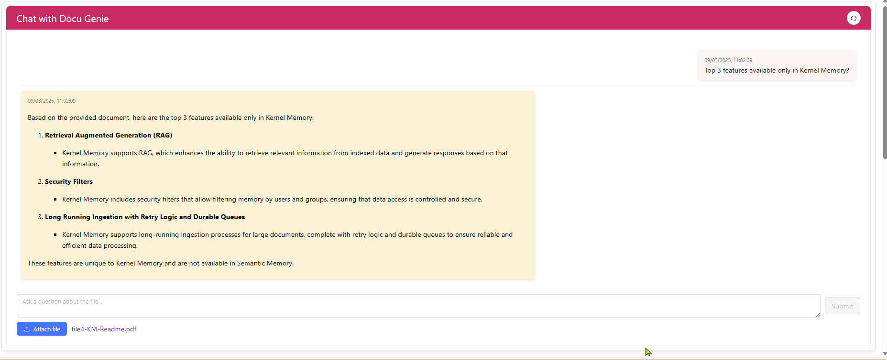

# Document AI Chat using Kernel Memory

## Summary

This project guides you through building an intelligent document chatbot using Kernel Memory and Azure services. It covers the architecture and implementation details, including using an Azure Function for backend processing, a SharePoint Framework (SPFx) web part for the user interface, and leveraging Azure AI Search and Azure OpenAI for advanced search and response generation. The project also provides step-by-step instructions and references to relevant documentation.

In today’s data-driven world, organizations are increasingly looking for ways to leverage their vast repositories of documents to enhance productivity and decision-making. Microsoft’s **Kernel Memory** (KM) is a powerful tool that enables developers to build sophisticated AI-driven document chat experiences.



## Architecture Overview

1. **SPFx Web Part:** The user interface where users can upload documents and ask questions.
2. **Azure Function App:** Manages document ingestion, indexing, and querying using Kernel Memory to upload documents to Blob Storage, extract and transform data, manage semantic memory, implement Retrieval-Augmented Generation (RAG), and provide answers with citations.



## Demo



## Compatibility

| :warning: Important          |
|:---------------------------|
| Every SPFx version is optimally compatible with specific versions of Node.js. In order to be able to build this sample, you need to ensure that the version of Node on your workstation matches one of the versions listed in this section. This sample will not work on a different version of Node.|
|Refer to <https://aka.ms/spfx-matrix> for more information on SPFx compatibility.   |

This sample is optimally compatible with the following environment configuration:


-Incompatible-red.svg "SharePoint Server 2016 Feature Pack 2 requires SPFx 1.1")


## Applies to

- [SharePoint Framework](https://aka.ms/spfx)
- [Microsoft 365 tenant](https://docs.microsoft.com/en-us/sharepoint/dev/spfx/set-up-your-developer-tenant)

> Get your own free development tenant by subscribing to [Microsoft 365 developer program](http://aka.ms/o365devprogram)


## Contributors

- [Ejaz Hussain](https://github.com/ejazhussain)

## Version history

| Version | Date             | Comments        |
| ------- | ---------------- | --------------- |
| 1.0     | March  10, 2025 | Initial release |

## Prerequisites

- **Azure AI Search**: An Azure AI Search resource configured in Azure. [Find more information here](https://docs.microsoft.com/en-us/azure/search/search-create-service-portal).
- **Azure Blob Storage**: An Azure Blob Storage account configured with a container to hold the uploaded files. [Find more information here](https://docs.microsoft.com/en-us/azure/storage/blobs/storage-quickstart-blobs-portal).
- **Azure OpenAI**: An Azure OpenAI resource configured in Azure. [Find more information here](https://learn.microsoft.com/en-us/azure/ai-services/openai/how-to/create-resource).
- **Visual Studio 2022**: Ensure you have Visual Studio 2022 installed for developing and running the Azure Function [Find more information here](https://visualstudio.microsoft.com/vs/).

## Minimal Path to Awesome

Follow these steps to get started with the Document AI Chat:

1. **Clone the repository (or [download this solution as a .ZIP file](https://pnp.github.io/download-partial/?url=https://github.com/pnp/sp-dev-fx-webparts/tree/main/samples/react-document-ai-chat) then unzip it)**
    ```sh
    git clone https://github.com/pnp/sp-dev-fx-webparts.git
    ```

2. *** From your command line, change your current directory to the directory containing this sample (`react-document-ai-chat`, located under `samples`)**
    ```sh
    cd sp-dev-fx-webparts/samples/react-document-ai-chat
    ```

3. **In the command line run the following command to install the packages**
    ```sh
    npm install
    ```

4. **Build the project**
    ```sh
    gulp build --ship
    ```

5. **Bundle the project**
    ```sh
    gulp bundle --ship
    ```

6. **Package the solution**
    ```sh
    gulp package-solution --ship
    ```


7. **Deploy the package to the app catalog**

8. **Add the web part `[O365C] Document AI Chat` to the page**

9. **Navigate to the `FunctionApp` repository and open it in Visual Studio 2022**

10. **Fill in the following settings in the `local.settings.json` file**
    ```json
    {
      "IsEncrypted": false,
      "Values": {
        "AzureWebJobsStorage": "UseDevelopmentStorage=true",
        "FUNCTIONS_WORKER_RUNTIME": "dotnet-isolated",
        "AZURE:EmbeddingModel": "text-embedding-ada-002",
        "AZURE:ChatCompletionModel": "gpt-4o",
        "AZURE:AzureOpenAIEndpoint": "",
        "AZURE:AzureOpenAIKey": "",
        "AZURE:OpenAIEndpoint": "",
        "AZURE:OpenAIKey": "",
        "AZURE:AzureAISearchEndpoint": "",
        "AZURE:AzureAISearchKey": "",
        "AZURE:AzureBlobConnectionString": "",
        "AZURE:AzureBlobContainerName": "documentmemory"
      },
      "Host": {
        "LocalHttpPort": 7210,
        "CORS": "*"
      }
    }
    ```

11. **Run the Azure Function** and copy the Azure Function local endpoint.
12. **Navigate to the property pane of the web part** and populate the Azure Function URL with the copied endpoint.
13. **Attach any document to the web part** that you want to ask questions about.
14. **Add your question** and click on the submit button.
15. If everything works fine on the backend, you should receive a response from the AI regarding your question.

## Features

- **Kernel Memory Integration**: Leverages Microsoft’s Kernel Memory for sophisticated AI-driven document chat experiences.
- **Azure Function Backend**: Utilizes Azure Functions for document ingestion, indexing, and querying.
- **Azure AI Search and OpenAI**: Integrates Azure AI Search and Azure OpenAI for advanced search and response generation.
- **SPFx Web Part**: Provides a user-friendly interface for uploading documents and asking questions.
- **Retrieval-Augmented Generation (RAG)**: Implements RAG to provide answers with citations.
- **Secure and Scalable**: Ensures secure communication and data handling within the Azure and SharePoint environment.
- **Customizable**: Allows customization to fit specific organizational needs and branding.
- **User-Friendly**: Easy to deploy and use, enhancing the overall employee experience.

## Help

We do not support samples, but this community is always willing to help, and we want to improve these samples. We use GitHub to track issues, which makes it easy for  community members to volunteer their time and help resolve issues.

If you're having issues building the solution, please run [spfx doctor](https://pnp.github.io/cli-microsoft365/cmd/spfx/spfx-doctor/) from within the solution folder to diagnose incompatibility issues with your environment.

You can try looking at [issues related to this sample](https://github.com/pnp/sp-dev-fx-webparts/issues?q=label%3A%22sample%3A%20react-document-ai-chat%22) to see if anybody else is having the same issues.

You can also try looking at [discussions related to this sample](https://github.com/pnp/sp-dev-fx-webparts/discussions?discussions_q=react-document-ai-chat) and see what the community is saying.

If you encounter any issues using this sample, [create a new issue](https://github.com/pnp/sp-dev-fx-webparts/issues/new?assignees=&labels=Needs%3A+Triage+%3Amag%3A%2Ctype%3Abug-suspected%2Csample%3A%20react-document-ai-chat&template=bug-report.yml&sample=react-document-ai-chat&authors=@ejazhussain&title=react-document-ai-chat%20-%20).

For questions regarding this sample, [create a new question](https://github.com/pnp/sp-dev-fx-webparts/issues/new?assignees=&labels=Needs%3A+Triage+%3Amag%3A%2Ctype%3Aquestion%2Csample%3A%20react-document-ai-chat&template=question.yml&sample=react-document-ai-chat&authors=@ejazhussain&title=react-document-ai-chat%20-%20).

Finally, if you have an idea for improvement, [make a suggestion](https://github.com/pnp/sp-dev-fx-webparts/issues/new?assignees=&labels=Needs%3A+Triage+%3Amag%3A%2Ctype%3Aenhancement%2Csample%3A%20react-document-ai-chat&template=suggestion.yml&sample=react-document-ai-chat&authors=@ejazhussain&title=react-document-ai-chat%20-%20).

## Disclaimer

**THIS CODE IS PROVIDED *AS IS* WITHOUT WARRANTY OF ANY KIND, EITHER EXPRESS OR IMPLIED, INCLUDING ANY IMPLIED WARRANTIES OF FITNESS FOR A PARTICULAR PURPOSE, MERCHANTABILITY, OR NON-INFRINGEMENT.**

