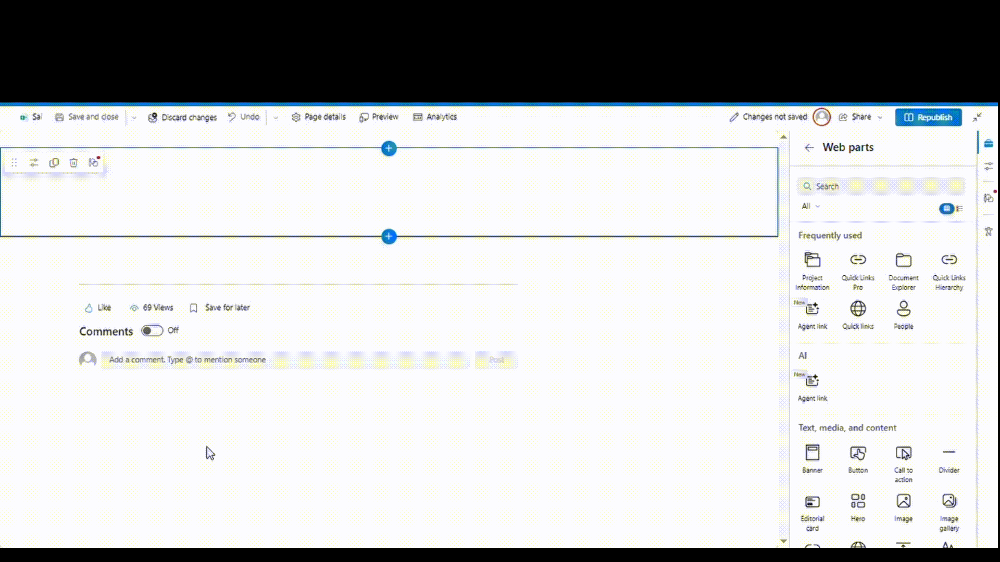
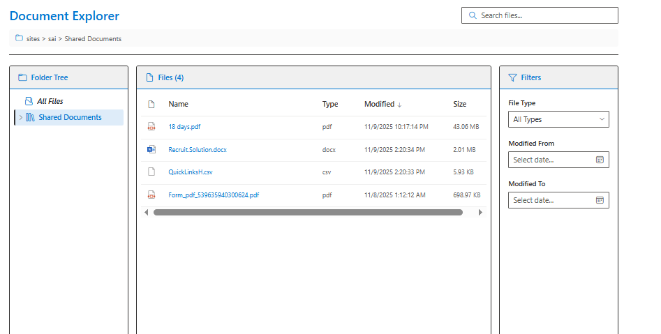
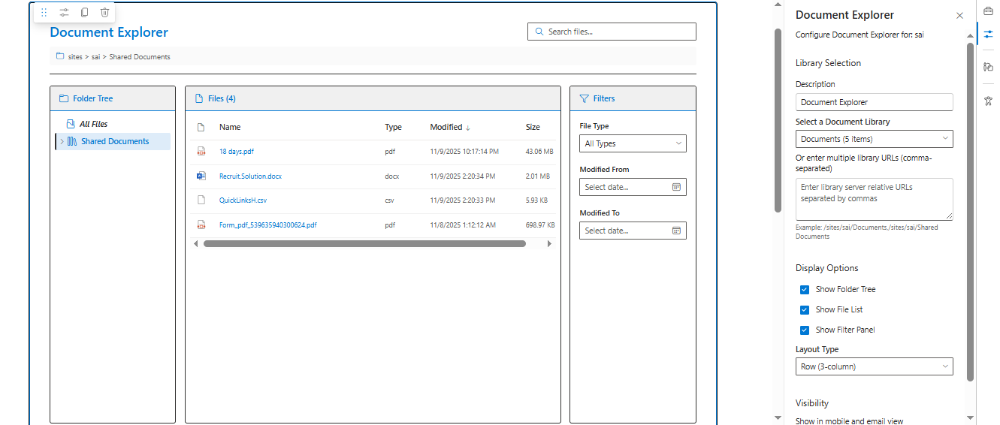

# Document Explorer

## Summary

A comprehensive SharePoint Framework (SPFx) web part that enables users to browse, search, and filter documents across multiple SharePoint document libraries. Features an interactive folder tree navigation, sortable file list with detailed information, and advanced filtering capabilities - all within a configurable three-panel layout.



## Compatibility

| :warning: Important          |
|:---------------------------|
| Every SPFx version is optimally compatible with specific versions of Node.js. In order to be able to build this sample, you need to ensure that the version of Node on your workstation matches one of the versions listed in this section. This sample will not work on a different version of Node.|
|Refer to <https://aka.ms/spfx-matrix> for more information on SPFx compatibility.   |

This sample is optimally compatible with the following environment configuration:


-Incompatible-red.svg "SharePoint Server 2016 Feature Pack 2 requires SPFx 1.1")


## Applies to

- [SharePoint Framework](https://aka.ms/spfx)
- [Microsoft 365 tenant](https://docs.microsoft.com/en-us/sharepoint/dev/spfx/set-up-your-developer-tenant)

> Get your own free development tenant by subscribing to [Microsoft 365 developer program](http://aka.ms/o365devprogram)

## Prerequisites

- SharePoint Online environment
- Access to one or more SharePoint document libraries
- Permissions to read documents and folders

## Contributors

- [Sai Siva Ram Bandaru](https://github.com/saiiiiiii)

## Version history

| Version | Date             | Comments        |
| ------- | ---------------- | --------------- |
| 1.0     | November 9, 2025 | Initial release |


## Minimal Path to Awesome

- Clone this repository
- Ensure that you are at the solution folder
- In the command-line run:
  - `npm install`
  - `gulp serve`

## Features

This web part illustrates the following concepts:

### Core Features

- **Multi-Library Support**: Browse documents from one or multiple SharePoint libraries simultaneously
- **Folder Tree Navigation**: Expandable/collapsible folder hierarchy with recursive subfolder loading
- **File List View**: Sortable, detailed file list with icons, metadata, and direct file access
- **Advanced Filtering**: Filter documents by file type, modification date range, and search text
- **Flexible Layouts**: Choose between row (3-column) or stacked (mobile-friendly) layouts
- **Configurable Panels**: Show/hide folder tree, file list, or filter panel independently
- **Recursive File Loading**: Option to load all files from a folder including all subfolders with "All Files" feature
- **Direct File Access**: Click any file to open directly in browser or download
- **Permission-Aware**: Graceful handling of restricted libraries with informative warnings

### Technical Highlights

- **PnP JS v3 Integration**: Modern SharePoint REST API interactions using @pnp/sp
- **React Class Components**: Structured component architecture with lifecycle management
- **Dynamic Column Sizing**: Intelligent panel width calculation based on visible components
- **Performance Optimized**: Efficient folder expansion with on-demand loading
- **TypeScript**: Fully typed interfaces for better development experience
- **SCSS Modules**: Scoped styling with CSS modules
- **Accessibility**: Keyboard navigation and screen reader support

### PnP JS Usage

The solution demonstrates:

- Setting up PnP JS with SPFx context
- Reading folders and files with server relative paths
- Recursive folder traversal for deep file discovery
- Filtering document libraries (BaseTemplate eq 101)
- Expanding related entities (RootFolder, ListItemAllFields)
- Error handling for access denied scenarios
- Working with file metadata (Name, ServerRelativeUrl, TimeLastModified, Length)

### Fluent UI Implementation

Uses these Fluent UI React components:

- **DetailsList**: Sortable file list with custom renderers
- **SearchBox**: Real-time file search functionality
- **Dropdown**: Library and filter selection
- **DatePicker**: Date range filtering
- **MessageBar**: User feedback for errors and warnings
- **Spinner**: Loading states for async operations
- **Icon**: File type icons and UI indicators
- **Checkbox**: Display option controls

## Configuration

### Web Part Properties

| Property | Type | Default | Description |
|----------|------|---------|-------------|
| description | string | "Document Explorer" | Web part description |
| selectedLibrary | string | "" | Server relative URL of selected library |
| manualLibraries | string | "" | Comma-separated list of library URLs |
| showFolderTree | boolean | true | Display folder navigation tree |
| showFileList | boolean | true | Display file list panel |
| showFilterPanel | boolean | true | Display filter controls |
| layoutType | choice | "row" | Layout style: row or stacked |

### Layout Types

#### Row Layout (3-Column)

Three-panel horizontal layout with dynamic widths:

- **All panels visible**: 20% (tree) + 60% (files) + 20% (filters)
- **Two panels visible**: 20% + 80%
- **One panel visible**: 100%

Best for desktop and wide-screen displays.

#### Stacked Layout

Vertical stacked panels, each taking full width. Best for mobile devices or narrow containers.

## Usage

### Initial Setup

1. Edit a SharePoint page
2. Add the "Document Explorer" web part
3. Click the web part's settings
4. In the property pane:
   - **Option A**: Select a library from the dropdown
   - **Option B**: Enter comma-separated library URLs in "Manual Libraries" field

     ```
     Example: /sites/yoursite/Documents,/sites/yoursite/Shared Documents
     ```

5. Configure display options (show/hide panels)
6. Choose layout type
7. Save and publish the page

### Browsing Documents

#### Using Folder Tree

1. Expand libraries by clicking the chevron icon
2. Click **"All Files"** (italic, at top) to load all documents recursively from that library
3. Click any folder name to load files from that folder only
4. Expand subfolders to navigate deeper
5. Selected folder appears highlighted in blue

#### File List Actions

- **Click column headers** to sort by name, type, date, or size
- **Click file names** to open files directly
- **Search box** filters files in real-time
- Files display with appropriate icons for their type

#### Filtering Options

- **File Type**: Filter by extension (PDF, DOCX, XLSX, etc.)
- **Modified From**: Show files modified after this date
- **Modified To**: Show files modified before this date
- **Clear Filters**: Reset all active filters

### Multi-Library Configuration

To browse multiple libraries simultaneously, enter comma-separated URLs in the property pane:

```
/sites/sai/Documents,/sites/sai/Archive,/sites/sai/Shared Documents
```

The web part will:

- Load all accessible libraries
- Display a warning for libraries you cannot access
- Show combined folder tree with library names as root nodes
- Identify which library each file belongs to

## Screenshots

### Document Library Explorer Demo


*Document Library Explorer Demo*

### Full Three-Panel View


*Complete view showing folder tree, file list, and filter panel*

### Property Pane Configuration


*Easy configuration of libraries and display options*

## Advanced Scenarios

### Recursive File Loading

The **"All Files"** feature (italic text at the top of each library) performs recursive traversal.

This is useful for:

- Searching across entire libraries
- Generating complete file inventories
- Finding files in deeply nested structures

### Permission Handling

The web part gracefully handles various permission scenarios:

- **No access to library**: Shows warning with library name
- **Partial access**: Loads accessible libraries, warns about others
- **Folder-level restrictions**: Displays error message for specific folders
- **File-level restrictions**: Files open with SharePoint's permission dialog

### Performance Considerations

- Folders load children on-demand (not all at once)
- File list uses virtualization for large datasets
- Search and filters operate on already-loaded data (no additional requests)
- Recursive loading shows progress spinner

## Troubleshooting

### Library Not Appearing in Dropdown

**Issue**: A document library doesn't show in the selection dropdown

**Solutions**:

- Verify you have read permissions to the library
- Check if library is hidden (Hidden=true libraries are excluded)
- Confirm library is a Document Library (BaseTemplate=101)
- Ensure the library exists in the current site

### "Access Denied" Errors

**Issue**: Error messages when trying to access libraries or folders

**Solutions**:

- Contact SharePoint administrator for appropriate permissions
- Use property pane to remove inaccessible libraries from configuration
- Check SharePoint audit logs for recent permission changes
- Verify your account has at least Read permissions

### Files Not Loading

**Issue**: Files don't appear when selecting a folder

**Solutions**:

- Verify folder path in breadcrumb is correct
- Check browser console (F12) for detailed error messages
- Confirm files exist and aren't checked out exclusively
- Ensure files aren't in a restricted folder

### Property Pane Issues

**Issue**: Libraries not loading in property pane dropdown

**Solutions**:

- Open and close the property pane to trigger refresh
- Check browser console for initialization errors
- Verify PnP JS configuration is correct
- Ensure web part context is properly initialized

## References

- [Getting started with SharePoint Framework](https://docs.microsoft.com/en-us/sharepoint/dev/spfx/set-up-your-developer-tenant)
- [Building for Microsoft teams](https://docs.microsoft.com/en-us/sharepoint/dev/spfx/build-for-teams-overview)
- [Use Microsoft Graph in your solution](https://docs.microsoft.com/en-us/sharepoint/dev/spfx/web-parts/get-started/using-microsoft-graph-apis)
- [Publish SharePoint Framework applications to the Marketplace](https://docs.microsoft.com/en-us/sharepoint/dev/spfx/publish-to-marketplace-overview)
- [Microsoft 365 Patterns and Practices](https://aka.ms/m365pnp)
- [PnP JS Documentation](https://pnp.github.io/pnpjs/)
- [Fluent UI React](https://developer.microsoft.com/en-us/fluentui#/controls/web)
- [Working with Folders and Files using PnP JS](https://pnp.github.io/pnpjs/sp/folders/)

## Help

We do not support samples, but this community is always willing to help, and we want to improve these samples. We use GitHub to track issues, which makes it easy for community members to volunteer their time and help resolve issues.

If you're having issues building the solution, please run [spfx doctor](https://pnp.github.io/cli-microsoft365/cmd/spfx/spfx-doctor/) from within the solution folder to diagnose incompatibility issues with your environment.

You can try looking at [issues related to this sample](https://github.com/pnp/sp-dev-fx-webparts/issues?q=label%3A%22sample%3A%20document-explorer%22) to see if anybody else is having the same issues.

You can also try looking at [discussions related to this sample](https://github.com/pnp/sp-dev-fx-webparts/discussions?discussions_q=document-explorer) and see what the community is saying.

If you encounter any issues while using this sample, [create a new issue](https://github.com/pnp/sp-dev-fx-webparts/issues/new?assignees=&labels=Needs%3A+Triage+%3Amag%3A%2Ctype%3Abug-suspected%2Csample%3A%20document-explorer&template=bug-report.yml&sample=document-explorer&authors=@saiiiiiii&title=document-explorer%20-%20).

For questions regarding this sample, [create a new question](https://github.com/pnp/sp-dev-fx-webparts/issues/new?assignees=&labels=Needs%3A+Triage+%3Amag%3A%2Ctype%3Aquestion%2Csample%3A%20document-explorer&template=question.yml&sample=document-explorer&authors=@saiiiiiii&title=document-explorer%20-%20).

Finally, if you have an idea for improvement, [make a suggestion](https://github.com/pnp/sp-dev-fx-webparts/issues/new?assignees=&labels=Needs%3A+Triage+%3Amag%3A%2Ctype%3Aenhancement%2Csample%3A%20document-explorer&template=suggestion.yml&sample=document-explorer&authors=@saiiiiiii&title=document-explorer%20-%20).

## Disclaimer

**THIS CODE IS PROVIDED *AS IS* WITHOUT WARRANTY OF ANY KIND, EITHER EXPRESS OR IMPLIED, INCLUDING ANY IMPLIED WARRANTIES OF FITNESS FOR A PARTICULAR PURPOSE, MERCHANTABILITY, OR NON-INFRINGEMENT.**


