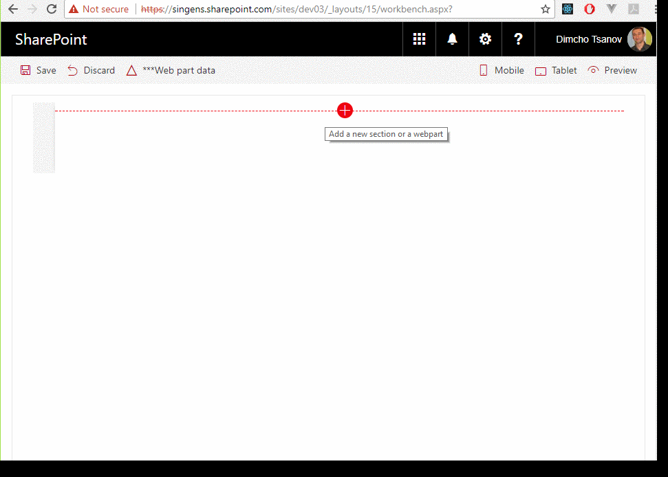

# Documents Web Part

## Summary
This sample shows how to build web parts that display documents in accordance with the SharePoint Online modern experience. The code uses Office UI Fabric components on the top of SharePoint framework. The web parts implement filtering and sorting. Two data source approaches are demonstrated: items retrieved from the search index and real-time query to a document library.

## Used SharePoint Framework Version 

## Applies to

* [SharePoint Framework](https://docs.microsoft.com/sharepoint/dev/spfx/sharepoint-framework-overview)
* [Office 365 tenant](https://docs.microsoft.com/sharepoint/dev/spfx/set-up-your-development-environment)

## Prerequisites
 
- Office 365 subscription with SharePoint Online.
- SharePoint Framework [development environment](https://docs.microsoft.com/sharepoint/dev/spfx/set-up-your-development-environment) already set up.

## Solution

Solution|Author(s)
--------|---------
react-documents|Dimcho Tsanov
react-documents (v2.0)|Harsha Vardhini ([harshagracy](https://twitter.com/harshagracy?s=20))

## Version history

Version|Date|Comments
-------|----|--------
1.0|October 13, 2017|Initial release
2.0|April 28, 2020|Initial release

## Disclaimer
**THIS CODE IS PROVIDED *AS IS* WITHOUT WARRANTY OF ANY KIND, EITHER EXPRESS OR IMPLIED, INCLUDING ANY IMPLIED WARRANTIES OF FITNESS FOR A PARTICULAR PURPOSE, MERCHANTABILITY, OR NON-INFRINGEMENT.**

---

## Minimal Path to Awesome

- Clone this repository
- in the command line run:
  - `npm install`
  - `gulp serve`

## Features

This Web Part illustrates the following concepts on top of the SharePoint Framework:

-Using React for building SharePoint Framework client-side web parts.
-Using Office UI Fabric React styles for building user experience consistent with SharePoint and Office.
-Using the SharePoint rest API for querying document library's files.
-Using the SharePoint rest API for retrieving documents from the search index.
-Passing web part properties to React components.
-Reusing single React component between two web parts.

