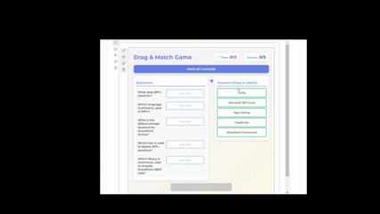
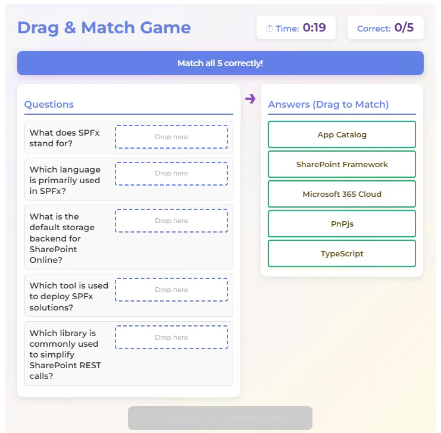

# Drag Match Game - SharePoint WebPart

An interactive drag-and-drop matching game for SharePoint Online. Users match questions with their correct answers by dragging items from one column to another.

## Used SharePoint Framework Version

## Applies to

* [SharePoint Framework](https://aka.ms/spfx)
* [Microsoft 365 Tenant](https://learn.microsoft.com/sharepoint/dev/spfx/set-up-your-developer-tenant)

## Features

* **Drag & Drop Interface**: Intuitive drag-and-drop gameplay
* **Time-Based Scoring**: Bonus points for faster completion
* **One-Time Play**: Each user can only play once
* **Responsive Design**: Works on desktop and mobile devices
* **Real-Time Timer**: Live countdown during gameplay
* **Visual Feedback**: Instant feedback with color-coded matches

## Contributors

* [Sai Siva Ram Bandaru](https://github.com/saiiiiiii)

## Version History

| Version | Date              | Comments        |
| ------- | ----------------- | --------------- |
| 1.0     | Feb 07, 2026 | Initial release |

## SharePoint Lists Required

### 1. MatchQuestions

Stores the questions and answers for the game.

**Columns**:

* Title (Single line of text) - Internal identifier
* Question (Single line of text) - The question text
* Answer (Single line of text) - The correct answer
* Difficulty (Choice) - Easy, Medium, Hard
* IsActive (Yes/No) - Whether this question is active

### 2. GameScores

Stores all game scores and results.

**Columns**:

* Title (Single line of text) - Auto-generated
* Player (Single line of text) - Player's display name
* PlayerEmail (Single line of text) - Player's email
* GameName (Single line of text) - Name of the game
* Score (Number) - Total points earned
* CorrectCount (Number) - Number of correct answers
* TimeTakenSeconds (Number) - Time taken in seconds
* Timestamp (Date and Time) - When the score was recorded

## Configuration

## How to Play

1. **Start**: Click on the web part to begin - a 3-second countdown will appear
2. **Match**: Drag answers from the right column to match with questions on the left
3. **Feedback**:
   * Green = Correct match (stays in place)
   * Red = Wrong match (returns to pool after 1 second)
4. **Submit**: Once all questions are matched correctly, click "Submit Game"
5. **Results**: View your score breakdown and bonuses

## References

* [Getting started with SharePoint Framework](https://learn.microsoft.com/sharepoint/dev/spfx/set-up-your-developer-tenant)
* [Building for Microsoft Teams](https://learn.microsoft.com/sharepoint/dev/spfx/build-for-teams-overview)
* [Use Microsoft Graph in your solution](https://learn.microsoft.com/sharepoint/dev/spfx/web-parts/get-started/using-microsoft-graph-apis)
* [Publish SharePoint Framework applications to the Marketplace](https://learn.microsoft.com/sharepoint/dev/spfx/publish-to-marketplace-overview)
* [Microsoft 365 Patterns and Practices](https://aka.ms/m365pnp)
* [PnP JS Documentation](https://pnp.github.io/pnpjs/)
* [Fluent UI React](https://developer.microsoft.com//fluentui#/controls/web)

## Help

We do not support samples, but this community is always willing to help, and we want to improve these samples. We use GitHub to track issues, which makes it easy for community members to volunteer their time and help resolve issues.

If you're having issues building the solution, please run [spfx doctor](https://pnp.github.io/cli-microsoft365/cmd/spfx/spfx-doctor/) from within the solution folder to diagnose incompatibility issues with your environment.

You can try looking at [issues related to this sample](https://github.com/pnp/sp-dev-fx-webparts/issues?q=label%3A%22sample%3A%20react-dragmatch-game%22) to see if anybody else is having the same issues.

You can also try looking at [discussions related to this sample](https://github.com/pnp/sp-dev-fx-webparts/discussions?discussions_q=react-dragmatch-game) and see what the community is saying.

If you encounter any issues while using this sample, [create a new issue](https://github.com/pnp/sp-dev-fx-webparts/issues/new).

## Disclaimer

**THIS CODE IS PROVIDED *AS IS* WITHOUT WARRANTY OF ANY KIND, EITHER EXPRESS OR IMPLIED, INCLUDING ANY IMPLIED WARRANTIES OF FITNESS FOR A PARTICULAR PURPOSE, MERCHANTABILITY, OR NON-INFRINGEMENT.**

