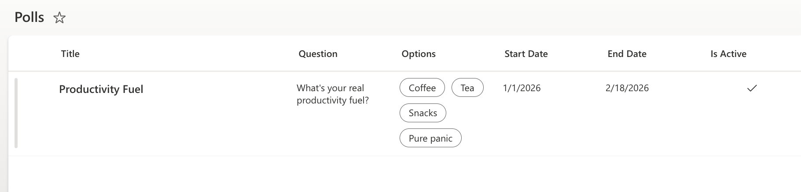
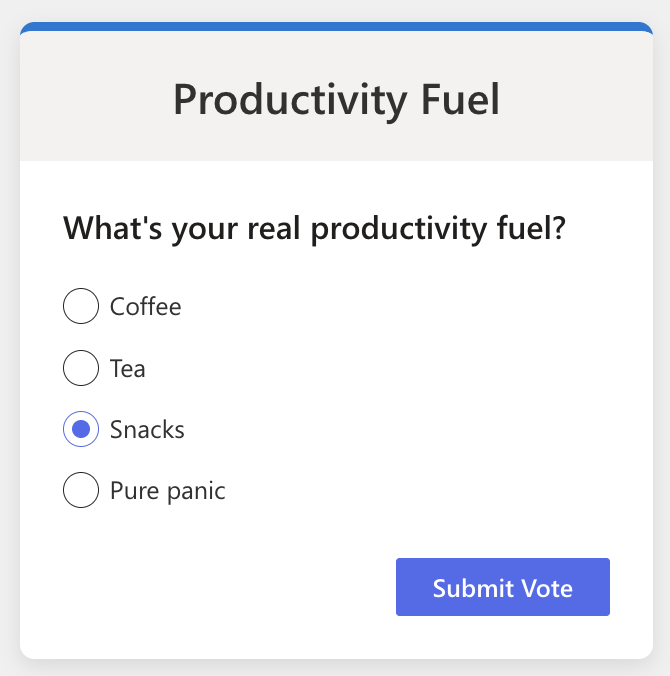
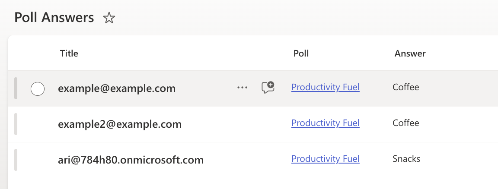
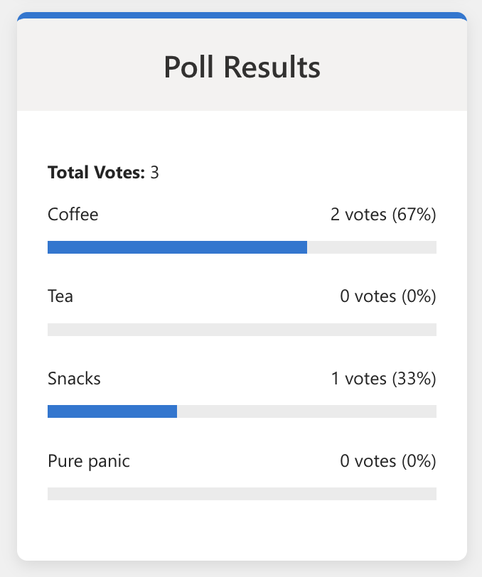

# React Dynamic Poll

## Summary

 This web part allows users to vote on an active poll and immediately see the results. It is built using the SharePoint Framework (SPFx), React, and Fluent UI. The web part fetches the active poll question and options from a SharePoint list named 'Polls' and stores user answers in a 'Poll Answers' list.

 
 
 
 
 

## Compatibility

 | :warning: Important          |
 |:---------------------------|
 | Every SPFx version is optimally compatible with specific versions of Node.js. In order to be able to Toolchain this sample, you need to ensure that the version of Node on your workstation matches one of the versions listed in this section. This sample will not work on a different version of Node.|
 |Refer to <https://aka.ms/spfx-matrix> for more information on SPFx compatibility.   |

 This sample is optimally compatible with the following environment configuration:

 
 
 

## Applies to

* [SharePoint Framework](https://learn.microsoft.com/sharepoint/dev/spfx/sharepoint-framework-overview)
* [Microsoft 365 tenant](https://learn.microsoft.com/sharepoint/dev/spfx/set-up-your-development-environment)

 > Get your own free development tenant by subscribing to [Microsoft 365 developer program](https://aka.ms/m365/devprogram)

## Contributors

* [Ari Gunawan](https://github.com/arigunawan)

## Version history

 |Version|Date|Comments|
 |-------|----|--------|
 |1.0|February 7, 2026|Initial release|

## Prerequisites

* A SharePoint list named **Polls** with the following columns:
  * Title (Single line of text)
  * Question (Single line of text)
  * Options (Choice)
    * Can add values manually
    * Allow multiple selections
  * StartDate (Date and Time)
  * EndDate (Date and Time)
  * IsActive (Yes/No)
* A SharePoint list named **Poll Answers** with the following columns:
  * Title (Single line of text) - *Used to store User Email*
  * Poll (Lookup to Polls list)
  * Answer (Single line of text)

## Minimal path to awesome

* Clone this repository
* From your command line, change your current directory to the directory containing this sample
* in the command line run:
  * `npm install`
  * `gulp serve`

## Features

 This Web Part illustrates the following concepts on top of the SharePoint Framework:

* **Dynamic Polling**: Fetches the currently active poll based on date and status.
* **Interactive Voting**: Allows users to select an option and vote.
* **Immediate Visual Feedback**: Displays a professional, colorful, and responsive UI with immediate feedback ("Thanks for voting!").
* **Real-time Results**: Shows poll results using Fluent UI Progress Indicators immediately after voting.
* **SharePoint Integration**: deeply integrated with SharePoint lists for data storage and user context (Email) for vote tracking.
* **PnP JS Integration**: Uses PnP JS for efficient SharePoint data operations.

## Help

 We do not support samples, but this community is always willing to help, and we want to improve these samples. We use GitHub to track issues, which makes it easy for  community members to volunteer their time and help resolve issues.

 If you're having issues building the solution, please run [spfx doctor](https://pnp.github.io/cli-microsoft365/cmd/spfx/spfx-doctor/) from within the solution folder to diagnose incompatibility issues with your environment.

 You can try looking at [issues related to this sample](https://github.com/pnp/sp-dev-fx-webparts/issues?q=label%3A%22sample%3A%20react-dynamic-poll%22) to see if anybody else is having the same issues.

You can also try looking at [discussions related to this sample](https://github.com/pnp/sp-dev-fx-webparts/discussions?discussions_q=react-dynamic-poll) and see what the community is saying.

If you encounter any issues using this sample, [create a new issue](https://github.com/pnp/sp-dev-fx-webparts/issues/new?assignees=&labels=Needs%3A+Triage+%3Amag%3A%2Ctype%3Abug-suspected%2Csample%3A%20react-dynamic-poll&template=bug-report.yml&sample=react-dynamic-poll&authors=@AriGunawan&title=react-dynamic-poll%20-%20).

For questions regarding this sample, [create a new question](https://github.com/pnp/sp-dev-fx-webparts/issues/new?assignees=&labels=Needs%3A+Triage+%3Amag%3A%2Ctype%3Aquestion%2Csample%3A%20react-dynamic-poll&template=question.yml&sample=react-dynamic-poll&authors=@AriGunawan&title=react-dynamic-poll%20-%20).

Finally, if you have an idea for improvement, [make a suggestion](https://github.com/pnp/sp-dev-fx-webparts/issues/new?assignees=&labels=Needs%3A+Triage+%3Amag%3A%2Ctype%3Aenhancement%2Csample%3A%20react-dynamic-poll&template=suggestion.yml&sample=react-dynamic-poll&authors=@AriGunawan&title=react-dynamic-poll%20-%20).

## Disclaimer

 **THIS CODE IS PROVIDED *AS IS* WITHOUT WARRANTY OF ANY KIND, EITHER EXPRESS OR IMPLIED, INCLUDING ANY IMPLIED WARRANTIES OF FITNESS FOR A PARTICULAR PURPOSE, MERCHANTABILITY, OR NON-INFRINGEMENT.**

 
