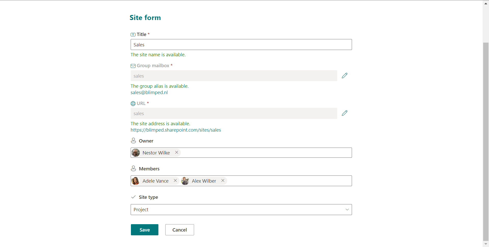
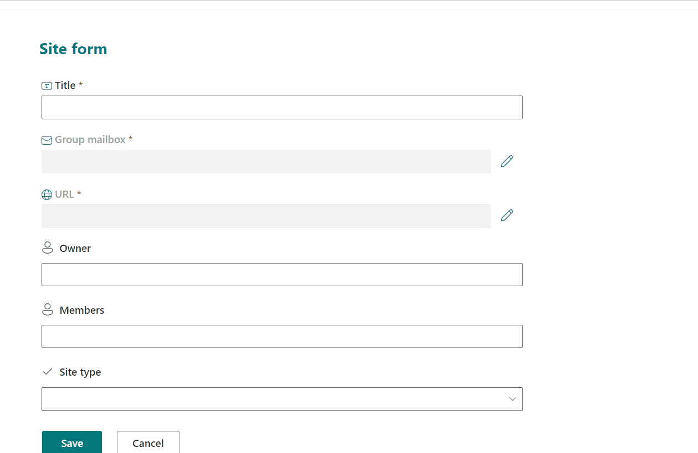

# Dynamic Site Form

## Summary

This solution is a sample of an SPFx Form Customizer using the SPFx PnP Controls Dynamic Form to render a form. It combines default fields with fieldOverrides to create a similar experience to the SharePoint default new site form.

## Compatibility

| :warning: Important          |
|:---------------------------|
| Every SPFx version is only compatible with specific version(s) of Node.js. In order to be able to build this sample, please ensure that the version of Node on your workstation matches one of the versions listed in this section. This sample will not work on a different version of Node.|
|Refer to <https://aka.ms/spfx-matrix> for more information on SPFx compatibility.   |

This sample is optimally compatible with the following environment configuration:

-Incompatible-red.svg "SharePoint Server 2016 Feature Pack 2 requires SPFx 1.1")

## Applies to

- [SharePoint Framework](https://aka.ms/spfx)
- [Microsoft 365 tenant](https://learn.microsoft.com/sharepoint/dev/spfx/set-up-your-developer-tenant)

> Get your own free development tenant by subscribing to [Microsoft 365 developer program](http://aka.ms/m365devprogram)

## Contributors

- [Martin Lingstuyl](https://github.com/martinlingstuyl)

## Version history

| Version | Date             | Comments        |
| ------- | ---------------- | --------------- |
| 1.0.0.0 | Jun 22, 2023 | Initial setup |

## Minimal Path to Awesome

- Create a SharePoint list with a Hyperlink field (Internal name: 'URL'), a text field (Internal name: 'GroupMailbox') and any custom fields you like. 
- Clone this repository
- Ensure that you are at the solution folder
- Replace `pageUrl`, `rootFolder` and `properties` variables of serve configurations in `serve.json`.
- in the command-line run:
  - `npm install`
  - `gulp serve --config newSiteForm_NewForm`
- To package and deploy:
  - Use `gulp bundle --ship` & `gulp package-solution --ship`
  - Add the `.sppkg` to your SharePoint App Catalog

> This sample can also be opened with [VS Code Remote Development](https://code.visualstudio.com/docs/remote/remote-overview). Visit <https://aka.ms/spfx-devcontainer> for further instructions.

## Features

- The form has uses a Dynamic Form to render the list form. 
- The form overrides the Title, URL and GroupMailbox fields with a custom implementation.
- The solution uses endpoints to verify availability of the site url and group mailbox.
- The New mode, Edit mode and View mode all work.

## Help

We do not support samples, but this community is always willing to help, and we want to improve these samples. We use GitHub to track issues, which makes it easy for  community members to volunteer their time and help resolve issues.

If you're having issues building the solution, please run [spfx doctor](https://pnp.github.io/cli-microsoft365/cmd/spfx/spfx-doctor/) from within the solution folder to diagnose incompatibility issues with your environment.

You can try looking at [issues related to this sample](https://github.com/pnp/sp-dev-fx-webparts/issues?q=label%3A%22sample%3A%20react-dynamic-site-form%22) to see if anybody else is having the same issues.

You can also try looking at [discussions related to this sample](https://github.com/pnp/sp-dev-fx-webparts/discussions?discussions_q=react-dynamic-site-form) and see what the community is saying.

If you encounter any issues using this sample, [create a new issue](https://github.com/pnp/sp-dev-fx-webparts/issues/new?assignees=&labels=Needs%3A+Triage+%3Amag%3A%2Ctype%3Abug-suspected%2Csample%3A%20react-dynamic-site-form&template=bug-report.yml&sample=react-dynamic-site-form&authors=@martinlingstuyl&title=react-dynamic-site-form%20-%20).

For questions regarding this sample, [create a new question](https://github.com/pnp/sp-dev-fx-webparts/issues/new?assignees=&labels=Needs%3A+Triage+%3Amag%3A%2Ctype%3Aquestion%2Csample%3A%20react-dynamic-site-form&template=question.yml&sample=react-dynamic-site-form&authors=@martinlingstuyl&title=react-dynamic-site-form%20-%20).

Finally, if you have an idea for improvement, [make a suggestion](https://github.com/pnp/sp-dev-fx-webparts/issues/new?assignees=&labels=Needs%3A+Triage+%3Amag%3A%2Ctype%3Aenhancement%2Csample%3A%20react-dynamic-site-form&template=suggestion.yml&sample=react-dynamic-site-form&authors=@martinlingstuyl&title=react-dynamic-site-form%20-%20).

## Disclaimer

**THIS CODE IS PROVIDED *AS IS* WITHOUT WARRANTY OF ANY KIND, EITHER EXPRESS OR IMPLIED, INCLUDING ANY IMPLIED WARRANTIES OF FITNESS FOR A PARTICULAR PURPOSE, MERCHANTABILITY, OR NON-INFRINGEMENT.**

---

