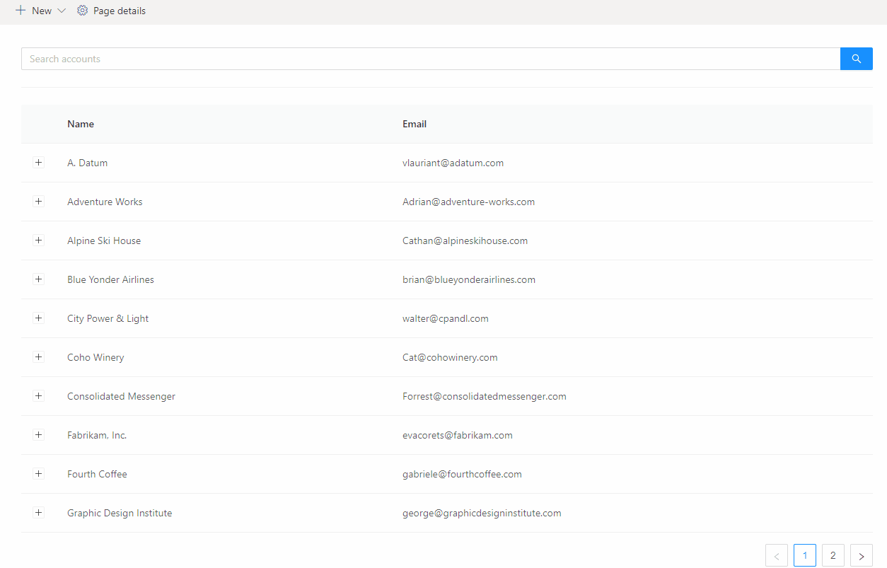
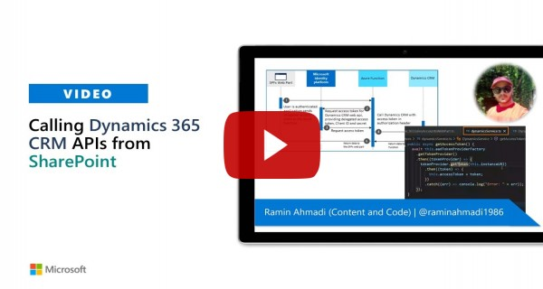

# Using Dynamics CRM API

## Summary
This sample shows how to consume Dynamics CRM API using AadTokenProvider class.

## Compatibility

 
 

-Incompatible-red.svg "SharePoint Server 2016 Feature Pack 2 requires SPFx 1.1")

## Applies to

* [SharePoint Framework Developer](http://dev.office.com/sharepoint/docs/spfx/sharepoint-framework-overview)
* [Office 365 developer tenant](http://dev.office.com/sharepoint/docs/spfx/set-up-your-developer-tenant)

## Solution

Solution|Author(s)
--------|---------
react-dynamics365-api|[Ramin Ahmadi](https://github.com/AhmadiRamin)

## Version history

Version|Date|Comments
-------|----|--------
1.0.0|Jul 12, 2020|Initial release

## Minimal Path to Awesome

* Clone this repository
* in the command line run:
  * `npm install`
  * `gulp serve`

>  This sample can also be opened with [VS Code Remote Development](https://code.visualstudio.com/docs/remote/remote-overview). Visit https://aka.ms/spfx-devcontainer for further instructions.

### Configuration

* Login to Azure Portal.
* Go to **Azure Active Directory**
* Go to the **App Registrations** page.
* Select **SharePoint Online Client Extensibility** from the list of applications.
* Select **API Permissions**.
* Add **Dynamics CRM** permission.
* Go to the **Manifest** page, and make sure the value for the `allowPublicClient` and the `oauth2AllowImplicitFlow` are both set to `true`.

## Features

This sample illustrates the following concepts on top of the SharePoint Framework:

* Using AadTokenProvider to consume Dynamics CRM API.
* How to get Accounts/Contacts information from Dynamics 365.
* React Hooks
* Using async / await for the async calls
* Ant design for the UI.

> **NOTE:** This sample will not work in the local workbench.

## Video

## Help

We do not support samples, but we this community is always willing to help, and we want to improve these samples. We use GitHub to track issues, which makes it easy for  community members to volunteer their time and help resolve issues.

If you're having issues building the solution, please run [spfx doctor](https://pnp.github.io/cli-microsoft365/cmd/spfx/spfx-doctor/) from within the solution folder to diagnose incompatibility issues with your environment.

You can try looking at [issues related to this sample](https://github.com/pnp/sp-dev-fx-webparts/issues?q=label%3A%22sample%3A%20react-dynamics-crm-api") to see if anybody else is having the same issues.

You can also try looking at [discussions related to this sample](https://github.com/pnp/sp-dev-fx-webparts/discussions?discussions_q=react-dynamics-crm-api) and see what the community is saying.

If you encounter any issues while using this sample, [create a new issue](https://github.com/pnp/sp-dev-fx-webparts/issues/new?assignees=&labels=Needs%3A+Triage+%3Amag%3A%2Ctype%3Abug-suspected%2Csample%3A%20react-dynamics-crm-api&template=bug-report.yml&sample=react-dynamics-crm-api&authors=@AhmadiRamin&title=react-dynamics-crm-api%20-%20).

For questions regarding this sample, [create a new question](https://github.com/pnp/sp-dev-fx-webparts/issues/new?assignees=&labels=Needs%3A+Triage+%3Amag%3A%2Ctype%3Aquestion%2Csample%3A%20react-dynamics-crm-api&template=question.yml&sample=react-dynamics-crm-api&authors=@AhmadiRamin&title=react-dynamics-crm-api%20-%20).

Finally, if you have an idea for improvement, [make a suggestion](https://github.com/pnp/sp-dev-fx-webparts/issues/new?assignees=&labels=Needs%3A+Triage+%3Amag%3A%2Ctype%3Aenhancement%2Csample%3A%20react-dynamics-crm-api&template=question.yml&sample=react-dynamics-crm-api&authors=@AhmadiRamin&title=react-dynamics-crm-api%20-%20).

## Disclaimer

**THIS CODE IS PROVIDED *AS IS* WITHOUT WARRANTY OF ANY KIND, EITHER EXPRESS OR IMPLIED, INCLUDING ANY IMPLIED WARRANTIES OF FITNESS FOR A PARTICULAR PURPOSE, MERCHANTABILITY, OR NON-INFRINGEMENT.**

