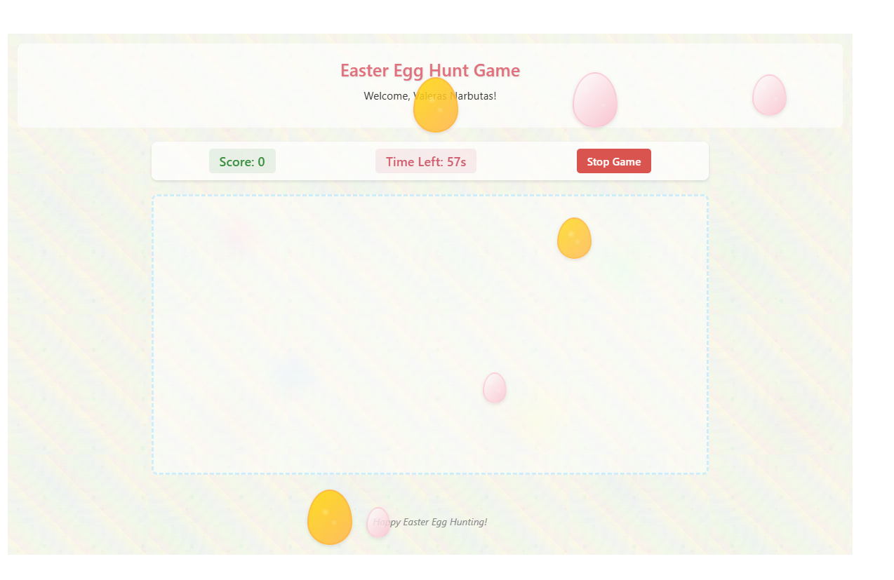
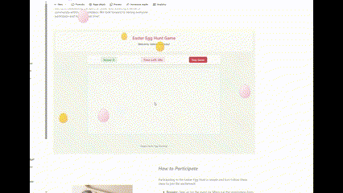

# Easter Egg Hunt Game SPFx Webpart

A fun interactive Easter Egg Hunt Game built as a SharePoint Framework web part. This web part creates an engaging, festive activity that allows users to hunt for hidden Easter eggs across a SharePoint page. The game includes regular and bonus eggs with different point values, and eggs can be placed both inside the web part and around other elements on the SharePoint page.





## Compatibility

| :warning: Important          |
|:---------------------------|
| Every SPFx version is only compatible with specific version(s) of Node.js. In order to be able to build this sample, please ensure that the version of Node on your workstation matches one of the versions listed in this section. This sample will not work on a different version of Node.|
|Refer to <https://aka.ms/spfx-matrix> for more information on SPFx compatibility.   |


## Used SharePoint Framework Version


## Applies to

* [SharePoint Framework](https://learn.microsoft.com/sharepoint/dev/spfx/sharepoint-framework-overview)
* [Office 365 developer tenant](https://learn.microsoft.com/sharepoint/dev/spfx/set-up-your-developer-tenant)

## Contributors

* [Valeras Narbutas](https://github.com/ValerasNarbutas)

## Version history

Version|Date|Comments
-------|----|--------
1.0|April 15, 2025|Initial release

## Minimal Path to Awesome

- Clone this repository
- Navigate to the solution folder
- Run the following commands:
  ```bash
  npm install
  gulp bundle
  gulp package-solution
  ```
- Upload the solution package to your app catalog
- Add the app to your site
- Add the web part to a page

## Features

This Easter Egg Hunt Game SPFx web part offers the following features:

- **Interactive Gameplay**: Users can hunt for eggs by clicking on them when found
- **Multiple Egg Types**: Regular eggs and bonus eggs with different point values
- **Various Egg Sizes**: Small, medium, and large eggs with different point multipliers
- **Cross-Page Integration**: Eggs can appear both inside the web part and on external page elements
- **Configurable Settings**: Customize game duration, number of eggs, and bonus eggs
- **Responsive Design**: Works well on various screen sizes
- **Accessible Design**: Support for keyboard navigation and screen readers
- **Score Tracking**: Keep track of found eggs and total score
- **Timer**: Game ends when time runs out or all eggs are found

### Configuration Options

The web part includes the following configuration options:

- **Game Duration**: Set the length of the game in seconds
- **Number of Eggs**: Set how many regular eggs to generate
- **Number of Bonus Eggs**: Set how many golden bonus eggs to generate
- **Show Game Area**: Toggle whether to show the main game area
- **External CSS Classes**: Define classes of external page elements where eggs can appear (semicolon-separated)

## Usage

1. Add the web part to a SharePoint page
2. Configure the game settings in the property pane
3. If you want eggs to appear outside the web part, add external CSS classes
4. Click "Start Game" to begin
5. Hunt for eggs throughout the page
6. Game ends when all eggs are found or time runs out

## Help

We do not support samples, but this community is always willing to help, and we want to improve these samples. We use GitHub to track issues, which makes it easy for  community members to volunteer their time and help resolve issues.

If you're having issues building the solution, please run [spfx doctor](https://pnp.github.io/cli-microsoft365/cmd/spfx/spfx-doctor/) from within the solution folder to diagnose incompatibility issues with your environment.

You can try looking at [issues related to this sample](https://github.com/pnp/sp-dev-fx-webparts/issues?q=label%3A%22sample%3A%20react-advent-calendar%22) to see if anybody else is having the same issues.

You can also try looking at [discussions related to this sample](https://github.com/pnp/sp-dev-fx-webparts/discussions?discussions_q=react-advent-calendar) and see what the community is saying.

If you encounter any issues using this sample, [create a new issue](https://github.com/pnp/sp-dev-fx-webparts/issues/new?assignees=&labels=Needs%3A+Triage+%3Amag%3A%2Ctype%3Abug-suspected%2Csample%3A%20react-advent-calendar&template=bug-report.yml&sample=react-advent-calendar&authors=@YOURGITHUBUSERNAME&title=react-advent-calendar%20-%20).

For questions regarding this sample, [create a new question](https://github.com/pnp/sp-dev-fx-webparts/issues/new?assignees=&labels=Needs%3A+Triage+%3Amag%3A%2Ctype%3Aquestion%2Csample%3A%20react-advent-calendar&template=question.yml&sample=react-advent-calendar&authors=@YOURGITHUBUSERNAME&title=react-advent-calendar%20-%20).

Finally, if you have an idea for improvement, [make a suggestion](https://github.com/pnp/sp-dev-fx-webparts/issues/new?assignees=&labels=Needs%3A+Triage+%3Amag%3A%2Ctype%3Aenhancement%2Csample%3A%20react-advent-calendar&template=suggestion.yml&sample=react-advent-calendar&authors=@YOURGITHUBUSERNAME&title=react-advent-calendar%20-%20).

## Disclaimer

**THIS CODE IS PROVIDED _AS IS_ WITHOUT WARRANTY OF ANY KIND, EITHER EXPRESS OR IMPLIED, INCLUDING ANY IMPLIED WARRANTIES OF FITNESS FOR A PARTICULAR PURPOSE, MERCHANTABILITY, OR NON-INFRINGEMENT.**


