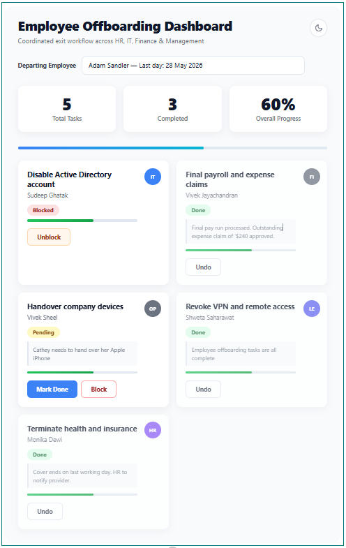

# React Employee Offboarding Checklist

## Summary

A web part for coordinating employee offboarding tasks across HR, IT, Finance and Management:

- Select a departing employee from a dropdown
- See all offboarding tasks in a card grid — one card per task
- Track status per task: Pending, Done, or Blocked
- Mark tasks done (or undo) with a single click
- Stats tiles show total tasks, completed count, and overall progress
- Department colour-coded badges on each card (IT = blue, HR = purple, Finance = amber, etc.)
- Responsive two-column card layout collapses to single column on mobile



## Applies to

- SharePoint Framework 1.20.0
- Microsoft 365 tenant

## Prerequisites

Create two SharePoint lists in your target site, or run the provisioning script:

```powershell
Connect-PnPOnline -Url "https://yourtenant.sharepoint.com/sites/yoursite" -Interactive
.\scripts\provision-offboarding-lists.ps1
```

**OffboardingEmployees** — one row per departing employee:

| Column | Type | Notes |
|---|---|---|
| Title | Single line | Employee display name |
| Department | Choice | (IT, HR, Finance, Management, Security, IAM, Legal, Facilities)
| LastDay | Date and Time | Last working day |

**OffboardingTasks** — tasks linked to each employee:

| Column | Type | Notes |
|---|---|---|
| Title | Single line | Task name |
| Employee | Lookup → OffboardingEmployees | Links the task to the employee |
| OwningDepartment | Choice | (IT, HR, Finance, Management, Security, IAM, Legal, Facilities)
| AssignedTo | Person | Person responsible for completing the task |
| Status | Choice (Pending, Done, Blocked)
| Notes | Multiple lines | Optional context |

> List names default to `OffboardingEmployees` and `OffboardingTasks` but can be changed in the web part property pane.

## Compatibility

| :warning: Important          |
|:---------------------------|
| Every SPFx version is only compatible with specific version(s) of Node.js. In order to be able to build this sample, please ensure that the version of Node on your workstation matches one of the versions listed in this section. This sample will not work on a different version of Node.|
|Refer to <https://aka.ms/spfx-matrix> for more information on SPFx compatibility.   |


-Incompatible-red.svg "SharePoint Server 2016 Feature Pack 2 requires SPFx 1.1")


## Contributors

- [Sudeep Ghatak](https://github.com/sudeepghatak)

## Version history

| Version | Date | Comments |
|---|---|---|
| 1.0 | May 6, 2026 | Initial release |

## Features

- Employee selector dropdown — switch between multiple concurrent offboardings
- Stats dashboard: total tasks, completed count, overall progress percentage
- Task card grid: 2 columns on desktop, 1 on mobile
- Department colour badges auto-assigned: IT (blue), HR (purple), Finance (amber), Management (green), Security (red), IAM (cyan)
- Status pills: Pending (amber), Done (green), Blocked (red)
- "Mark Done" / "Undo" toggle per task — optimistic UI update
- Blocked tasks cannot be toggled (requires manual list edit)
- Empty state messaging when no employees or tasks are found

## Minimal Path to Awesome

- Open a terminal in the sample folder:
  - cd samples/react-employee-offboarding-checklist
- Install dependencies:
  - npm install
- Provision SharePoint lists (requires PnP.PowerShell):
  - Connect-PnPOnline -Url "https://yourtenant.sharepoint.com/sites/yoursite" -Interactive
  - .\scripts\provision-offboarding-lists.ps1
- Trust the dev certificate (Windows):
  - gulp trust-dev-cert
- Start local debugging:
  - gulp serve
- Open the hosted workbench:
  - <https://yourtenant.sharepoint.com/_layouts/15/workbench.aspx>
- Add the "Employee Offboarding Checklist" web part to the canvas.

## Package and Deploy

1) Build and package

- gulp clean
- gulp build
- gulp bundle --ship
- gulp package-solution --ship

2) Deploy

- Upload sharepoint/solution/*.sppkg to your tenant App Catalog
- Add the app to your target site
- Add the web part to a page

## Configuration

Open the web part property pane to configure:

- **Web Part Title** — displayed in the header (default: `Employee Offboarding Dashboard`)
- **Employees List Name** — internal name of the employees list (default: `OffboardingEmployees`)
- **Tasks List Name** — internal name of the tasks list (default: `OffboardingTasks`)

## Troubleshooting

- **"List not found" error** — Verify both lists exist at the current site with the correct internal names and column names as documented above.
- **Tasks not appearing** — Confirm the Employee lookup column in OffboardingTasks points to the correct OffboardingEmployees list, and that the EmployeeId field is populated.
- **Mark Done has no effect** — Ensure the current user has Contribute permission on the OffboardingTasks list.
- **Build errors** — Run `gulp build` once after `npm install` to regenerate the SCSS type file with the correct hash.

## Scripts (common)

- npm install
- gulp clean
- gulp build
- gulp serve
- gulp bundle --ship
- gulp package-solution --ship

## References

- Getting started with SharePoint Framework
  <https://docs.microsoft.com/en-us/sharepoint/dev/spfx/set-up-your-developer-tenant>
- PnP JS documentation
  <https://pnp.github.io/pnpjs/>
- Microsoft 365 Patterns and Practices (PnP)
  <https://aka.ms/m365pnp>

## Disclaimer

**THIS CODE IS PROVIDED *AS IS* WITHOUT WARRANTY OF ANY KIND, EITHER EXPRESS OR IMPLIED, INCLUDING ANY IMPLIED WARRANTIES OF FITNESS FOR A PARTICULAR PURPOSE, MERCHANTABILITY, OR NON-INFRINGEMENT.**


