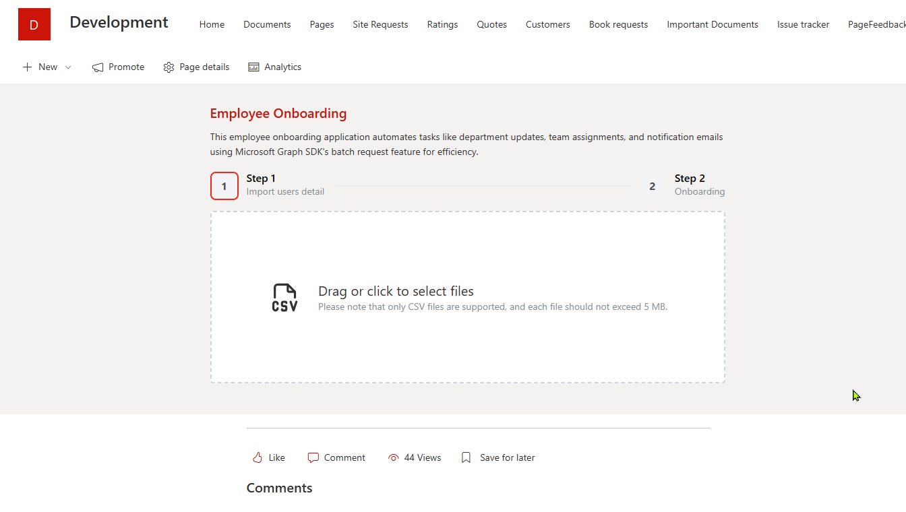
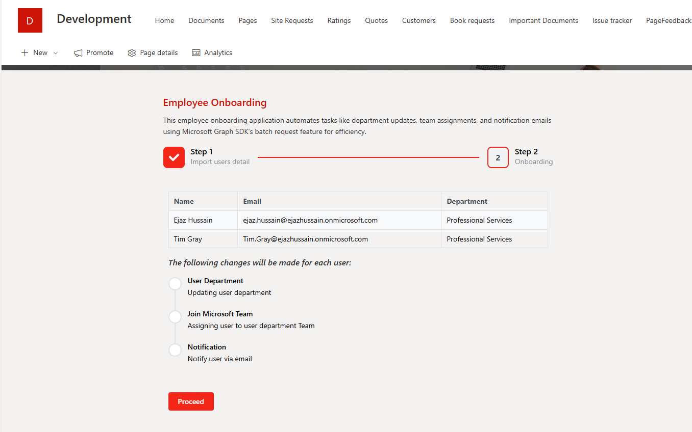
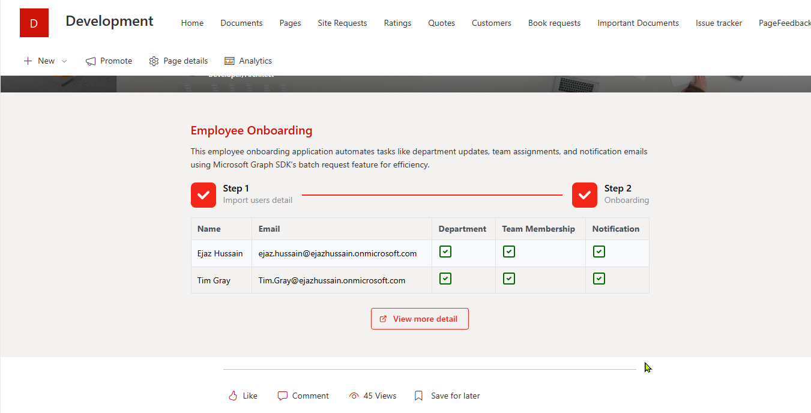

# Employee Onboarding

## Summary

This project is an SPFx (SharePoint Framework) application designed for employee onboarding. It automates various tasks for each employee, such as updating their department, joining the team, and sending notification emails. The application utilizes the Microsoft Graph SDK's batch requests approach to efficiently manage these operations within a .NET-based Azure function. Additionally, the system logs information into a SharePoint list for auditing purposes.

For more information on batch requests with Microsoft Graph SDK, refer to the [official documentation](https://learn.microsoft.com/graph/sdks/batch-requests?tabs=csharp).

## Demo

* Users can import a CSV file containing user information.


* List of users to be processed


* Completion of onboarding tasks


* Summary


## Compatibility

| :warning: Important          |
|:---------------------------|
| Every SPFx version is optimally compatible with specific versions of Node.js. In order to be able to build this sample, you need to ensure that the version of Node on your workstation matches one of the versions listed in this section. This sample will not work on a different version of Node.|
|Refer to <https://aka.ms/spfx-matrix> for more information on SPFx compatibility.   |

This sample is optimally compatible with the following environment configuration:


-Incompatible-red.svg "SharePoint Server 2016 Feature Pack 2 requires SPFx 1.1")


## Applies to

* [SharePoint Framework](https://aka.ms/spfx)
* [Microsoft 365 tenant](https://docs.microsoft.com/en-us/sharepoint/dev/spfx/set-up-your-developer-tenant)

> Get your own free development tenant by subscribing to [Microsoft 365 developer program](http://aka.ms/o365devprogram)
>
## Contributors

* [Ejaz Hussain](https://github.com/ejazhussain)

## Version history

| Version | Date            | Comments        |
| ------- | --------------- | --------------- |
| 1.0     | September 01, 2024 | Initial release |

## Prerequisites

### NodeJS - v18.17.1

### Setting up backend

### 1. Create and configure the Azure AD application

* Run the following command to Create an Azure AD app

```PowerShell
$app = Register-PnPAzureADApp -ApplicationName "sp-graph-auth" -Tenant contoso.onmicrosoft.com -OutPath c:\temp -CertificatePassword (ConvertTo-SecureString -String "password" -AsPlainText -Force) -Store CurrentUser -Interactive
```

* Keep note of the EncodedBased64String and thumbprint value of the certificate

* Upload the generate certificate to Azure AD app

* Generate a client secret and keep note of this value

* Configured permissions as below

| API / Permissions name            | Type         | Description                                              |
|-----------------------------------|--------------|----------------------------------------------------------|
| **Microsoft Graph (4)**           |              |                                                          |
| Mail.Send                         | Application  | Send mail as any user                                    |
| Sites.FullControl.All             | Application  | Have full control of all site collections                |
| TeamMember.ReadWrite.All          | Application  | Add and remove members from all teams                    |
| User.ReadWrite.All                | Application  | Read and write all users' full profiles                  |
| **SharePoint (3)**                |              |                                                          |
| Sites.FullControl.All             | Application  | Have full control of all site collections                |
| Sites.ReadWrite.All               | Application  | Read and write items in all site collections             |

### 2. Deploy Azure function app

1. Create an Azure function app. [Creating Azure Function App](https://learn.microsoft.com/en-us/azure/azure-functions/functions-create-function-app-portal?pivots=programming-language-csharp)
2. Navigate to `/api/O365C.FuncApp.Induction` folder
3. Run the following commands to publish the azure function app to azure

```ps
#publish the code

dotnet publish -c Release
$publishFolder = "O365C.FuncApp.Induction/bin/Release/net8.0/publish"
```

```ps
# create the zip

$publishZip = "publish.zip"
if(Test-path $publishZip) {Remove-item $publishZip}
Add-Type -assembly "system.io.compression.filesystem"
[io.compression.zipfile]::CreateFromDirectory($publishFolder, $publishZip)
```

```ps
# deploy the zipped package

az functionapp deployment source config-zip `
 -g $resourceGroup -n $functionAppName --src $publishZip
```

### 3. Configure an Azure function app

1. **Open Function App:** Locate and select your Function App from the "Function Apps" section.
2. **Access Configuration:** Navigate to the "Configuration" section under "Settings".
3. **Add Application Settings:** Use the "+ New application setting" button to add new environment variables.

```JSON
[

  {
    "name": "Base64EncodedCert",
    "value": "Certificate base64 encoded value",
  },
  {
    "name": "CertificateThumbprint",
    "value": "Certificate thumbprint",
  },
  {
    "name": "ClientId",
    "value": "xxxxxx-xxxxx-4b47-b143-db04e3b5586f",
  },
  {
    "name": "ClientSecret",
    "value": "xxxxxx-xxxxx-4b47-b143-db04e3b5586f",
  },  
  {
    "name": "TenantId",
    "value": "xxxx-xxxxx-xxx-8304-0f0f2f840b5d",
  },
  {
    "name": "SiteUrl",
    "value": "https://mytenant.sharepoint.com/sites/dev"
  }

]
```

5. **Save Changes:** After adding your variables, save the changes.
6. **Restart Function App:** Optionally, restart your Function App to ensure the new settings are applied.

### 4. Get function app endpoint

Retrieve the function URL for the `Onboarding` function from the previously deployed function app and save it for later use in the web part properties.

### 5. Creating SharePoint list (Onboarding)

Create the SharePoint list called `Onboarding` with the following columns

| Column | Type               |
|------------------------|--------------------|
| Title                  | Single line of text |
| Email                  | Single line of text |
| Department             | Yes/No              |
| Team Membership        | Yes/No              |
| Notification           | Yes/No              |
| Completed On           | Date and Time       |
| Processed On           | Date and Time       |


## Minimal Path to Awesome

* Clone this repository
* Ensure that you are at the solution folder
* in the command-line run:
  * `npm install`
  * `npm run serve`

* Add the web part to the page and configure the following properties
  * Title
  * Description
  * ListUrl
  * Azure Function Url

## Features

1. **CSV Import**:
   * Users can import a CSV file containing user information for onboarding.
   * The application parses the CSV file and displays the list of users to be processed.

2. **Automated Onboarding Tasks**:
   * Updates the department information for each employee.
   * Adds employees to the appropriate teams.
   * Sends notification emails to the employees.

3. **Batch Processing with Microsoft Graph SDK**:
   * Utilizes the Microsoft Graph SDK's batch requests approach to efficiently manage multiple operations.
   * Ensures efficient and scalable processing of onboarding tasks.

4. **Azure Function Integration**:
   * Offloads processing to a .NET-based Azure function for better performance and scalability.
   * Logs information into a SharePoint list for auditing purposes.

5. **Progress Tracking**:
   * Displays the progress of onboarding tasks.
   * Provides a summary of completed tasks.

## Help


We do not support samples, but this community is always willing to help, and we want to improve these samples. We use GitHub to track issues, which makes it easy for  community members to volunteer their time and help resolve issues.

If you're having issues building the solution, please run [spfx doctor](https://pnp.github.io/cli-microsoft365/cmd/spfx/spfx-doctor/) from within the solution folder to diagnose incompatibility issues with your environment.

You can try looking at [issues related to this sample](https://github.com/pnp/sp-dev-fx-webparts/issues?q=label%3A%22sample%3A%20react-employees-onboarding%22) to see if anybody else is having the same issues.

You can also try looking at [discussions related to this sample](https://github.com/pnp/sp-dev-fx-webparts/discussions?discussions_q=react-employees-onboarding) and see what the community is saying.

If you encounter any issues using this sample, [create a new issue](https://github.com/pnp/sp-dev-fx-webparts/issues/new?assignees=&labels=Needs%3A+Triage+%3Amag%3A%2Ctype%3Abug-suspected%2Csample%3A%20react-employees-onboarding&template=bug-report.yml&sample=react-employees-onboarding&authors=@ejazhussain&title=react-employees-onboarding%20-%20).

For questions regarding this sample, [create a new question](https://github.com/pnp/sp-dev-fx-webparts/issues/new?assignees=&labels=Needs%3A+Triage+%3Amag%3A%2Ctype%3Aquestion%2Csample%3A%20react-employees-onboarding&template=question.yml&sample=react-employees-onboarding&authors=@ejazhussain&title=react-employees-onboarding%20-%20).

Finally, if you have an idea for improvement, [make a suggestion](https://github.com/pnp/sp-dev-fx-webparts/issues/new?assignees=&labels=Needs%3A+Triage+%3Amag%3A%2Ctype%3Aenhancement%2Csample%3A%20react-employees-onboarding&template=suggestion.yml&sample=react-employees-onboarding&authors=@ejazhussain&title=react-employees-onboarding%20-%20).

## Disclaimer

**THIS CODE IS PROVIDED _AS IS_ WITHOUT WARRANTY OF ANY KIND, EITHER EXPRESS OR IMPLIED, INCLUDING ANY IMPLIED WARRANTIES OF FITNESS FOR A PARTICULAR PURPOSE, MERCHANTABILITY, OR NON-INFRINGEMENT.**


