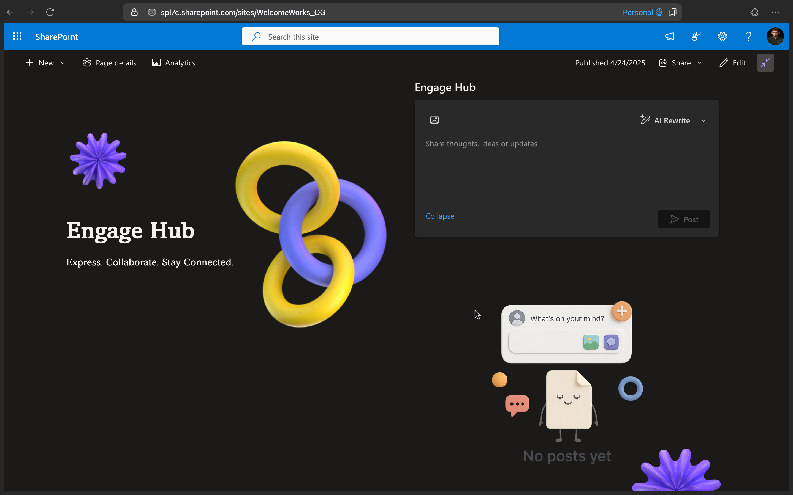

# Engage Hub

## Summary

Built purely with off-the-shelf SharePoint capabilities, Engage Hub is a contemporary SPFx-based substitute for Viva Engage. In addition to providing essential social capabilities such as liking and unliking posts, threaded comments, and comment creation, it manages post data using SharePoint Lists and Document Libraries.

Engage Hub maintains responsiveness and light weight with its elegant React user interface and integrated infinite scrolling. Additionally, it incorporates an AI-powered twist by using the Azure OpenAI JavaScript SDK to assist users in revising content and correcting grammar mistakes.

## Compatibility

| :warning: Important                                                                                                                                                                                                                                                                                   |
| :---------------------------------------------------------------------------------------------------------------------------------------------------------------------------------------------------------------------------------------------------------------------------------------------------- |
| Every SPFx version is optimally compatible with specific versions of Node.js. In order to be able to build this sample, you need to ensure that the version of Node on your workstation matches one of the versions listed in this section. This sample will not work on a different version of Node. |
| Refer to <https://aka.ms/spfx-matrix> for more information on SPFx compatibility.                                                                                                                                                                                                                     |

## Used SharePoint Framework Version

This sample is optimally compatible with the following environment configuration:

-Incompatible-red.svg> "SharePoint Server 2016 Feature Pack 2 requires SPFx 1.1")

## Applies to

- [SharePoint Framework](https://aka.ms/spfx)
- [Microsoft 365 tenant](https://docs.microsoft.com/en-us/sharepoint/dev/spfx/set-up-your-developer-tenant)

> Get your own free development tenant by subscribing to [Microsoft 365 developer program](http://aka.ms/o365devprogram)

## Prerequisites

Create a SharePoint  list `Discussion Point` in the SPO site with below columns

| Column Name | Type  |
| ----------- | ----- |
| Description       | Multi-line text with enhanced text enabled  |
| UserID | Text  |
| PostID | Text  |
| AuthorName   | Text |
| AuthorMailID   | Text |

Create a Document library `Discussion Point Gallery` in SPO site & create one new column

| Column Name | Type  |
| ----------- | ----- |
| PostID   | Text |

## Contributors🧑‍💻

- [Sandeep P S](https://github.com/Sandeep-FED)

## Version history

| Version | Date             | Comments                            |
| ------- | ---------------- | ----------------------------------- |
| 1.0     | April 27, 2025   | Initial release                     |
| 1.1     | May 4, 2025    | Add support for Rich Text, MSFT Notepad inspired AI features & other improvements Editor |
| 1.2     | Oct 22, 2025    | Upgrade to SPFx1.21.1, implemented Fluent UI Components color changes based on site theme colors & introduced image viewer component for RTE image uploads and post lists images |

## Minimal Path to Awesome⚡

- Clone this repository
- Ensure that you are at the solution folder
- in the command-line run:
  - `npm install`
  - `gulp serve`

## Deploy Package Solution 🚀

- Ensure that you are at the solution folder
- in the command-line run:
  - `gulp build --ship`
  - `gulp bundle --ship`
  - `gulp package-solution --ship`

- Upload package to AppCatalog & add it to the SharePoint site.

## Features💡

Key features demonstrated by this solution:

- Leverage like/unlike, comments capabilities of list
- Azure OpenAI JS SDK
- Infinite loading
- Custom hooks
- Follows single responsibility principle

## References

- [Microsoft 365 Patterns and Practices](https://aka.ms/m365pnp) - Guidance, tooling, samples and open-source controls for your Microsoft 365 development.
- [SharePoint Framework](https://docs.microsoft.com/sharepoint/dev/spfx/set-up-your-developer-tenant)
- [PnP JS](https://pnp.github.io/pnpjs/)
- [React Docs](https://react.dev/learn)
- [Azure OpenAI Library for TS](https://learn.microsoft.com/en-us/javascript/api/overview/azure/openai-readme?view=azure-node-latest)
- [AOAI SDK](https://github.com/Azure/azure-sdk-for-js/tree/main/sdk/openai/openai)

## Help

We do not support samples, but we this community is always willing to help, and we want to improve these samples. We use GitHub to track issues, which makes it easy for community members to volunteer their time and help resolve issues.

If you're having issues building the solution, please run [spfx doctor](https://pnp.github.io/cli-microsoft365/cmd/spfx/spfx-doctor/) from within the solution folder to diagnose incompatibility issues with your environment.

If you encounter any issues while using this sample, [create a new issue](https://github.com/pnp/sp-dev-fx-webparts/issues/new?assignees=&labels=Needs%3A+Triage+%3Amag%3A%2Ctype%3Abug-suspected%2Csample%3A%20react-engage-hub&template=bug-report.yml&sample=react-engage-hub&authors=@Sandeep-FED&title=react-engage-hub%20-%20).

For questions regarding this sample, [create a new question](https://github.com/pnp/sp-dev-fx-webparts/issues/new?assignees=&labels=Needs%3A+Triage+%3Amag%3A%2Ctype%3Aquestion%2Csample%3A%20react-engage-hub&template=question.yml&sample=react-engage-hub&authors=@Sandeep-FED&title=react-engage-hub%20-%20).

Finally, if you have an idea for improvement, [make a suggestion](https://github.com/pnp/sp-dev-fx-webparts/issues/new?assignees=&labels=Needs%3A+Triage+%3Amag%3A%2Ctype%3Aenhancement%2Csample%3A%20react-engage-hub&template=question.yml&sample=react-engage-hub&authors=@Sandeep-FED&title=react-engage-hub-widget%20-%20).

## Disclaimer

**THIS CODE IS PROVIDED _AS IS_ WITHOUT WARRANTY OF ANY KIND, EITHER EXPRESS OR IMPLIED, INCLUDING ANY IMPLIED WARRANTIES OF FITNESS FOR A PARTICULAR PURPOSE, MERCHANTABILITY, OR NON-INFRINGEMENT.**

