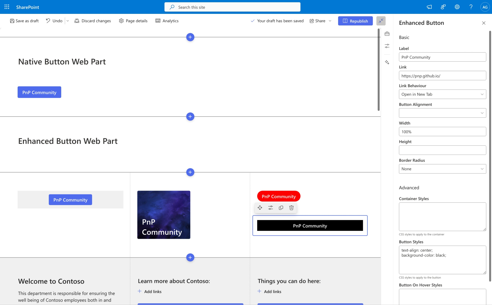

# Enhanced Button

## Summary

The Enhanced Button Web Part is a custom SharePoint web part that extends the functionality of the native button web part. It provides additional configuration options to create more customizable and flexible buttons within your SharePoint pages.

## Compatibility

| :warning: Important          |
|:---------------------------|
| Every SPFx version is optimally compatible with specific versions of Node.js. In order to be able to build this sample, you need to ensure that the version of Node on your workstation matches one of the versions listed in this section. This sample will not work on a different version of Node.|
|Refer to <https://aka.ms/spfx-matrix> for more information on SPFx compatibility.   |

This sample is optimally compatible with the following environment configuration:

-Incompatible-red.svg "SharePoint Server 2016 Feature Pack 2 requires SPFx 1.1")

## Applies to

* [SharePoint Framework](https://learn.microsoft.com/sharepoint/dev/spfx/sharepoint-framework-overview)
* [Microsoft 365 tenant](https://learn.microsoft.com/sharepoint/dev/spfx/set-up-your-development-environment)

> Get your own free development tenant by subscribing to [Microsoft 365 developer program](https://aka.ms/m365/devprogram)

## Contributors
<!--
We use this section to recognize and promote your contributions. Please provide one author per line -- even if you worked together on it.

We'll only use the info you provided here. Make sure to include your full name, not just your GitHub username.

Provide a link to your GitHub profile to help others find more cool things you have done. The only link we'll accept is a link to your GitHub profile.

If you want to provide links to your social media, blog, and employer name, make sure to update your GitHub profile.
-->

* [Ari Gunawan](https://github.com/AriGunawan)

## Version history

Version|Date|Comments
-------|----|--------
1.0|September 01, 2024|Initial release

## Minimal path to awesome

* Clone this repository (or [download this solution as a .ZIP file](https://pnp.github.io/download-partial/?url=https://github.com/pnp/sp-dev-fx-webparts/tree/main/samples/react-enhanced-button) then unzip it)
* From your command line, change your current directory to the directory containing this sample (`react-enhanced-button`, located under `samples`)
* in the command line run:
  * `npm install`
  * `gulp serve` or `npm run serve`

> This sample can also be opened with [VS Code Remote Development](https://code.visualstudio.com/docs/remote/remote-overview). Visit <https://aka.ms/spfx-devcontainer> for further instructions.

## Features

This web part offers the following enhanced configuration options:

Basic configuration options:

* **Label**: Customize the button text
* **Link**: Specify the URL to link to
* **Link Behaviour**: Configure how the button link opens (e.g., same tab, new tab)
* **Button Alignment**: Align the button horizontally (left, center, right)
* **Width**: Customize the button width
* **Height**: Adjust the button height
* **Border Radius**: Set the corner roundness of the button

Advanced configuration options:

* **Container Styles**: Apply custom styles to the button container using raw CSS value
* **Button Styles**: Customize the button's appearance using raw CSS value
* **Button Hover Styles**: Define styles for when users hover over the button using raw CSS value

## Help

We do not support samples, but this community is always willing to help, and we want to improve these samples. We use GitHub to track issues, which makes it easy for  community members to volunteer their time and help resolve issues.

If you're having issues building the solution, please run [spfx doctor](https://pnp.github.io/cli-microsoft365/cmd/spfx/spfx-doctor/) from within the solution folder to diagnose incompatibility issues with your environment.

You can try looking at [issues related to this sample](https://github.com/pnp/sp-dev-fx-webparts/issues?q=label%3A%22sample%3A%20react-enhanced-button%22) to see if anybody else is having the same issues.

You can also try looking at [discussions related to this sample](https://github.com/pnp/sp-dev-fx-webparts/discussions?discussions_q=react-enhanced-button) and see what the community is saying.

If you encounter any issues using this sample, [create a new issue](https://github.com/pnp/sp-dev-fx-webparts/issues/new?assignees=&labels=Needs%3A+Triage+%3Amag%3A%2Ctype%3Abug-suspected%2Csample%3A%20react-enhanced-button&template=bug-report.yml&sample=react-enhanced-button&authors=@AriGunawan&title=react-enhanced-button%20-%20).

For questions regarding this sample, [create a new question](https://github.com/pnp/sp-dev-fx-webparts/issues/new?assignees=&labels=Needs%3A+Triage+%3Amag%3A%2Ctype%3Aquestion%2Csample%3A%20react-enhanced-button&template=question.yml&sample=react-enhanced-button&authors=@AriGunawan&title=react-enhanced-button%20-%20).

Finally, if you have an idea for improvement, [make a suggestion](https://github.com/pnp/sp-dev-fx-webparts/issues/new?assignees=&labels=Needs%3A+Triage+%3Amag%3A%2Ctype%3Aenhancement%2Csample%3A%20react-enhanced-button&template=suggestion.yml&sample=react-enhanced-button&authors=@AriGunawan&title=react-enhanced-button%20-%20).

## Disclaimer

**THIS CODE IS PROVIDED *AS IS* WITHOUT WARRANTY OF ANY KIND, EITHER EXPRESS OR IMPLIED, INCLUDING ANY IMPLIED WARRANTIES OF FITNESS FOR A PARTICULAR PURPOSE, MERCHANTABILITY, OR NON-INFRINGEMENT.**

