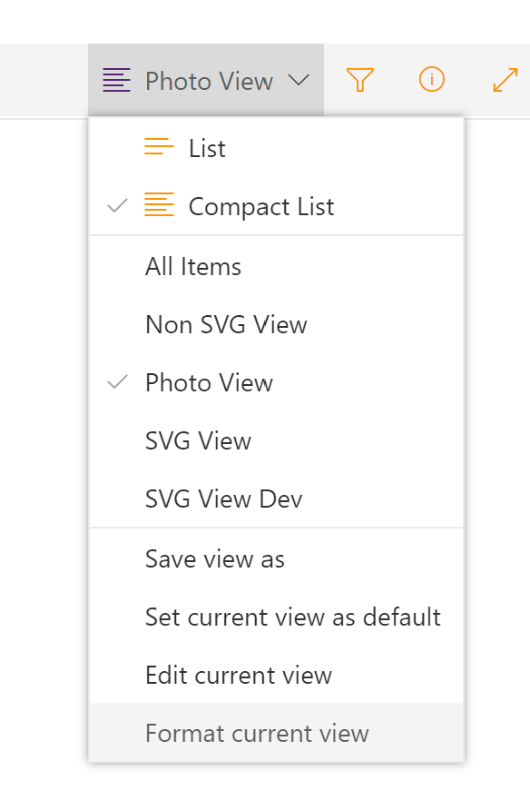

# Enhanced List Formatting

## Summary

This web part allows you to add custom CSS on a page to enhance list formatting.


## Used SharePoint Framework Version


## Applies to

* [SharePoint Framework](https://docs.microsoft.com/sharepoint/dev/spfx/sharepoint-framework-overview)
* [Office 365 tenant](https://docs.microsoft.com/sharepoint/dev/spfx/set-up-your-development-environment)

## Prerequisites

To use this web part, you must be familiar with SharePoint list formatting and CSS.

## Solution

Solution|Author(s)
--------|---------
react-enhanced-list-formatting | Hugo Bernier ([Tahoe Ninjas](http://tahoeninjas.blog), [@bernierh](https://twitter.com/bernierh))
react-enhanced-list-formatting | David Warner II ([@DavidWarnerII](https://twitter.com/davidwarnerii) / [Warner Digital](http://warner.digital))

## Version history

Version|Date|Comments
-------|----|--------
1.0|March 17, 2020|Initial release

## Disclaimer

**THIS CODE IS PROVIDED *AS IS* WITHOUT WARRANTY OF ANY KIND, EITHER EXPRESS OR IMPLIED, INCLUDING ANY IMPLIED WARRANTIES OF FITNESS FOR A PARTICULAR PURPOSE, MERCHANTABILITY, OR NON-INFRINGEMENT.**

---

## Minimal Path to Awesome

* Clone this repository
* in the command line run:
  * `npm install`
  * `gulp serve`

## Features

This web part demonstrates how to use a custom property pane control to allow users to inject custom CSS into the page at runtime.

> **Important**
>
> This web part is not intended to be used to override global CSS styles. It should only be used on custom CSS class names.
>
> At the time that we built this solution, the only codeless way to add custom CSS classes in a SharePoint page is to use the **Format view** option in a list view, then insert the **List** web part on a page.
>
> If you change any global styles, you may introduce unpredictable issues in your environment. Please remove the web part if you experience any issues. 
>
> Injecting custom CSS is *not* supported by Microsoft or the creators of this sample.


To use this web part, follow these steps:

1. Create a custom list view
2. From your custom list view, select **Format current view** from the view drop-down.

3. In the **Format view** pane, add the `class` attribute in an element node, as follows:

```json
    "attributes": {
      "class": "yourcustomclassgoeshere"
    },
```

3. **Preview** and **Save** your custom format.
4. Add the list web part to a page and select the custom view you created
5. Add the **Enhanced List Formatting** web part (this web part) to the same page where you added the **List** web part.
6. After dismissing the disclaimer, use the web part's property pane to add your own CSS styles.
7. Save your page and preview it in **View** mode.

> **TIP**
>
> Try to use the out-of-the-box custom view format schema by using the `style` attribute wherever possible. Your users may want to use your custom view in areas where the web part will not be available -- for example, within Microsoft Teams.
>
> Rely on custom CSS styles to *augment* your design, not replace the custom view format.

### Suitable uses of this web part

Here are some examples of how you should use this web part responsibly:

- Add styles to your custom CSS classes that the custom view format schema does not support (e.g.: RGBA values)
- Add [pseudo-elements](https://developer.mozilla.org/en-US/docs/Web/CSS/Pseudo-elements) styles to your custom CSS classes (e.g.: `::first-letter`, `::after`, `::before`)
- Add [pseudo-classes](https://developer.mozilla.org/en-US/docs/Web/CSS/Pseudo-classes) styles to your custom CSS classes (e.g.: `:hover`, `:first`, `:nth-child`)
- Add [animations](https://developer.mozilla.org/en-US/docs/Web/CSS/animation) to your custom CSS classes

### Unsuitable uses

At the risk of repeating ourselves, do not use this web part to do the following style changes:

- Changing any CSS classes that begin with `ms-`, as they indicate a Microsoft global style.
- Changing element styles, unless you use your custom CSS class as a selector to ensure that your styles only apply to your list (e.g.: `div.mycustomclass`,  `.mycustomclass > div`)

### Removing the annoying disclaimer

The sample has a disclaimer that is inspired by that annoying disclaimer you see on most in-dashboard GPS systems. If you want to remove it, you can do so by following these steps:

1. Open `EnhancedListFormattingWebPart.manifest.json'
2. Find the following section:

```json
"properties": {
      "description": "Enhanced List Formatting"
    }
```

3. Add the following JSON:

```json
"acceptedDisclaimer": true
```

4. Your `properties` JSON should now look like this:

```json
"properties": {
      "description": "Enhanced List Formatting",
      "acceptedDisclaimer": true
    }
```

5. Test that your changes work by using `gulp build` and `gulp serve` and re-add a new version of the web part to your page
6. Build a production version of the solution using `gulp dist`. See [Building the code](#Building_the_code)

### Building the code

```bash
git clone the repo
npm i
npm i -g gulp
gulp
```

This package produces the following:

* lib/* - intermediate-stage commonjs build artifacts
* dist/* - the bundled script, along with other resources
* deploy/* - all resources which should be uploaded to a CDN.

### Build options

* gulp clean - Cleans the solution
* gulp test - Runs unit tests
* gulp serve - Runs the solution for testing purposes
* gulp bundle - Bundles the solution
* gulp package-solution - Packages the solution
* gulp dev -- Builds a clean instance of the solution for development purposes
* gulp dist -- Builds a clean instance of the solution for distribution purposes


