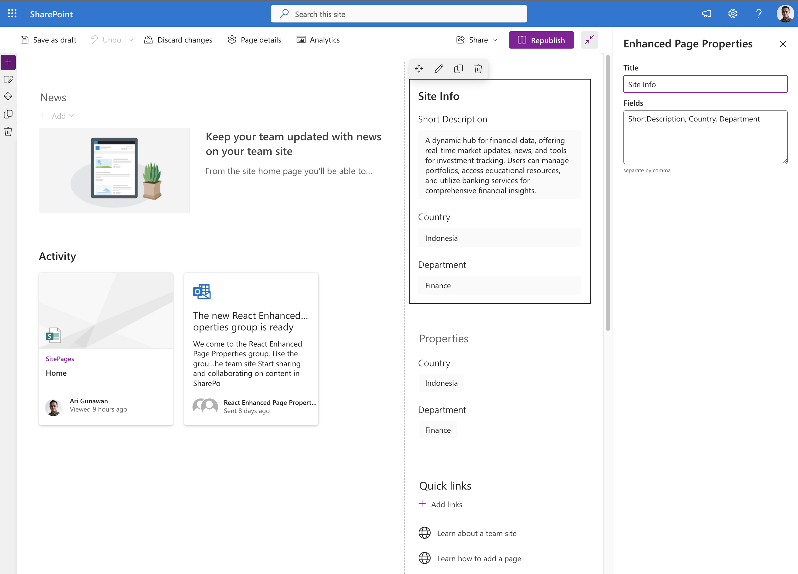

# Enhanced Page Properties

## Summary

This is a web part that goes beyond the standard SharePoint Page Properties web part, offering expanded support for various metadata types and configurations. Effortlessly display key page details based on metadata files, providing a comprehensive view of your content. Streamline information management and enhance user interaction with this versatile and customizable web part.

Currently support following types:
- Single line text
- Multiple line text
- Choice
- Date

### Configuration

- **Title**: Allow to set the displayed title. The built in SharePoint Page Properties web part doesn't allow user to change the displayed title. It will always be **Properties**
- **Fields**: Allow to display multiple fields separated by comma (this will be improved in the future). It's already support multiple line type. The built in SharePoint Page Properties web part doesn't support it.

### Plan for next version

- Support taxonomy field view
- Support people field view
- Support lookup field view
- Support currency field view
- Support hyperlink field view
- Support image field view
- Improve web part configuration

## Compatibility

## Applies to

- [SharePoint Framework](https://docs.microsoft.com/sharepoint/dev/spfx/sharepoint-framework-overview)
- [Microsoft 365 tenant](https://docs.microsoft.com/sharepoint/dev/spfx/set-up-your-development-environment)

> Get your own free development tenant by subscribing to [Microsoft 365 developer program](https://aka.ms/m365devprogram)

## Contributors

- [Ari Gunawan](https://github.com/AriGunawan)

## Version history

Version|Date|Comments
-------|----|--------
1.1|October 23, 2023|Add support for choice and date fields
1.0|September 23, 2023|Initial release

## Minimal path to awesome

- Clone this repository (or [download this solution as a .ZIP file](https://pnp.github.io/download-partial/?url=https://github.com/pnp/sp-dev-fx-webparts/tree/main/samples/react-enhanced-page-properties) then unzip it)
- From your command line, change your current directory to the directory containing this sample (`react-enhanced-page-properties`, located under `samples`)
- in the command line run:
  - `npm install`
  - `gulp serve`

> This sample can also be opened with [VS Code Remote Development](https://code.visualstudio.com/docs/remote/remote-overview). Visit <https://aka.ms/spfx-devcontainer> for further instructions.

## Features

- Show page metadata
- Set displayed title
- Set displayed fields
- Show warning message if the fields is not exist

## Help

We do not support samples, but this community is always willing to help, and we want to improve these samples. We use GitHub to track issues, which makes it easy for  community members to volunteer their time and help resolve issues.

If you're having issues building the solution, please run [spfx doctor](https://pnp.github.io/cli-microsoft365/cmd/spfx/spfx-doctor/) from within the solution folder to diagnose incompatibility issues with your environment.

You can try looking at [issues related to this sample](https://github.com/pnp/sp-dev-fx-webparts/issues?q=label%3A%22sample%3A%20react-enhanced-page-properties%22) to see if anybody else is having the same issues.

You can also try looking at [discussions related to this sample](https://github.com/pnp/sp-dev-fx-webparts/discussions?discussions_q=react-enhanced-page-properties) and see what the community is saying.

If you encounter any issues using this sample, [create a new issue](https://github.com/pnp/sp-dev-fx-webparts/issues/new?assignees=&labels=Needs%3A+Triage+%3Amag%3A%2Ctype%3Abug-suspected%2Csample%3A%20react-enhanced-page-properties&template=bug-report.yml&sample=react-enhanced-page-properties&authors=@AriGunawan&title=react-enhanced-page-properties%20-%20).

For questions regarding this sample, [create a new question](https://github.com/pnp/sp-dev-fx-webparts/issues/new?assignees=&labels=Needs%3A+Triage+%3Amag%3A%2Ctype%3Aquestion%2Csample%3A%20react-enhanced-page-properties&template=question.yml&sample=react-enhanced-page-properties&authors=@AriGunawan&title=react-enhanced-page-properties%20-%20).

Finally, if you have an idea for improvement, [make a suggestion](https://github.com/pnp/sp-dev-fx-webparts/issues/new?assignees=&labels=Needs%3A+Triage+%3Amag%3A%2Ctype%3Aenhancement%2Csample%3A%20react-enhanced-page-properties&template=suggestion.yml&sample=react-enhanced-page-properties&authors=@AriGunawan&title=react-enhanced-page-properties%20-%20).

## Disclaimer

**THIS CODE IS PROVIDED *AS IS* WITHOUT WARRANTY OF ANY KIND, EITHER EXPRESS OR IMPLIED, INCLUDING ANY IMPLIED WARRANTIES OF FITNESS FOR A PARTICULAR PURPOSE, MERCHANTABILITY, OR NON-INFRINGEMENT.**

