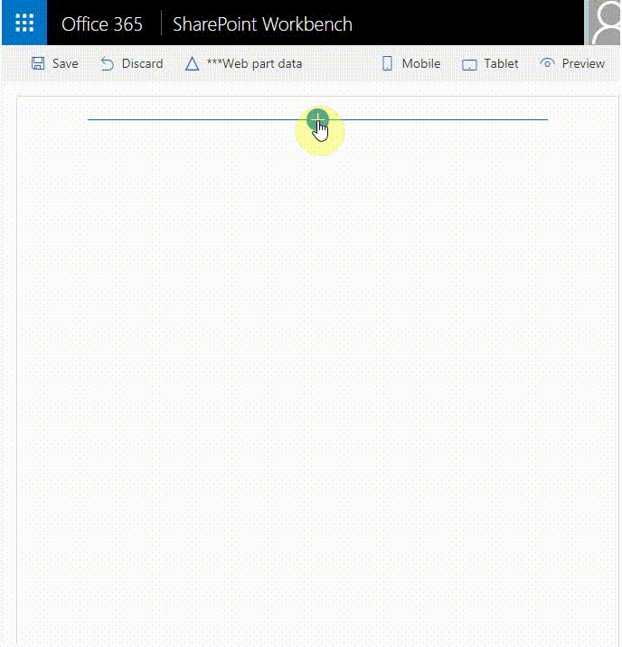

# SPFx Event Aggregator Sample #

> ## DEPRECATED 
>
> The event aggregator is deprecated and no longer available in the SharePoint Framework. Please use [dynamic data](https://docs.microsoft.com/en-us/sharepoint/dev/spfx/dynamic-data) instead. #

Following issue [#659](https://github.com/SharePoint/sp-dev-fx-webparts/issues/659), the event aggregator functionality is no longer working. This feature was in ALPHA state and never made it to general availability state. There is a replacement for the event aggregator. Please have a look at the dynamic data functionality and use it instead [https://docs.microsoft.com/en-us/sharepoint/dev/spfx/dynamic-data](https://docs.microsoft.com/en-us/sharepoint/dev/spfx/dynamic-data). There is already a sample in this library [https://github.com/SharePoint/sp-dev-fx-webparts/tree/master/samples/react-events-dynamicdata](https://github.com/SharePoint/sp-dev-fx-webparts/tree/master/samples/react-events-dynamicdata)

## Summary

This sample shows how we can use the SPFx Event Aggregator to communicate between web parts through broadcasting events utilizing the [Publish–subscribe pattern](https://en.wikipedia.org/wiki/Publish–subscribe_pattern). It enables a webpart or component to raise event (broadcast message) through the SPFx event aggregator and that event is received by other web parts or components that have been subscribed to receive it. 

> Please note the SPFx Event Aggregator is still in Alpha and **NOT SUPPORTED IN PRODUCTION USE**, but this sample will be updated in future when there are changes from the Alpha version to GA.

## Used SharePoint Framework Version 

## Applies to

* [SharePoint Framework](https://docs.microsoft.com/sharepoint/dev/spfx/sharepoint-framework-overview)
* [Office 365 developer tenant](https://docs.microsoft.com/sharepoint/dev/spfx/set-up-your-developer-tenant)

## Prerequisites

- Office 365 subscription with SharePoint Online.
- SharePoint Framework [development environment](https://docs.microsoft.com/sharepoint/dev/spfx/set-up-your-development-environment) already set up.

## Solution

Solution|Author(s)
--------|---------
react-events-aggregator | Miguel Rabaca ( [Spanish Point](http://www.spanishpoint.ie) ), Velin Georgiev ( [@VelinGeorgiev](https://twitter.com/velingeorgiev) ), Austin Breslin  ( [@AustinBreslin](https://www.linkedin.com/in/austin-breslin-84b4a74b/) )

## Version history

Version|Date|Comments
-------|----|--------
0.0.1|August 22, 2017 | Initial commit
0.0.2|March 20, 2018 | Updated to SPFx v1.4.1
0.0.3|November 18, 2018 | Sample deprecated 

## Disclaimer
**THIS CODE IS PROVIDED *AS IS* WITHOUT WARRANTY OF ANY KIND, EITHER EXPRESS OR IMPLIED, INCLUDING ANY IMPLIED WARRANTIES OF FITNESS FOR A PARTICULAR PURPOSE, MERCHANTABILITY, OR NON-INFRINGEMENT.**

---

## Minimal Path to Awesome

- Clone this repository.
- Open the command line, navigate to the web part folder and execute:
    - `npm i`
    - `gulp test` (optional)
    - `gulp serve`

## Features

This Web Part illustrates the following concepts on top of the SharePoint Framework:

- Using React for building SharePoint Framework client-side web parts.
- Using Office UI Fabric React styles for building user experience consistent with SharePoint and Office.
- The use the SPFx event aggregator to broadcast messages (events).
- The use the SPFx event aggregator to subscribe and receive broadcasted messages (events).
- Unit tests including spies, mocks and faking class methods and properties.

