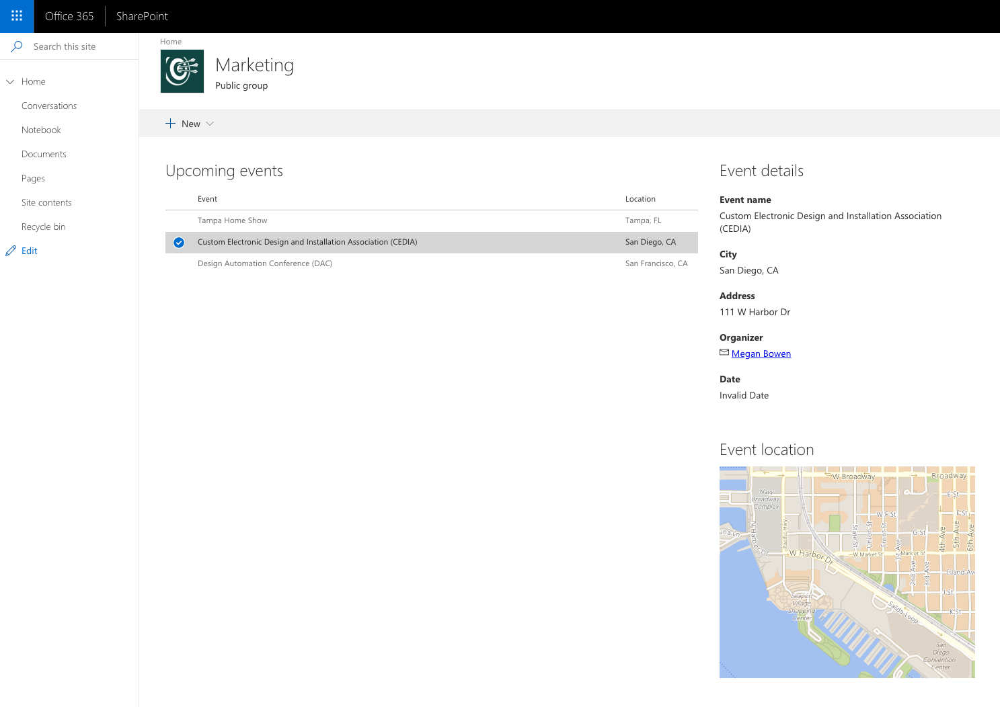

# Dynamic data

Sample web parts illustrating using the SharePoint Framework Dynamic data capability.

## Compatibility

 
 

-Incompatible-red.svg "SharePoint Server 2016 Feature Pack 2 requires SPFx 1.1")

## Applies to

* [SharePoint Framework](https://docs.microsoft.com/sharepoint/dev/spfx/sharepoint-framework-overview)
* [Office 365 developer tenant](https://docs.microsoft.com/sharepoint/dev/spfx/set-up-your-developer-tenant)

## Solution

Solution|Author(s)
--------|---------
react-events-dynamicdata|[Waldek Mastykarz](https://github.com/waldekmastykarz) (MVP, Rencore, @waldekm)
react-events-dynamicdata|[Hugo Bernier](https://github.com/hugoabernier) (MVP, [@bernierh](https://twitter.com/bernierh))

## Version history

Version|Date|Comments
-------|----|--------
1.2|July 8, 2020|Updated sample to SPFx v1.10.0 (Hugo Bernier)
1.1|November 9, 2018|Updated sample to SPFx v1.7.0
1.0|June 5, 2018|Initial release

## Minimal Path to Awesome

* clone this repo
* move to right folder
* in the command line run:
  * `npm install`
  * `gulp bundle --ship`
  * `gulp package-solution --ship`
* from the `sharepoint/solution` folder, deploy the `.sppkg` file to the App catalog in your tenant
* in the site where you want to test this solution
  * add the app named _react-events-dynamicdata-client-side-solution_
  * edit a page
  * add the three web parts named: _Events_, _Event details_ and _Map_
  * configure the _Event details_ web part:
    * as _Connect to source_, choose the _Events_ option
    * as _Event's properties_, choose the _Event_ option
  * configure the _Map_ web part:
    * get a Bing maps API key (follow the link in the web part)
    * as _Connect to source_, choose the _Events_ option
    * as _Event's properties_, choose the _Location_ option
    * as _Address_, choose the _address_ option
    * as _City_, choose the _city_ option

>  This sample can also be opened with [VS Code Remote Development](https://code.visualstudio.com/docs/remote/remote-overview). Visit https://aka.ms/spfx-devcontainer for further instructions.

## Features

This sample contains a set of SharePoint Framework client-side web parts that illustrate the Dynamic data capability.

Web parts in this solution illustrate the following concepts on top of the SharePoint Framework:

* making web part a dynamic data source
* exposing multiple data properties from a single data source
* subscribing to dynamic data source notifications from a web part
* deploying list instances from a SharePoint Framework solution package
* using [PnPjs](https://github.com/pnp/pnpjs) to retrieve data from a SharePoint list
* using [SharePoint Framework React Controls](https://github.com/pnp/sp-dev-fx-controls-react) in web parts

## Help

We do not support samples, but we this community is always willing to help, and we want to improve these samples. We use GitHub to track issues, which makes it easy for  community members to volunteer their time and help resolve issues.

If you're having issues building the solution, please run [spfx doctor](https://pnp.github.io/cli-microsoft365/cmd/spfx/spfx-doctor/) from within the solution folder to diagnose incompatibility issues with your environment.

You can try looking at [issues related to this sample](https://github.com/pnp/sp-dev-fx-webparts/issues?q=label%3A%22sample%3A%20react-events-dynamicdata") to see if anybody else is having the same issues.

You can also try looking at [discussions related to this sample](https://github.com/pnp/sp-dev-fx-webparts/discussions?discussions_q=react-events-dynamicdata) and see what the community is saying.

If you encounter any issues while using this sample, [create a new issue](https://github.com/pnp/sp-dev-fx-webparts/issues/new?assignees=&labels=Needs%3A+Triage+%3Amag%3A%2Ctype%3Abug-suspected%2Csample%3A%20react-events-dynamicdata&template=bug-report.yml&sample=react-events-dynamicdata&authors=@waldekmastykarz%20@hugoabernier&title=react-events-dynamicdata%20-%20).

For questions regarding this sample, [create a new question](https://github.com/pnp/sp-dev-fx-webparts/issues/new?assignees=&labels=Needs%3A+Triage+%3Amag%3A%2Ctype%3Aquestion%2Csample%3A%20react-events-dynamicdata&template=question.yml&sample=react-events-dynamicdata&authors=@waldekmastykarz%20@hugoabernier&title=react-events-dynamicdata%20-%20).

Finally, if you have an idea for improvement, [make a suggestion](https://github.com/pnp/sp-dev-fx-webparts/issues/new?assignees=&labels=Needs%3A+Triage+%3Amag%3A%2Ctype%3Aenhancement%2Csample%3A%20react-events-dynamicdata&template=question.yml&sample=react-events-dynamicdata&authors=@waldekmastykarz%20@hugoabernier&title=react-events-dynamicdata%20-%20).

## Disclaimer

**THIS CODE IS PROVIDED *AS IS* WITHOUT WARRANTY OF ANY KIND, EITHER EXPRESS OR IMPLIED, INCLUDING ANY IMPLIED WARRANTIES OF FITNESS FOR A PARTICULAR PURPOSE, MERCHANTABILITY, OR NON-INFRINGEMENT.**

