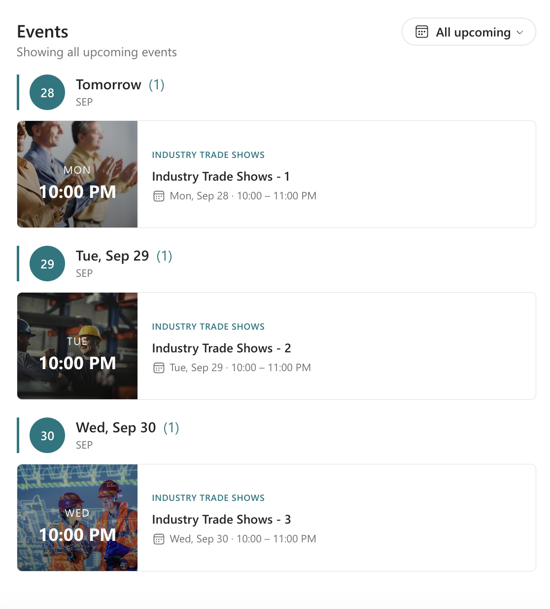
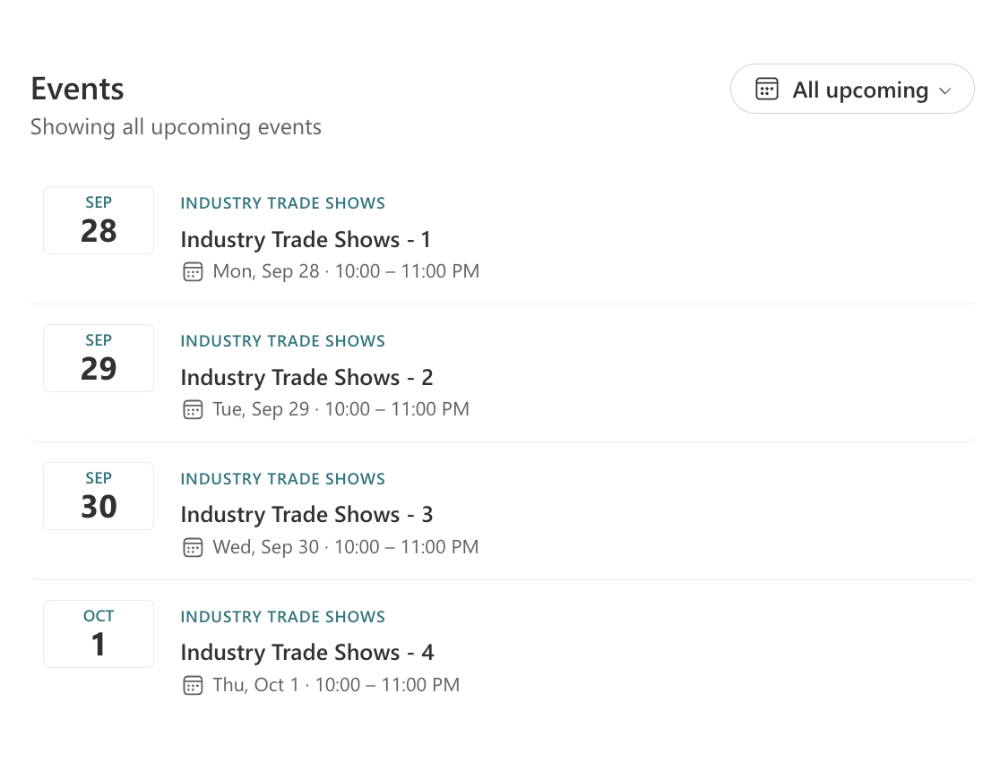
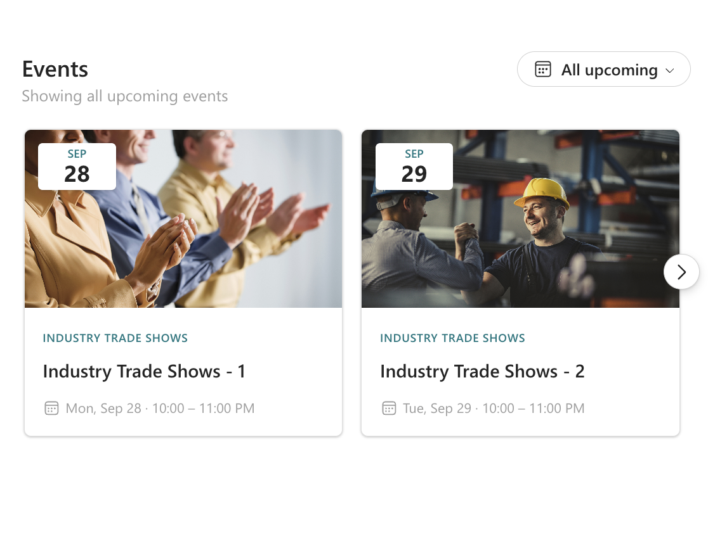
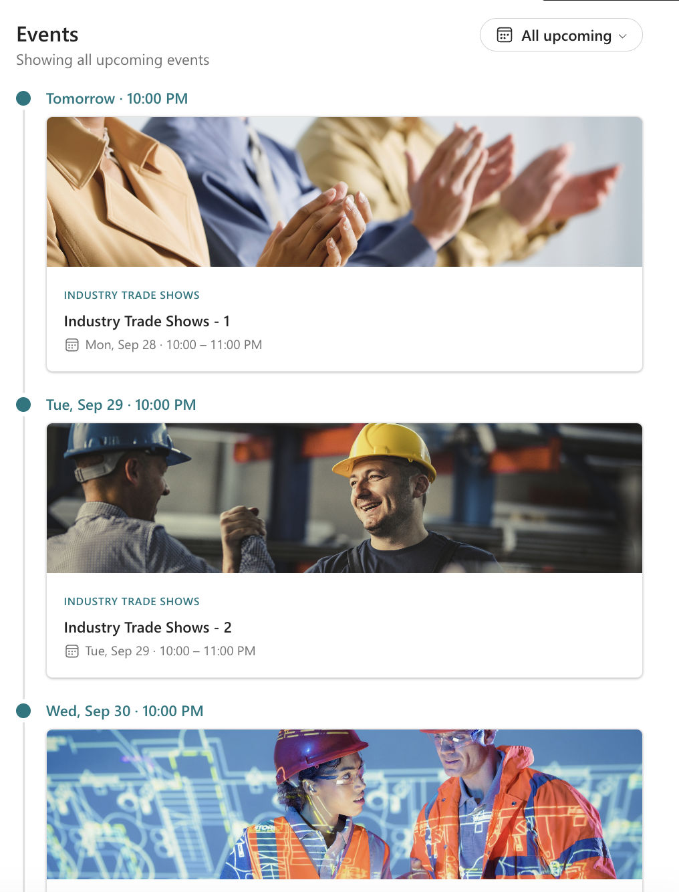
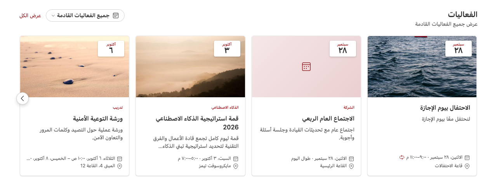

# Events Layouts

## Summary

Show upcoming events from SharePoint Events lists and Microsoft 365 group calendars in one responsive feed. Choose from six layouts: Agenda, Grid, List, Filmstrip, Carousel and Timeline. The web part picks up the site theme and section background automatically, fits any column width, and supports right-to-left languages such as Arabic, including the Hijri calendar.

*Agenda: events grouped under a heading for each day, with the start time shown over the event image.*

*Grid: image cards in a responsive grid, each with a date badge.*

*List: a compact list with a date tile next to each event, without images.*

*Filmstrip: a horizontal row of cards that viewers scroll with the arrow buttons.*

*Carousel: one large event at a time, with play/pause, previous/next and page indicators.*

*Timeline: events in date order along a vertical line, with the date and time above each card.*

*Filmstrip in Arabic: the right-to-left layout with Arabic localization.*

## Compatibility

| :warning: Important          |
|:---------------------------|
| Every SPFx version is optimally compatible with specific versions of Node.js. In order to be able to Toolchain this sample, you need to ensure that the version of Node on your workstation matches one of the versions listed in this section. This sample will not work on a different version of Node.|
|Refer to <https://aka.ms/spfx-matrix> for more information on SPFx compatibility.   |

This sample is optimally compatible with the following environment configuration:

-Incompatible-red.svg "SharePoint Server 2016 Feature Pack 2 requires SPFx 1.1")

## Applies to

* [SharePoint Framework](https://learn.microsoft.com/sharepoint/dev/spfx/sharepoint-framework-overview)
* [Microsoft 365 tenant](https://learn.microsoft.com/sharepoint/dev/spfx/set-up-your-development-environment)

> Get your own free development tenant by subscribing to [Microsoft 365 developer program](https://aka.ms/m365/devprogram)

## Contributors

* [Zeyad Elmaghraby](https://github.com/zeyadelmaghraby)

## Version history

|Version|Date|Comments|
|-------|----|--------|
|1.0|September 27, 2026|Initial release|

## Prerequisites

* At least one **Events** list in SharePoint (the list behind the out-of-the-box Events web part). If you don't select any calendar, the web part uses the first Events list of the current site.
* **Optional, for Microsoft 365 group calendars:** approve the `Group.Read.All` Microsoft Graph permission after you deploy the package. In the SharePoint admin center, go to **Advanced** > **API access** and approve the pending request. SharePoint Events lists work without this permission.

## Minimal path to awesome

* Clone this repository (or [download this solution as a .ZIP file](https://pnp.github.io/download-partial/?url=https://github.com/pnp/sp-dev-fx-webparts/tree/main/samples/react-events-layouts) then unzip it)
* From your command line, change your current directory to the directory containing this sample (`react-events-layouts`, located under `samples`)
* In the command line run:
  * `npm install`
  * `npm run start`
* Open the hosted workbench (`https://<your-tenant>.sharepoint.com/_layouts/15/workbench.aspx`) and add the **Events Layouts** web part.

To deploy:

* Run `npm run build`
* Upload `sharepoint/solution/react-events-layouts.sppkg` to the tenant or site collection app catalog
* Approve the Microsoft Graph permission request if you want to use group calendars (see [Prerequisites](#prerequisites))

## Features

Events Layouts brings events from several calendars together, sorts them by date and presents them in the layout that best suits the page.

| Setting | Description |
|---------|-------------|
| **Title** | Heading above the events. Leave empty to hide it. |
| **Layout** | Agenda, Grid, List, Filmstrip, Carousel or Timeline. |
| **Height** | Fixed height in pixels with scrolling. `0` follows the content. |
| **Rotate slides automatically** | Carousel only. Viewers can pause it at any time. |
| **Maximum events** | 1 to 50 events. |
| **Title lines / Description lines** | Number of lines shown before the text is truncated. |
| **Show description, image, location, organizer, category** | Turn each detail on or off. |
| **Show date filter** | Lets viewers switch between *All upcoming*, *Today*, *Next 7 days* and *Next 30 days*. |
| **"See all" link** | Optional link shown next to the title. |
| **Selected calendars** | Search across the tenant for SharePoint Events lists and Microsoft 365 groups. |
| **Default date range** | The range shown when the page loads. |
| **Text direction** | Automatic (follows the page language), left to right, or right to left. |
| **Date and time locale** | Any BCP 47 tag such as `en-US`, `ar-SA` or `fr-FR`. Leave empty to follow the site regional settings. |
| **Calendar** | Locale default, Gregorian, or Hijri (Umm al-Qura). |
| **Always use Latin digits** | Shows 0-9 instead of the locale's native digits. |

This web part illustrates the following concepts on top of the SharePoint Framework:

* Using **Fluent UI v9** in SPFx, including the Carousel, TagPicker, Menu and Skeleton components
* Converting the SharePoint theme into a Fluent UI v9 theme so the web part updates when the site theme changes, and supports section backgrounds (`supportsThemeVariants`) and Microsoft Teams light, dark and high contrast themes
* Responsive layouts based on the web part's own width (`ResizeObserver`), so they adapt to any section or column
* Right-to-left support through `FluentProvider` direction and Griffel's automatic style flipping
* Locale-aware dates with the `Intl` API, including relative days ("Tomorrow"), date ranges, Hijri calendar and numbering systems
* Reading SharePoint list items with `SPHttpClient` and group calendars with `MSGraphClientV3`, including recurring event expansion through `calendarView`
* A custom property pane control built with React and Fluent UI v9
* English and Arabic localization

### Notes

* Dates are shown in the viewer's local time zone. All-day events keep their calendar date in every time zone.
* Recurring events in classic SharePoint calendar lists are shown once, on their first occurrence. Recurring events in group calendars are expanded into individual occurrences.

## Help

We do not support samples, but this community is always willing to help, and we want to improve these samples. We use GitHub to track issues, which makes it easy for  community members to volunteer their time and help resolve issues.

If you're having issues building the solution, please run [spfx doctor](https://pnp.github.io/cli-microsoft365/cmd/spfx/spfx-doctor/) from within the solution folder to diagnose incompatibility issues with your environment.

You can try looking at [issues related to this sample](https://github.com/pnp/sp-dev-fx-webparts/issues?q=label%3A%22sample%3A%20react-events-layouts%22) to see if anybody else is having the same issues.

You can also try looking at [discussions related to this sample](https://github.com/pnp/sp-dev-fx-webparts/discussions?discussions_q=react-events-layouts) and see what the community is saying.

If you encounter any issues using this sample, [create a new issue](https://github.com/pnp/sp-dev-fx-webparts/issues/new?assignees=&labels=Needs%3A+Triage+%3Amag%3A%2Ctype%3Abug-suspected%2Csample%3A%20react-events-layouts&template=bug-report.yml&sample=react-events-layouts&authors=@zeyadelmaghraby&title=react-events-layouts%20-%20).

For questions regarding this sample, [create a new question](https://github.com/pnp/sp-dev-fx-webparts/issues/new?assignees=&labels=Needs%3A+Triage+%3Amag%3A%2Ctype%3Aquestion%2Csample%3A%20react-events-layouts&template=question.yml&sample=react-events-layouts&authors=@zeyadelmaghraby&title=react-events-layouts%20-%20).

Finally, if you have an idea for improvement, [make a suggestion](https://github.com/pnp/sp-dev-fx-webparts/issues/new?assignees=&labels=Needs%3A+Triage+%3Amag%3A%2Ctype%3Aenhancement%2Csample%3A%20react-events-layouts&template=suggestion.yml&sample=react-events-layouts&authors=@zeyadelmaghraby&title=react-events-layouts%20-%20).

## Disclaimer

**THIS CODE IS PROVIDED *AS IS* WITHOUT WARRANTY OF ANY KIND, EITHER EXPRESS OR IMPLIED, INCLUDING ANY IMPLIED WARRANTIES OF FITNESS FOR A PARTICULAR PURPOSE, MERCHANTABILITY, OR NON-INFRINGEMENT.**

