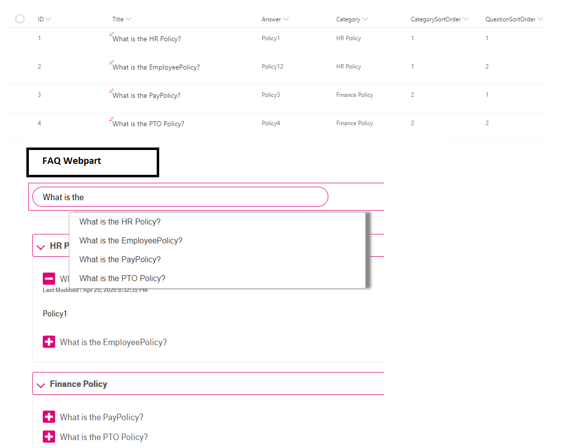

# SharePoint Framework Faq App

## Summary
- This Web Part allows users to create Frequently Asked Questions(Faq App) in modern and classic SharePoint pages.
- This webpart allows to search within questions and answers which are stored in a SharePoint FAQ list.
- "React-autosuggest and react-accessible-accordion" react packages are used for the search and accordion control.

## Used SharePoint Framework Version 

## Applies to

* [SharePoint Framework](https://docs.microsoft.com/sharepoint/dev/spfx/sharepoint-framework-overview)
* [Office 365 tenant](https://docs.microsoft.com/sharepoint/dev/spfx/set-up-your-development-environment)

## Solution

Solution|Author(s)
--------|---------
react-FAQApp | Ashok Swain - LinkedIn: https://www.linkedin.com/in/ashok-kumar-swain-2627a514

## Version history

Version|Date|Comments
-------|----|--------
1.0 | April 25, 2020 | Initial release

## Disclaimer

**THIS CODE IS PROVIDED *AS IS* WITHOUT WARRANTY OF ANY KIND, EITHER EXPRESS OR IMPLIED, INCLUDING ANY IMPLIED WARRANTIES OF FITNESS FOR A PARTICULAR PURPOSE, MERCHANTABILITY, OR NON-INFRINGEMENT.**

## Minimal Path to Awesome

- `git clone` the repo
- `npm i`
- `npm i -g gulp`
- `gulp serve`

### Local Mode

A browser in local mode (localhost) will be opened.
`https://localhost:4321/temp/workbench.html`

### SharePoint Mode

If you want to try on a real environment, open:
`https://[your-domain].sharepoint.com/_layouts/15/workbench.aspx`

## Usage

- Create a FAQ List in SharePoint.
- Create the below fields:
- `Title` field can be considered as "Question" field.

Column Name|Field Type
-------|----
`Title`|Single line of text
`Answer`|Multiple lines of text
`Category`|Single line of text
`CategorySortOrder`|Number
`QuestionSortOrder`|Number

- Edit the webpart, set the  **ListName** in the property pane 

## Features

- This Web Part allows users to create Frequently Asked Questions(FAQ App) in modern and classic SharePoint pages.
- An accordion layout is used to make it easy to browse through different questions.
- Expand answers to your most frequent questions.
- Include text, links, images in your answers.
- A search bar to make your FAQ accordion searchable.
- This webpart allows to search within questions and answers which are stored in a SharePoint FAQ list.
- Sorting is enabled on both the category & Question

