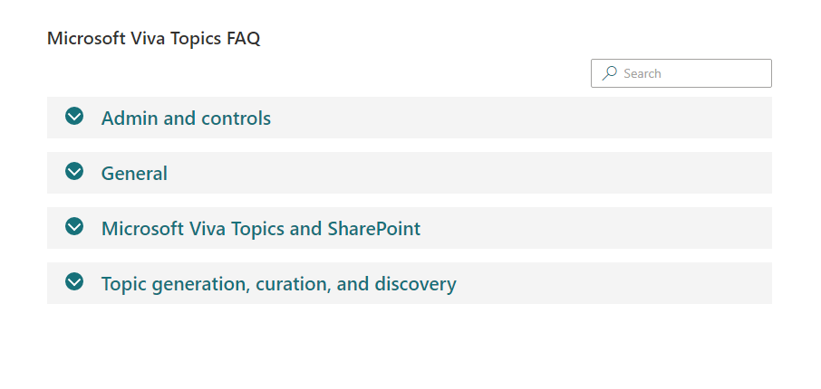

# Frequently Asked Questions with Property Field Collection Data

## Summary

- This Web Part allows users to create Frequently Asked Questions using Property Field Collection Data for SharePoint Online.
- This web part allows to search within questions and answers which are stored in a Property Field Collection Data and can be easily edited inline within the web part using Property Pane. Search text is highlighted in the search results.
- Provides options to view as an Accordion or Tab.
- In mobile browser defaults to Accordion view.

## Compatibility

-Incompatible-red.svg "SharePoint Server 2016 Feature Pack 2 requires SPFx 1.1")

## Applies to

- [SharePoint Framework](https://aka.ms/spfx)
- [Microsoft 365 tenant](https://docs.microsoft.com/en-us/sharepoint/dev/spfx/set-up-your-developer-tenant)

> Get your own free development tenant by subscribing to [Microsoft 365 developer program](http://aka.ms/o365devprogram)

## Prerequisites

There are no pre-requisites to use these samples.

## Solution

Solution|Author(s)
--------|---------
react-Faqs | [Arun Kumar Perumal](https://github.com/arunkumarperumal) - LinkedIn:  <https://www.linkedin.com/in/arunkumarperumal/>

## Version history

Version|Date|Comments
-------|----|--------
1.0|March 07, 2022|Initial release

## Minimal path to awesome

- Clone this repository (or [download this solution as a .ZIP file](https://pnp.github.io/download-partial/?url=https://github.com/pnp/sp-dev-fx-webparts/tree/main/samples/react-faqs) then unzip it)
- Ensure that you are at the solution folder
- in the command-line run:
  - `npm install`
  - `gulp serve`

> This sample can also be opened with [VS Code Remote Development](https://code.visualstudio.com/docs/remote/remote-overview). Visit <https://aka.ms/spfx-devcontainer> for further instructions.

## Features

This Web Part allows users to create Frequently Asked Questions using Property Field Collection Data for SharePoint Online.

Has the following features:

- Ability to create FAQ Categories
- Ability to create FAQs with Rich Text Editor for Answer using PnP Rich Text Control 
- Ability to sort FAQs with capability from PnP Property Pane PropertyFieldCollectionData
- Ability to view the FAQs as an Accordion or Tab 
- Ability to search based on FAQ Question and Answer and highlights the search term in the results
- Defaults to Accordion in Mobile displays
- Uses Custom Accordion components included in the code.
- Use the site Primary colors and themes for display- 
- Uses Office UI Fabric Search Box for the search functionality

> Share your web part with others through Microsoft 365 Patterns and Practices program to get visibility and exposure. More details on the community, open-source projects and other activities from http://aka.ms/m365pnp.

## References

- [Getting started with SharePoint Framework](https://docs.microsoft.com/en-us/sharepoint/dev/spfx/set-up-your-developer-tenant)
- [Building for Microsoft teams](https://docs.microsoft.com/en-us/sharepoint/dev/spfx/build-for-teams-overview)
- [Use Microsoft Graph in your solution](https://docs.microsoft.com/en-us/sharepoint/dev/spfx/web-parts/get-started/using-microsoft-graph-apis)
- [Publish SharePoint Framework applications to the Marketplace](https://docs.microsoft.com/en-us/sharepoint/dev/spfx/publish-to-marketplace-overview)
- [Microsoft 365 Patterns and Practices](https://aka.ms/m365pnp) - Guidance, tooling, samples and open-source controls for your Microsoft 365 development

## Help

We do not support samples, but this community is always willing to help, and we want to improve these samples. We use GitHub to track issues, which makes it easy for  community members to volunteer their time and help resolve issues.

If you're having issues building the solution, please run [spfx doctor](https://pnp.github.io/cli-microsoft365/cmd/spfx/spfx-doctor/) from within the solution folder to diagnose incompatibility issues with your environment.

You can try looking at [issues related to this sample](https://github.com/pnp/sp-dev-fx-webparts/issues?q=label%3A%22sample%3A%20react-faqs%22) to see if anybody else is having the same issues.

You can also try looking at [discussions related to this sample](https://github.com/pnp/sp-dev-fx-webparts/discussions?discussions_q=react-faqs) and see what the community is saying.

If you encounter any issues while using this sample, [create a new issue](https://github.com/pnp/sp-dev-fx-webparts/issues/new?assignees=&labels=Needs%3A+Triage+%3Amag%3A%2Ctype%3Abug-suspected%2Csample%3A%20react-faqs&template=bug-report.yml&sample=react-faqs&authors=@arunkumarperumal&title=react-faqs%20-%20).

For questions regarding this sample, [create a new question](https://github.com/pnp/sp-dev-fx-webparts/issues/new?assignees=&labels=Needs%3A+Triage+%3Amag%3A%2Ctype%3Aquestion%2Csample%3A%20react-faqs&template=question.yml&sample=react-faqs&authors=@arunkumarperumal&title=react-faqs%20-%20).

Finally, if you have an idea for improvement, [make a suggestion](https://github.com/pnp/sp-dev-fx-webparts/issues/new?assignees=&labels=Needs%3A+Triage+%3Amag%3A%2Ctype%3Aenhancement%2Csample%3A%20react-faqs&template=suggestion.yml&sample=react-faqs&authors=@arunkumarperumal&title=react-faqs%20-%20).

## Disclaimer

**THIS CODE IS PROVIDED *AS IS* WITHOUT WARRANTY OF ANY KIND, EITHER EXPRESS OR IMPLIED, INCLUDING ANY IMPLIED WARRANTIES OF FITNESS FOR A PARTICULAR PURPOSE, MERCHANTABILITY, OR NON-INFRINGEMENT.**

