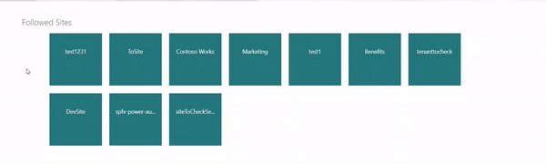
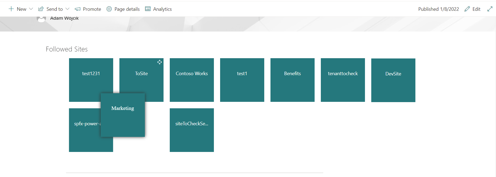
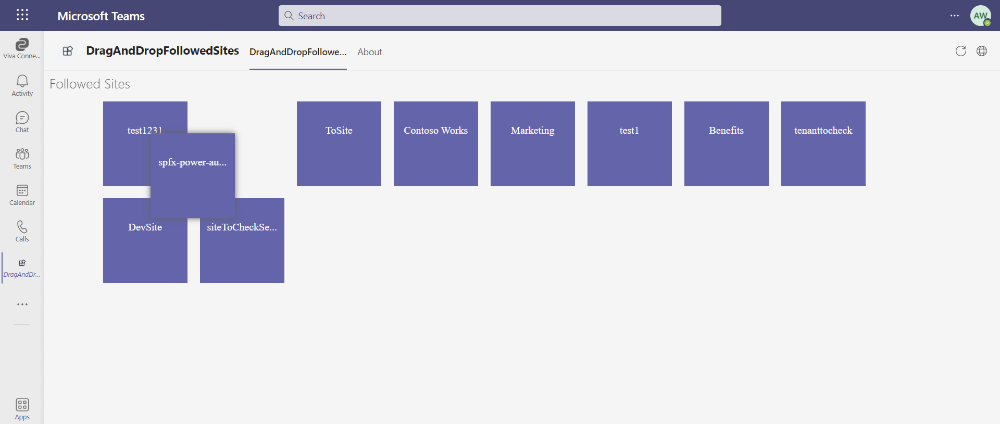
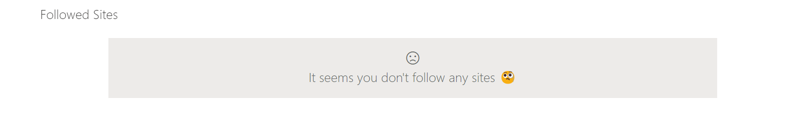
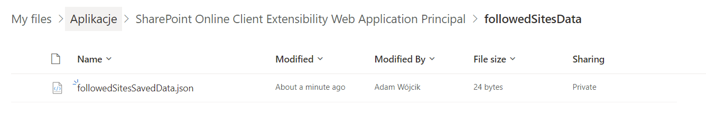
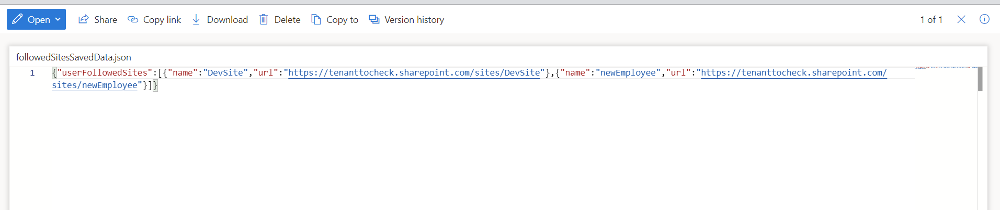

# react-followed-drag-and-drop-grid

## Summary

This webpart is a good example (starting point) for a solution to implement alternative view for user followed sites (or any kind of links). The webpart uses Microsoft Graph so it presents how to define needed web api permissions in package-solution and use MS Graph API endpoints.

how it looks on SP site

how it looks in Teams

when user does not have any followed sites

Another cool feature is also done using MS Graph in order to save or update the order of the links as a .json file in special approot folder which is kept on each individual user OneDrive. Thanks to that the webpart may keep the user order of the links in one place where it may be easily used in a SharePoint page or in Teams.

## Used SharePoint Framework Version

## Applies to

- [SharePoint Framework](https://aka.ms/spfx)
- [Microsoft 365 tenant](https://docs.microsoft.com/en-us/sharepoint/dev/spfx/set-up-your-developer-tenant)

## Prerequisites

As this solution uses Microsoft Graph to get user followed sites it is required to approve all web api permission requests in SharePoint Admin page https://YourCoolTenantNameHere-admin.sharepoint.com/_layouts/15/online/AdminHome.aspx#/webApiPermissionManagement

## Solution

Solution|Author(s)
--------|---------
react-followed-drag-and-drop-grid | [Adam Wójcik](https://github.com/Adam-it)

## Version history

Version|Date|Comments
-------|----|--------
1.0|January 09, 2022|Initial release

## Disclaimer

**THIS CODE IS PROVIDED *AS IS* WITHOUT WARRANTY OF ANY KIND, EITHER EXPRESS OR IMPLIED, INCLUDING ANY IMPLIED WARRANTIES OF FITNESS FOR A PARTICULAR PURPOSE, MERCHANTABILITY, OR NON-INFRINGEMENT.**

---

## Minimal Path to Awesome

- Clone this repository
- Ensure that you are at the solution folder
- in the command-line run:
  - `npm install`
  - `gulp serve`
  - `gulp bundle --ship`
  - `gulp package-solution --ship`
  - Add to AppCatalog and deploy
  - Approve the MS Graph API permissions in SharePoint Admin page

## Features

Description of the extension that expands upon high-level summary above.

This extension illustrates the following concepts:

- how to use Microsoft Graph api and get user followed sites or use special approot on user OneDrive
- how to save/update data in a json file special approot folder on user OneDrive as a place to keep data a use in SharePoint or Teams
- how to create a simple alternative drag and drop view for links

## References

- [Getting started with SharePoint Framework](https://docs.microsoft.com/en-us/sharepoint/dev/spfx/set-up-your-developer-tenant)
- [Building for Microsoft teams](https://docs.microsoft.com/en-us/sharepoint/dev/spfx/build-for-teams-overview)
- [Use Microsoft Graph in your solution](https://docs.microsoft.com/en-us/sharepoint/dev/spfx/web-parts/get-started/using-microsoft-graph-apis)
- [Publish SharePoint Framework applications to the Marketplace](https://docs.microsoft.com/en-us/sharepoint/dev/spfx/publish-to-marketplace-overview)
- [Microsoft 365 Patterns and Practices](https://aka.ms/m365pnp) - Guidance, tooling, samples and open-source controls for your Microsoft 365 development