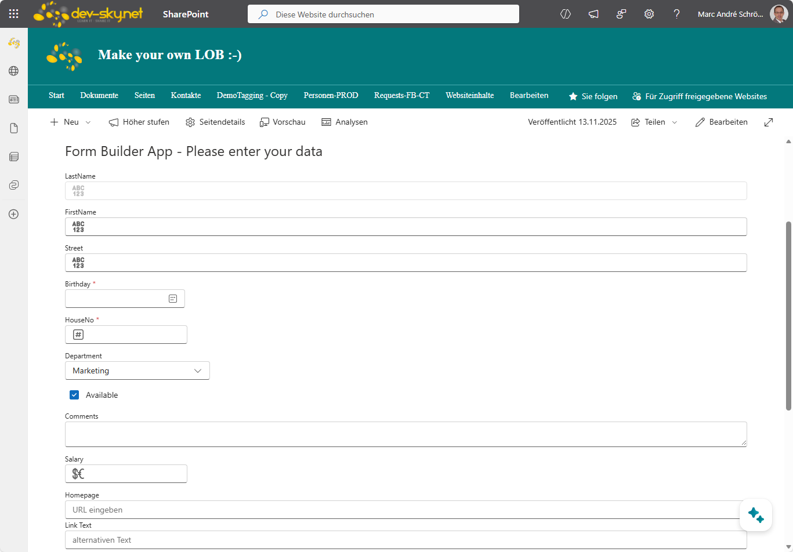
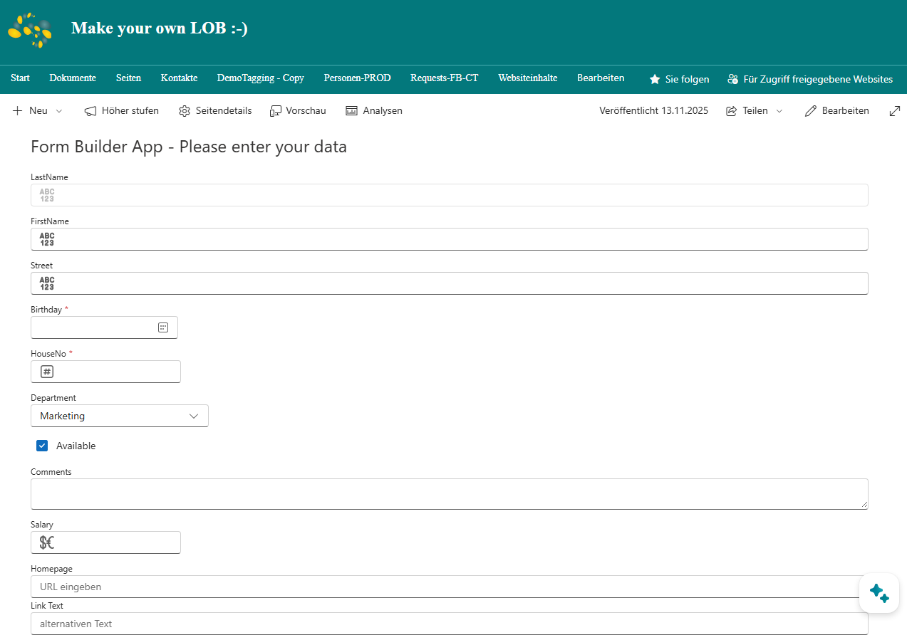

# SharePoint - Dynamic Form Builder (WebPart)
## Summary
This WebPart (App) builds and creates an input form from a given SharePoint List and defined view. The view is used to determine the fields and the order of the fields in the form.
This allows the form to be flexibly integrated into all SharePoint pages. The web part uses the latest version of the [Fluent UI React Components library](https://react.fluentui.dev/?path=/docs/concepts-introduction--page).

*UI of the generated form (1)*

*UI of the generated form (2)*

## Video

## Used SharePoint Framework Version

## Compatibility

| :warning: Important          |
|:---------------------------|
| Every SPFx version is only compatible with specific version(s) of Node.js. In order to be able to build this sample, please ensure that the version of Node on your workstation matches one of the versions listed in this section. This sample will not work on a different version of Node.|
|Refer to <https://aka.ms/spfx-matrix> for more information on SPFx compatibility.   |

-Incompatible-red.svg "SharePoint Server 2016 Feature Pack 2 requires SPFx 1.1")

## Applies to

- [SharePoint Framework](https://aka.ms/spfx)
- [Microsoft 365 tenant](https://docs.microsoft.com/en-us/sharepoint/dev/spfx/set-up-your-developer-tenant)

> Get your own free development tenant by subscribing to [Microsoft 365 developer program](http://aka.ms/o365devprogram)

## Contributors

- [Marc André Schröder-Zhou](https://github.com/maschroeder-z)

## Permissions
 The following permission is request vai webApiPermissionRequests:
 - resource: "Microsoft Graph" -> scope": "Mail.Send"
  
## Prerequisites

> You just need a SharePoint list and a view for field order configuration.

## Solution

| Solution    | Author(s)                                                   |
| ----------- | ----------------------------------------------------------- |
| Repository  | Marc André Schröder-Zhou (https://github.com/maschroeder-z) |

## Version history

| Version | Date             | Comments                |
| ------- | ---------------- | ----------------------- |
| 1.2     | 18.09.2025       | Upgrade to SPFx 1.21.1  |
| 1.1     | 24.07.2024       | Upgrade to SPFx 1.18    |
| 1.0     | 10.08.2023       | Initial Release         |

## Disclaimer

**THIS CODE IS PROVIDED _AS IS_ WITHOUT WARRANTY OF ANY KIND, EITHER EXPRESS OR IMPLIED, INCLUDING ANY IMPLIED WARRANTIES OF FITNESS FOR A PARTICULAR PURPOSE, MERCHANTABILITY, OR NON-INFRINGEMENT.**

---

## Minimal Path to Awesome

- Clone this repository
- Ensure that you are at the solution folder
- in the command-line run:
  - **npm install**
  - **gulp serve**

> Check your current Node version and installed SPFx-Framework version.

## Features
- Automatic creation of a form based on a list view
- Setting custom validation rules for fields (e.g., email format)
- Setting custom error messages
- Printing form data
- Optional: Sending a summary of form data to users via email
- Optional: Additional file transmission
- Restriction of permitted file attachments
- Custom confirmation text after submitting the form
- Optional: Additional text above the form
- Optional: Link to the list entry

## Help
Please contact me for further help or information about the sample.

## References

- [Getting started with SharePoint Framework](https://docs.microsoft.com/en-us/sharepoint/dev/spfx/set-up-your-developer-tenant)
- [Building for Microsoft teams](https://docs.microsoft.com/en-us/sharepoint/dev/spfx/build-for-teams-overview)
- [Use Microsoft Graph in your solution](https://docs.microsoft.com/en-us/sharepoint/dev/spfx/web-parts/get-started/using-microsoft-graph-apis)
- [Publish SharePoint Framework applications to the Marketplace](https://docs.microsoft.com/en-us/sharepoint/dev/spfx/publish-to-marketplace-overview)
- [Microsoft 365 Patterns and Practices](https://aka.ms/m365pnp) - Guidance, tooling, samples and open-source controls for your Microsoft 365 development

## Disclaimer

**THIS CODE IS PROVIDED _AS IS_ WITHOUT WARRANTY OF ANY KIND, EITHER EXPRESS OR IMPLIED, INCLUDING ANY IMPLIED WARRANTIES OF FITNESS FOR A PARTICULAR PURPOSE, MERCHANTABILITY, OR NON-INFRINGEMENT.**

