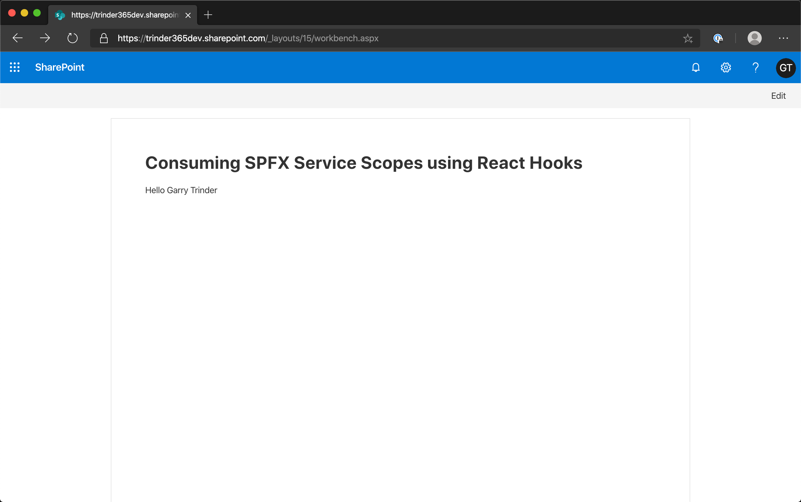

# Consuming SPFx Service Scopes using React Hooks

## Summary

This web part is designed to help developers understand how to use the Context API and useContext() React Hook to share global data between a hierarchy of nested React components. In this example, a Service Scope is shared globally that components can consume to call the Microsoft Graph, it also uses Functional Components replacing the more commonly seen Class Component approach.

## Used SharePoint Framework Version

## Applies to

* [SharePoint Framework](https://docs.microsoft.com/sharepoint/dev/spfx/sharepoint-framework-overview)
* [Office 365 tenant](https://docs.microsoft.com/sharepoint/dev/spfx/set-up-your-development-environment)

## Solution

Solution|Author(s)
--------|---------
react-functional-servicescope-hooks | Garry Trinder

## Version history

Version|Date|Comments
-------|----|--------
1.0|March 25, 2020|Initial release

## Disclaimer

**THIS CODE IS PROVIDED *AS IS* WITHOUT WARRANTY OF ANY KIND, EITHER EXPRESS OR IMPLIED, INCLUDING ANY IMPLIED WARRANTIES OF FITNESS FOR A PARTICULAR PURPOSE, MERCHANTABILITY, OR NON-INFRINGEMENT.**

---

## Minimal Path to Awesome

* Clone this repository
* Move to /samples/react-functional-servicescope-hooks folder
* At the command line run:
  * `npm install`
  * `gulp bundle --ship && gulp package-solution --ship`
* Upload `react-functional-servicescope-hooks.sppkg` to App Catalog site collection from `sharepoint/solution` folder
* Deploy package
* Go to SharePoint API Management screen in SharePoint Admin Center
* Approve `User.ReadBasic.All` permission for Microsoft Graph
* At the command line run:
  * `gulp serve`
* Navigate to remote workbench `https://tenant.sharepoint.com/_layouts/15/workbench.aspx`
* Add `HelloWorld` web part to the workbench

## Features

This sample demonstrates how 
 
 * Functional Components can be used to replace Class Components, simplifying the codebase
 * `useEffect()` React Hooks can replace `componentDidMount()` lifecycle method 
 * `useState()` React Hook can replace the use of `this.setState()` to update local component state

This Web Part illustrates the following concepts on top of the SharePoint Framework:

* React Hooks
* React Context API
* Functional Components

