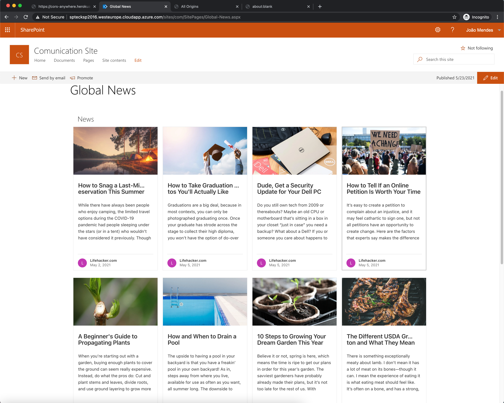

# Global News (SP2019 Version)

## Summary

This web part show a world news from various sources, it uses the API available on https://newsapi.org this collect information from news and blog sites arround the world.

Please go to https://newsapi.org to get more information.

## Compatibility

 
 

-Compatible-green.svg "SharePoint Server 2016 Feature Pack 2 requires SPFx 1.1")

## Applies to

* [SharePoint Framework](https://docs.microsoft.com/sharepoint/dev/spfx/sharepoint-framework-overview)
 

## Prerequisites

> none

## Solution

Solution|Author(s)
--------|---------
react-global-news-sp2019 | João Mendes

## Version history

Version|Date|Comments
-------|----|--------
1.0|May 22, 2021|Initial release

## Minimal Path to Awesome

* Clone this repository
* in the command line run:
  * `npm install`
  * `gulp serve`

>  This sample can also be opened with [VS Code Remote Development](https://code.visualstudio.com/docs/remote/remote-overview). Visit https://aka.ms/spfx-devcontainer for further instructions.

> Include any additional steps as needed.

## Features

Description of the web part with possible additional details than in short summary. 
This Web Part illustrates the following concepts on top of the SharePoint Framework:

* Office-ui-fabric-react components
 

## Disclaimer

**THIS CODE IS PROVIDED *AS IS* WITHOUT WARRANTY OF ANY KIND, EITHER EXPRESS OR IMPLIED, INCLUDING ANY IMPLIED WARRANTIES OF FITNESS FOR A PARTICULAR PURPOSE, MERCHANTABILITY, OR NON-INFRINGEMENT.**

