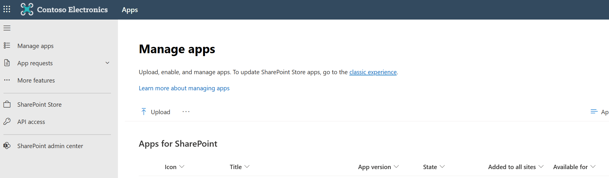
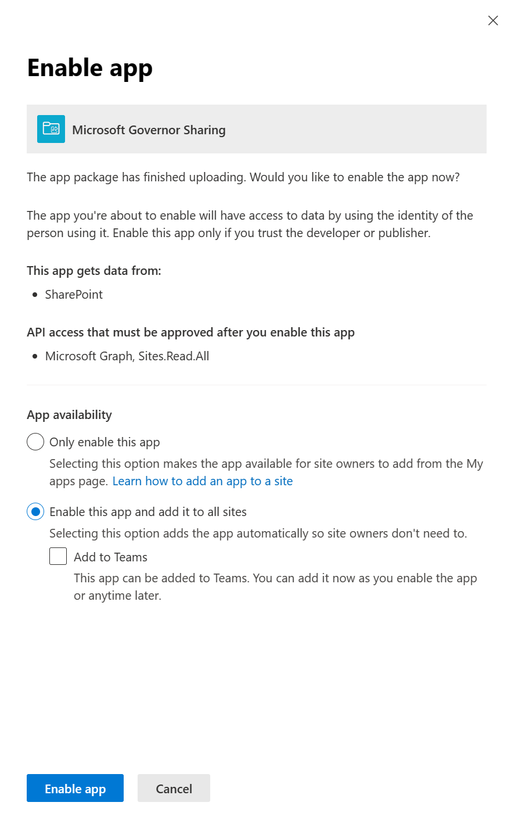
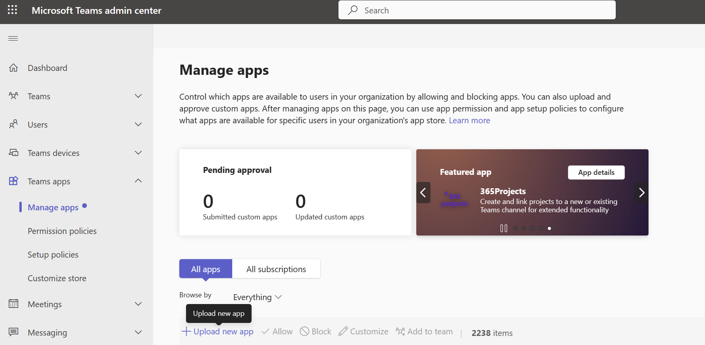
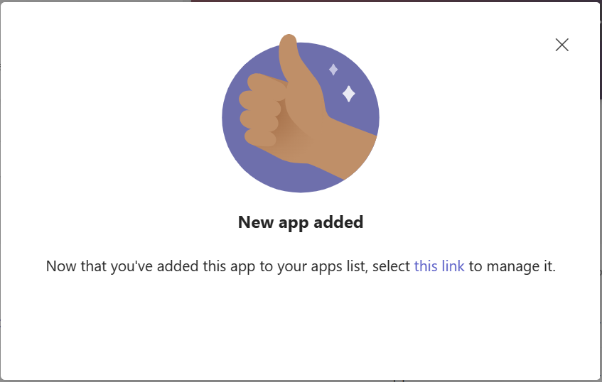
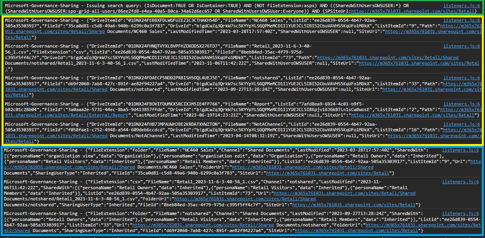

# Governor Sharing

## Summary

SPFx WebPart shows documents which have been (explicitly) shared within a SharePoint site or Team.

It does this by using the following steps:

- Issuing a Search Query (KQL) against the Graph API to retrieve documents where the managed property `SharedWithUsersOWSUSER` contains a value
- Iterate through the result of the search query to get the permissions (e.g. sharing information) per file (`/permissions` endpoint of `driveItems` on GraphAPI)
- Show the results in a `ShimmeredDetailsList` and the Pagination control for paging the results
- By selecting a document and clicking on the **Sharing Settings** button will open the **Manage Access** pane for further review of the sharing

Here is an example with a list of shared documents, with a clear distinction when they are shared with external users (notice the tooltip & icon in front of the document)

When you want to know more about the sharing settings of a particular document, you can select the document and then click on the ==Sharing Settings<== button, this will open up the Manage Access page for the selected document which tells you that a sharing link was created for the external user.

## Compatibility

| :warning: Important          |
|:---------------------------|
| Every SPFx version is only compatible with specific version(s) of Node.js. In order to be able to build this sample, please ensure that the version of Node on your workstation matches one of the versions listed in this section. This sample will not work on a different version of Node.|
|Refer to <https://aka.ms/spfx-matrix> for more information on SPFx compatibility.   |

This sample is optimally compatible with the following environment configuration:

-Incompatible-red.svg "SharePoint Server 2016 Feature Pack 2 requires SPFx 1.1")

## Applies to

- [SharePoint Framework](https://aka.ms/spfx)
- [Microsoft 365 tenant](https://docs.microsoft.com/en-us/sharepoint/dev/spfx/set-up-your-developer-tenant)

> Get your own free development tenant by subscribing to [Microsoft 365 developer program](https://aka.ms/m365/devprogram)

## Contributors

- [Robin Meure](https://github.com/robinmeure)

## Version history

| Version | Date             | Comments        |
| ------- | ---------------- | --------------- |
| 1.0     | October 27, 2023 | Initial release |

## Minimal Path to Awesome

- Clone this repository
- Move to right solution folder
- in the command line run:
  - `npm install`
  - `gulp serve`

## SharePoint App Deployment

### Prerequisites

- A copy of the solution .sppkg package.
- The user deploying an app must be a SharePoint Administrator or Global Administrator in Microsoft 365.
- The same user needs to approve and provide consent for the API permissions (this to call the Graph Search endpoint).

### Step 1 - Add the app to the SharePoint App catalog

Follow the steps below to add the app to the SharePoint App catalog:

- Go to [More features](https://go.microsoft.com/fwlink/?linkid=2185077) in the SharePoint admin center, and sign in with an account that has the SharePoint Administrator or Global Administrator for your organization.
- Under Apps, select Open. If you didn’t have an app catalog before, it might take a few minutes to load.

- On the Manage apps page, click **Upload**, and browse to location for the app package. The package file should have .sppkg extension.
- Select **Enable this app and add it to all sites**. This will automatically add the app to the sites, so that site owners will not need to do it themselves. Uncheck the box **Add to Teams**. If you want to add the App to Teams, you need to follow these instructions. Click **Enable app** at the bottom of the side panel.

### Step 2 - Provide API consent

After the API is Enable you will need to provide consent. For this step you need the Global Administrator role.
You will provide delegated permissions that will allow the application to act on a user's behalf. The application will never be able to access anything the signed in user themselves couldn't access. To learn more about delegated permissions see: <https://learn.microsoft.com/en-us/entra/identity-platform/permissions-consent-overview#types-of-permissions>

- Click on **Go to the API access** page.

- Click **Approve** to provide consent.

### Step 3 - Adding the app to a SharePoint site

- On the site where you want to use the app go to a page and open it for editing or create a new page for this purpose.
- Click on the **"+"** to add a new web part and search for "Governor sharing". Click on it to add it to the page.

- The webpart should now be added to your page.

- Save or Republish the page to see the changes applied.

## Teams App Deployment

For the Teams App deployment, the app needs to be deployed to the SharePoint App Catalog first (Step 1 and Step 2).

### Prerequisites

- A copy of the Teams Apps solution [package](/assets/governorsharing_teamspackage.zip)
- The user deploying the app must be a Teams Administrator or Global Administrator in Microsoft 365.

### Step 1 - Add the app to Teams App Catalog

- Browse to the Manage Apps page in the Teams Admin Center: <https://admin.teams.microsoft.com/policies/manage-apps>
- Click **Upload new App**, click **Upload** and browse to the teams app package location. The package file should have .zip extension. After selecting the package, click **Open**. The app will be uploaded.

- You may need to adjust your Teams App policies to make the app available for you organization. For more information see <https://learn.microsoft.com/en-us/microsoftteams/teams-app-permission-policies>.

### Step 2 - Add the app to a Teams a tab

- Go to MS Teams and click on the **Apps** on the left bar to open the App store of Teams.
- On the left menu choose **Built for your Org** option to pre-filter the apps and select "Governor sharing". Click **Add**.

- Click on **Add to a team**, choose a team and a channel where you want the app to be added and click **Set up a tab** on the bottom right of the pop-up window.

- Click on **Save**

- The app has been added to a Team. The settings panel on the right side can be closed.

## Troubleshooting

If you face any other errors, you can enable the debugging mode from the configuration pane. When this is enabled, there is a lot more details being outputted to the written to the console.

- In green you see the search (KQL) query what is used to retrieve documents
- In yellow, you see the search results
- In blue, you see the transformation of combining the searchresults and the permission calls

### Known errors

Issue: We can't upload the app because there's already an app in the catalog with the same app ID. To upload a new app, change the app ID and try again. To update an existing app, go to the app details page.

Solution: Delete the app in the Teams Apps overview and re-add the package.

More information about deleting apps in Teams can found here: <https://learn.microsoft.com/en-us/microsoftteams/teams-custom-app-policies-and-settings#delete-custom-apps-from-your-organizations-catalog>

## Help

We do not support samples, but this community is always willing to help, and we want to improve these samples. We use GitHub to track issues, which makes it easy for  community members to volunteer their time and help resolve issues.

If you're having issues building the solution, please run [spfx doctor](https://pnp.github.io/cli-microsoft365/cmd/spfx/spfx-doctor/) from within the solution folder to diagnose incompatibility issues with your environment.

You can try looking at [issues related to this sample](https://github.com/pnp/sp-dev-fx-webparts/issues?q=label%3A%22sample%3A%20react-governor-sharing%22) to see if anybody else is having the same issues.

You can also try looking at [discussions related to this sample](https://github.com/pnp/sp-dev-fx-webparts/discussions?discussions_q=react-governor-sharing) and see what the community is saying.

If you encounter any issues using this sample, [create a new issue](https://github.com/pnp/sp-dev-fx-webparts/issues/new?assignees=&labels=Needs%3A+Triage+%3Amag%3A%2Ctype%3Abug-suspected%2Csample%3A%20react-governor-sharing&template=bug-report.yml&sample=react-governor-sharing&authors=@robinmeure&title=react-governor-sharing%20-%20).

For questions regarding this sample, [create a new question](https://github.com/pnp/sp-dev-fx-webparts/issues/new?assignees=&labels=Needs%3A+Triage+%3Amag%3A%2Ctype%3Aquestion%2Csample%3A%20react-governor-sharing&template=question.yml&sample=react-governor-sharing&authors=@robinmeure&title=react-governor-sharing%20-%20).

Finally, if you have an idea for improvement, [make a suggestion](https://github.com/pnp/sp-dev-fx-webparts/issues/new?assignees=&labels=Needs%3A+Triage+%3Amag%3A%2Ctype%3Aenhancement%2Csample%3A%20react-governor-sharing&template=suggestion.yml&sample=react-governor-sharing&authors=@robinmeure&title=react-governor-sharing%20-%20).

## Disclaimer

**THIS CODE IS PROVIDED _AS IS_ WITHOUT WARRANTY OF ANY KIND, EITHER EXPRESS OR IMPLIED, INCLUDING ANY IMPLIED WARRANTIES OF FITNESS FOR A PARTICULAR PURPOSE, MERCHANTABILITY, OR NON-INFRINGEMENT.**

