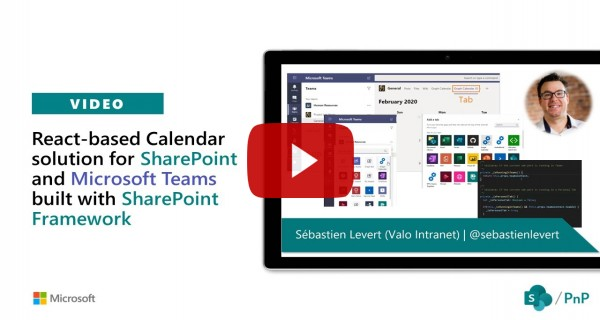

# Graph Calendar

## Summary
This is a sample web part developed using React Framework to gather events from the underlying group calendar of a Team site. This sample also demonstrates the utilization of web parts as Teams tabs and Personal tab and offering a visualization context to change behaviors based on the platform used (Getting the proper information from the team vs. SharePoint site, understanding the context of the theme on Teams, etc.).

### Web Part in SharePoint Online

### Web Part in Microsoft Teams

Web part is developed using below technologies 
* React Framework
* Full Calendar (fullcalendar.io)
* Microsoft Teams API
* Office UI Fabric

## Compatibility

 
 

-Incompatible-red.svg "SharePoint Server 2016 Feature Pack 2 requires SPFx 1.1")

## Applies to

* [SharePoint Framework](https://docs.microsoft.com/sharepoint/dev/spfx/sharepoint-framework-overview)
* [Office 365 tenant](https://docs.microsoft.com/sharepoint/dev/spfx/set-up-your-development-environment)

## Prerequisites
 
It is required that the users have view access on the underlying calendar.

## Solution

Solution|Author(s)
--------|---------
react-graph-calendar | [Sébastien Levert](https://github.com/sebastienlevert) (https://www.linkedin.com/in/sebastienlevert) ([@sebastienlevert](https://twitter.com/sebastienlevert))
react-graph-calendar | [Abderahman Moujahid](https://github.com/Abderahman88) (added support for recurring events and languages)

## Version history

Version|Date|Comments
-------|----|--------
1.0 |December 29, 2019 | Initial Release
1.1 |January 08, 2020 | Bumped to SPFx 1.10 and added the Personal Tab support
1.2 |October 27, 2020 | Recurring events support
1.2.1|November 1, 2020 | Changed return behavior for single items vs recurring items
1.2.2|November 3, 2020 | Show calendar in other languages
1.2.3|November 6, 2020 | Added property panel translations (English, French, Dutch)

## Minimal Path to Awesome

- Clone this repository
- From your command line, change your current directory to the directory containing this sample (`react-graph-calendar`, located under `samples`)
- in the command line run:
  - `npm install`
  - `gulp serve`
  - `gulp bundle --ship`
  - `gulp package-solution --ship`
  - Add to AppCatalog and deploy
  - Sync to Teams

>  This sample can also be opened with [VS Code Remote Development](https://code.visualstudio.com/docs/remote/remote-overview). Visit https://aka.ms/spfx-devcontainer for further instructions.

## Video

## Help

We do not support samples, but this community is always willing to help, and we want to improve these samples. We use GitHub to track issues, which makes it easy for  community members to volunteer their time and help resolve issues.

If you're having issues building the solution, please run [spfx doctor](https://pnp.github.io/cli-microsoft365/cmd/spfx/spfx-doctor/) from within the solution folder to diagnose incompatibility issues with your environment.

You can try looking at [issues related to this sample](https://github.com/pnp/sp-dev-fx-webparts/issues?q=label%3A%22sample%3A%20react-graph-calendar") to see if anybody else is having the same issues.

You can also try looking at [discussions related to this sample](https://github.com/pnp/sp-dev-fx-webparts/discussions?discussions_q=react-graph-calendar) and see what the community is saying.

If you encounter any issues while using this sample, [create a new issue](https://github.com/pnp/sp-dev-fx-webparts/issues/new?assignees=&labels=Needs%3A+Triage+%3Amag%3A%2Ctype%3Abug-suspected%2Csample%3A%20react-graph-calendar&template=bug-report.yml&sample=react-graph-calendar&authors=@Abderahman88%20@sebastienlevert&title=react-graph-calendar%20-%20).

For questions regarding this sample, [create a new question](https://github.com/pnp/sp-dev-fx-webparts/issues/new?assignees=&labels=Needs%3A+Triage+%3Amag%3A%2Ctype%3Aquestion%2Csample%3A%20react-graph-calendar&template=question.yml&sample=react-graph-calendar&authors=@Abderahman88%20@sebastienlevert&title=react-graph-calendar%20-%20).

Finally, if you have an idea for improvement, [make a suggestion](https://github.com/pnp/sp-dev-fx-webparts/issues/new?assignees=&labels=Needs%3A+Triage+%3Amag%3A%2Ctype%3Aenhancement%2Csample%3A%20react-graph-calendar&template=question.yml&sample=react-graph-calendar&authors=@Abderahman88%20@sebastienlevert&title=react-graph-calendar%20-%20).

## Disclaimer

**THIS CODE IS PROVIDED *AS IS* WITHOUT WARRANTY OF ANY KIND, EITHER EXPRESS OR IMPLIED, INCLUDING ANY IMPLIED WARRANTIES OF FITNESS FOR A PARTICULAR PURPOSE, MERCHANTABILITY, OR NON-INFRINGEMENT.**

