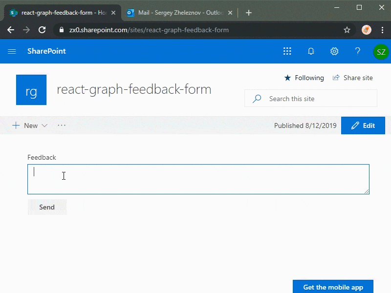

# Feedback Form

## Summary

Sample SPFx React web part which allows sending emails using Microsoft Graph.

## Compatibility

 
 

-Incompatible-red.svg "SharePoint Server 2016 Feature Pack 2 requires SPFx 1.1")

## Applies to

* [SharePoint Framework](https://docs.microsoft.com/sharepoint/dev/spfx/sharepoint-framework-overview)
* [Office 365 tenant](https://docs.microsoft.com/sharepoint/dev/spfx/set-up-your-development-environment)

## Solution

Solution|Author(s)
--------|---------
react-graph-feedback-form|Sergei Zheleznov (CollabStack)

## Version history

Version|Date|Comments
-------|----|--------
1.0.0|August 12, 2019|Initial release
1.0.3|Dec 15, 2019|Added Logger (@pnp/logging), Added max message length property (PropertyFieldNumber control from spfx-controls-react), Code refactoring, SPFx updated to 1.9.1
1.0.4|May 15, 2020|Upgraded to SPFx 1.10.0 (Hugo Bernier)

## Minimal Path to Awesome

* clone this repo
* in the command line run:
  * `npm i`
  * `gulp bundle --ship`
  * `gulp package-solution --ship`
* deploy the package to your app catalog
* approve the API permission request to access e-mails using Microsoft Graph
* add the web part to a page

>  This sample can also be opened with [VS Code Remote Development](https://code.visualstudio.com/docs/remote/remote-overview). Visit https://aka.ms/spfx-devcontainer for further instructions.

## Features

This sample illustrates the following concepts:

* using MSGraphClient to communicate with the Microsoft Graph in a SharePoint Framework solution
* requesting API permissions in a SharePoint Framework package
* sending e-mails using Microsoft Graph
* using MSGraphClient in a SharePoint Framework web part
* using @microsoft/microsoft-graph-types
* using @pnp/logging
* using @pnp/spfx-property-controls

## Help

We do not support samples, but we this community is always willing to help, and we want to improve these samples. We use GitHub to track issues, which makes it easy for  community members to volunteer their time and help resolve issues.

If you're having issues building the solution, please run [spfx doctor](https://pnp.github.io/cli-microsoft365/cmd/spfx/spfx-doctor/) from within the solution folder to diagnose incompatibility issues with your environment.

You can try looking at [issues related to this sample](https://github.com/pnp/sp-dev-fx-webparts/issues?q=label%3A%22sample%3A%20react-graph-feedback-form") to see if anybody else is having the same issues.

You can also try looking at [discussions related to this sample](https://github.com/pnp/sp-dev-fx-webparts/discussions?discussions_q=react-graph-feedback-form) and see what the community is saying.

If you encounter any issues while using this sample, [create a new issue](https://github.com/pnp/sp-dev-fx-webparts/issues/new?assignees=&labels=Needs%3A+Triage+%3Amag%3A%2Ctype%3Abug-suspected%2Csample%3A%20react-graph-feedback-form&template=bug-report.yml&sample=react-graph-feedback-form&authors=@hugoabernier&title=react-graph-feedback-form%20-%20).

For questions regarding this sample, [create a new question](https://github.com/pnp/sp-dev-fx-webparts/issues/new?assignees=&labels=Needs%3A+Triage+%3Amag%3A%2Ctype%3Aquestion%2Csample%3A%20react-graph-feedback-form&template=question.yml&sample=react-graph-feedback-form&authors=@hugoabernier&title=react-graph-feedback-form%20-%20).

Finally, if you have an idea for improvement, [make a suggestion](https://github.com/pnp/sp-dev-fx-webparts/issues/new?assignees=&labels=Needs%3A+Triage+%3Amag%3A%2Ctype%3Aenhancement%2Csample%3A%20react-graph-feedback-form&template=question.yml&sample=react-graph-feedback-form&authors=@hugoabernier&title=react-graph-feedback-form%20-%20).

## Disclaimer

**THIS CODE IS PROVIDED *AS IS* WITHOUT WARRANTY OF ANY KIND, EITHER EXPRESS OR IMPLIED, INCLUDING ANY IMPLIED WARRANTIES OF FITNESS FOR A PARTICULAR PURPOSE, MERCHANTABILITY, OR NON-INFRINGEMENT.**

