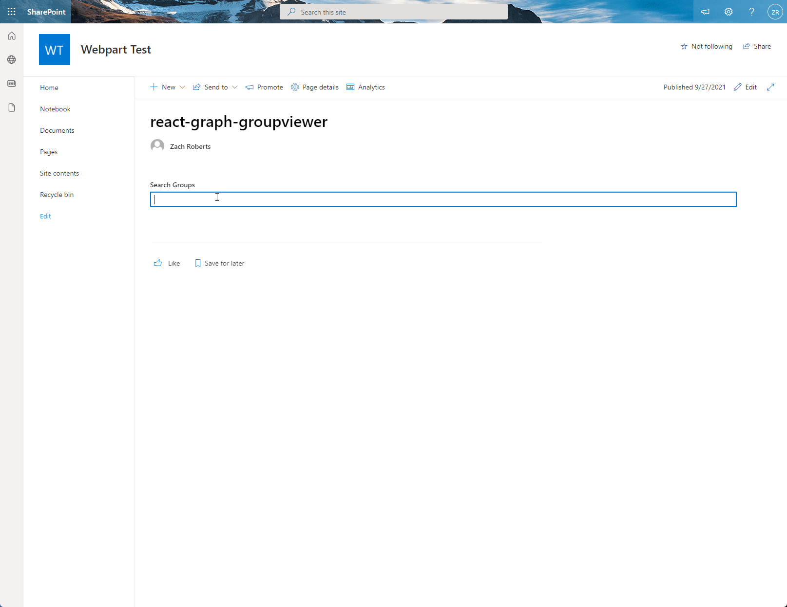

# Graph Group Viewer

## Summary

This webpart will provide the functionality to search for groups in your tenant and allow you to view the details of the selected group as well as view a list of group members and export the list of members to a CSV file.

## Compatibility

 

 

## Applies to

* [SharePoint Framework](https://docs.microsoft.com/sharepoint/dev/spfx/sharepoint-framework-overview)
* [Microsoft 365 tenant](https://docs.microsoft.com/sharepoint/dev/spfx/set-up-your-development-environment)
* [Microsoft Graph](https://docs.microsoft.com/en-us/graph/overview)
* [PnP React Controls](https://pnp.github.io/sp-dev-fx-controls-react/)

## Solution

Solution|Author(s)
--------|---------
react-graph-groupviewer | [Zach Roberts](https://github.com/zachroberts8668) ([@ZachSPODev](https://twitter.com/ZachSPODev))

## Version history

Version|Date|Comments
-------|----|--------
1.0|September 27, 2021|Initial release

## Prerequisites
There are no prerequisites to use this webpart.

## Minimal Path to Awesome

* Clone this repository
* If your SharePoint tenant does not already allow API access to the following Microsoft Graph permissions: Directory.Read.All, Group.Read.All and GroupMember.Read.All then please follow the below instructions.
    * in the command line run:
      * `npm install`
      * `gulp build --ship`
      * `gulp bundle --ship`
      * `gulp package-solution --ship`
    * browse to your SharePoint app catalog and load the SPFX package. Once loaded you will need to browse to your SharePoint Admin Center and under advanced you will need to open Api Access and allow the requests for Microsoft Graph. 
* If you have the APIs permissions already allowed you can follow the below steps.
    * in the command line run:
        * `npm install`
        * `gulp serve --nobrowser`
    * browse to your hosted workbench and add the webpart.

## Features

This Web Part illustrates the following concepts on top of the SharePoint Framework:

* Using Microsoft Graph to search for groups and return group members for the selected group.
* Exporting loaded data to a CSV file using [CSVLink](https://github.com/react-csv/react-csv)

## Disclaimer

**THIS CODE IS PROVIDED *AS IS* WITHOUT WARRANTY OF ANY KIND, EITHER EXPRESS OR IMPLIED, INCLUDING ANY IMPLIED WARRANTIES OF FITNESS FOR A PARTICULAR PURPOSE, MERCHANTABILITY, OR NON-INFRINGEMENT.**

## Help

We do not support samples, but we this community is always willing to help, and we want to improve these samples. We use GitHub to track issues, which makes it easy for  community members to volunteer their time and help resolve issues.

If you encounter any issues while using this sample, [create a new issue](https://github.com/pnp/sp-dev-fx-webparts/issues/new?assignees=&labels=Needs%3A+Triage+%3Amag%3A%2Ctype%3Abug-suspected&template=bug-report.yml&sample=react-graph-groupviewer&authors=@zroberts8668&title=react-graph-groupviewer%20-%20).

For questions regarding this sample, [create a new question](https://github.com/pnp/sp-dev-fx-webparts/issues/new?assignees=&labels=Needs%3A+Triage+%3Amag%3A%2Ctype%3Abug-suspected&template=question.yml&sample=react-graph-groupviewer&authors=@zroberts8668&title=react-graph-groupviewer%20-%20).

Finally, if you have an idea for improvement, [make a suggestion](https://github.com/pnp/sp-dev-fx-webparts/issues/new?assignees=&labels=Needs%3A+Triage+%3Amag%3A%2Ctype%3Abug-suspected&template=suggestion.yml&sample=react-graph-groupviewer&authors=@zroberts8668&title=react-graph-groupviewer%20-%20).

