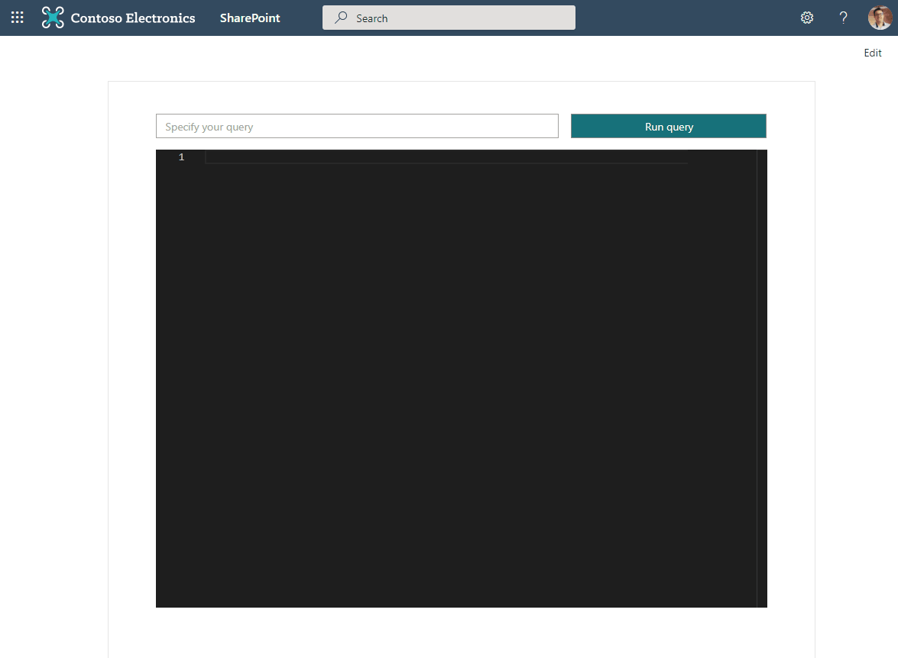

# Graph MGT Client

## Summary

This is a sample web part developed using React Framework that showcases how to use the latest `microsoft-graph-client` in order to do advanced configuration of the Microsoft Graph client. This enables scenarios like throttling management, Chaos management and a lot more!



## Compatibility


-Incompatible-red.svg "SharePoint Server 2016 Feature Pack 2 requires SPFx 1.1")


## Applies to

- [SharePoint Framework](https://aka.ms/spfx)
- [Microsoft 365 tenant](https://docs.microsoft.com/en-us/sharepoint/dev/spfx/set-up-your-developer-tenant)

> Get your own free development tenant by subscribing to [Microsoft 365 developer program](http://aka.ms/o365devprogram)

## Prerequisites

In the `package-solution.json` file, ensure that the scopes are available for the calls you want to do on Microsoft Graph.

```json
"webApiPermissionRequests": [
      {
        "resource": "Microsoft Graph",
        "scope": "User.Read.All"
      },
      {
        "resource": "Microsoft Graph",
        "scope": "Calendars.Read"
      }
    ],
```

## Solution

Solution|Author(s)
--------|---------
react-graph-mgt-client | [Sébastien Levert](https://www.linkedin.com/in/sebastienlevert), Microsoft ([@sebastienlevert](https://twitter.com/sebastienlevert))

## Version history

Version|Date|Comments
-------|----|--------
1.0|April 18, 2021|Initial release


## Minimal Path to Awesome

- Clone this repository
- Ensure that you are at the solution folder
- in the command-line run:
  - `npm install`
  - `gulp bundle`
  - `gulp package-solution`
- Deploy the generated *.sppkg to your App Catalog
- Approve the Microsoft Graph scopes
- in the command-line run:
  - `gulp serve`

>  This sample can also be opened with [VS Code Remote Development](https://code.visualstudio.com/docs/remote/remote-overview). Visit https://aka.ms/spfx-devcontainer for further instructions.


## Features

This sample illustrates how to leverage the Microsoft Graph Toolkit providers to extend the experience of using the `microsoft-graph-client` in SharePoint Framework and overcomes some of its current limitations.

This sample illustrates the following concepts:

- Adding MGT providers to an existing SPFx solution
- Replace Microsoft Graph calls built using the integrated Microsoft Graph client
- Use the latest and greatest Microsoft Graph client in order to have more power over your calls

## References

- [Getting started with SharePoint Framework](https://docs.microsoft.com/en-us/sharepoint/dev/spfx/set-up-your-developer-tenant)
- [Building for Microsoft teams](https://docs.microsoft.com/en-us/sharepoint/dev/spfx/build-for-teams-overview)
- [Use Microsoft Graph in your solution](https://docs.microsoft.com/en-us/sharepoint/dev/spfx/web-parts/get-started/using-microsoft-graph-apis)
- [Publish SharePoint Framework applications to the Marketplace](https://docs.microsoft.com/en-us/sharepoint/dev/spfx/publish-to-marketplace-overview)
- [Microsoft 365 Patterns and Practices](https://aka.ms/m365pnp) - Guidance, tooling, samples and open-source controls for your Microsoft 365 development


## Disclaimer

**THIS CODE IS PROVIDED *AS IS* WITHOUT WARRANTY OF ANY KIND, EITHER EXPRESS OR IMPLIED, INCLUDING ANY IMPLIED WARRANTIES OF FITNESS FOR A PARTICULAR PURPOSE, MERCHANTABILITY, OR NON-INFRINGEMENT.**


