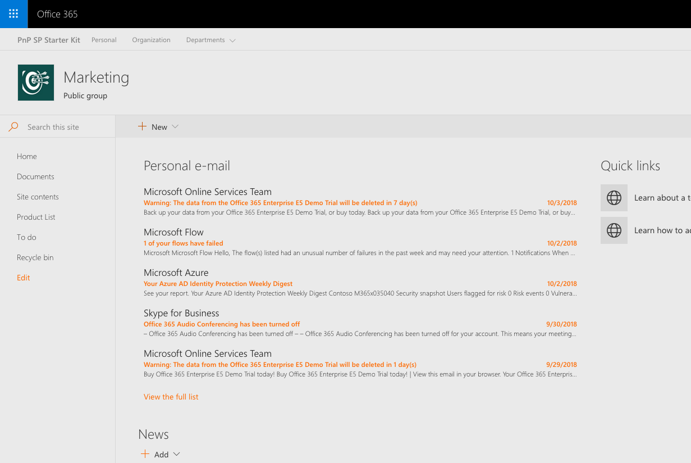

# Personal e-mail

## Summary

Sample React web part showing how to retrieve and display personal e-mail retrieved using the Microsoft Graph.

## Compatibility

 
 

-Incompatible-red.svg "SharePoint Server 2016 Feature Pack 2 requires SPFx 1.1")

## Applies to

* [SharePoint Framework](https://docs.microsoft.com/sharepoint/dev/spfx/sharepoint-framework-overview)
* [Office 365 developer tenant](https://docs.microsoft.com/sharepoint/dev/spfx/set-up-your-developer-tenant)

## Solution

Solution|Author(s)
--------|---------
react-graph-personalemail|Waldek Mastykarz (MVP, Rencore, @waldekm)

## Version history

Version|Date|Comments
-------|----|--------
1.0|October 3, 2018|Initial release

## Minimal Path to Awesome

* clone this repo
* in the command line run:
  * `npm i`
  * `gulp bundle --ship`
  * `gulp package-solution --ship`
* deploy the package to your app catalog
* approve the API permission request to access e-mails using Microsoft Graph
* add the web part to a page

## Features

This sample illustrates the following concepts on top of the SharePoint Framework:

* using the MSGraphClient to communicate with the Microsoft Graph in a SharePoint Framework solution
* requesting API permissions in a SharePoint Framework package
* retrieving e-mails using the Microsoft Graph
* using the MSGraphClient in a SharePoint Framework web part

## Disclaimer

**THIS CODE IS PROVIDED *AS IS* WITHOUT WARRANTY OF ANY KIND, EITHER EXPRESS OR IMPLIED, INCLUDING ANY IMPLIED WARRANTIES OF FITNESS FOR A PARTICULAR PURPOSE, MERCHANTABILITY, OR NON-INFRINGEMENT.**

