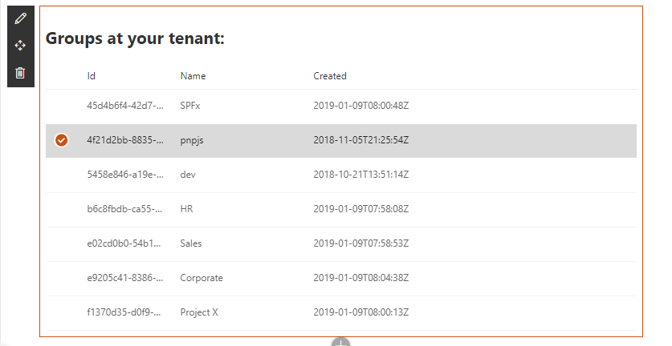
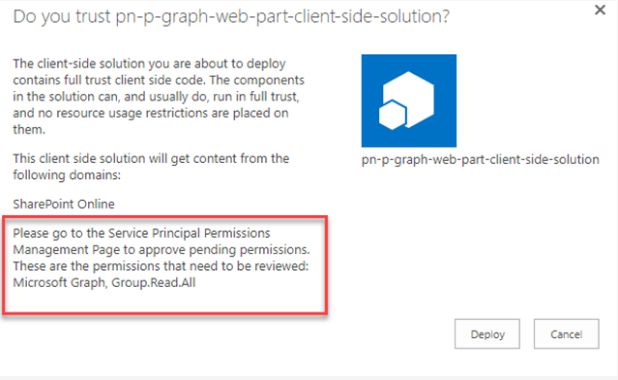
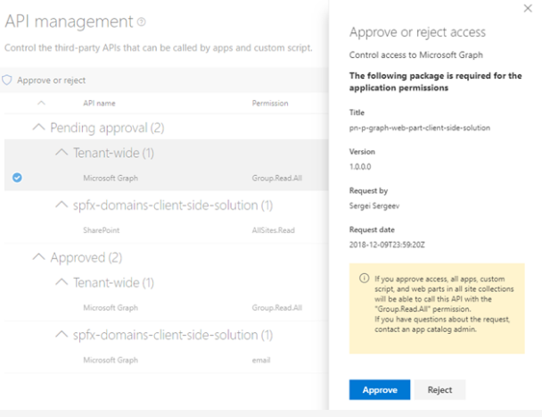

# Using PnPJS with Microsoft Graph

## Summary
This web part demonstrates how to use [PnPJS](https://pnp.github.io/pnpjs/) with SharePoint Framework and how to query [Microsoft Graph](https://learn.microsoft.com/graph/overview) with PnPJS.
It requests a list of Azure AD [groups](https://learn.microsoft.com/graph/api/group-list?view=graph-rest-1.0) at your tenant and shows them using [Office UI Fabric React](https://developer.microsoft.com/en-us/fabric#/components) list.

## Compatibility

| :warning: Important          |
|:---------------------------|
| Every SPFx version is only compatible with specific version(s) of Node.js. In order to be able to build this sample, please ensure that the version of Node on your workstation matches one of the versions listed in this section. This sample will not work on a different version of Node.|
|Refer to <https://aka.ms/spfx-matrix> for more information on SPFx compatibility.   |

 
 

-Incompatible-red.svg "SharePoint Server 2016 Feature Pack 2 requires SPFx 1.1")

## Applies to
* [SharePoint Framework](https://learn.microsoft.com/sharepoint/dev/spfx/sharepoint-framework-overview)
* [Office 365 developer tenant](https://learn.microsoft.com/sharepoint/dev/spfx/set-up-your-developer-tenant)

## Contributors

* [Sergei Sergeev](https://github.com/SergeevSergeiS) 

## Version history

Version|Date|Comments
-------|----|--------
1.0|Jan 09, 2019|Initial release

## Minimal Path to Awesome
- clone this repo
- navigate to the folder with current sample
- restore dependencies: `$ npm i`
- bundle solution: `$ gulp bundle --ship`
- package solution: `$ gulp package-solution --ship`
- locate solution at `./sharepoint/solution/pn-p-graph-web-part.sppkg` and upload it to your tenant app catalog
- you will see a message saying that solution has pending permissions which need to be approved:  

- you should approve permission requests from your SharePoint Framework web part. There are [different options available](https://learn.microsoft.com/sharepoint/dev/spfx/use-aadhttpclient#manage-permission-requests) - new SharePoint Admin UI, PowerShell, [`$o365`](https://pnp.github.io/office365-cli/) cli. For the matter of this sample, the fastest way to do it is through new SharePoint Admin UI. Open Web API permission management page by navigating to the url `https://<org>-admin.sharepoint.com/_layouts/15/online/AdminHome.aspx#/webApiPermissionManagement` (changing `<org>` to your real organization name) or by going to the new Admin UI directly from old SharePoint Admin Center. Select Pending `Group.Read.All` request and approve it:

- run `$ gulp serve` and open hosted workbench, i.e. `https://<org>.sharepoint.com/sites/<your site>/_layouts/15/workbench.aspx`
- add `PnPGraph` web part to see it in action

>  This sample can also be opened with [VS Code Remote Development](https://code.visualstudio.com/docs/remote/remote-overview). Visit https://aka.ms/spfx-devcontainer for further instructions.

## Features  
Web part in this solution illustrates the following concepts on top of the SharePoint Framework:
- showcases PnPJS configuration inside SharePoint Framework
- showcases how to use MS Graph with PnPJS 
- showcases how to correctly configure SharePoint Framework solution and tenant to allow PnPJS to call MS Graph

## Disclaimer

**THIS CODE IS PROVIDED *AS IS* WITHOUT WARRANTY OF ANY KIND, EITHER EXPRESS OR IMPLIED, INCLUDING ANY IMPLIED WARRANTIES OF FITNESS FOR A PARTICULAR PURPOSE, MERCHANTABILITY, OR NON-INFRINGEMENT.**

