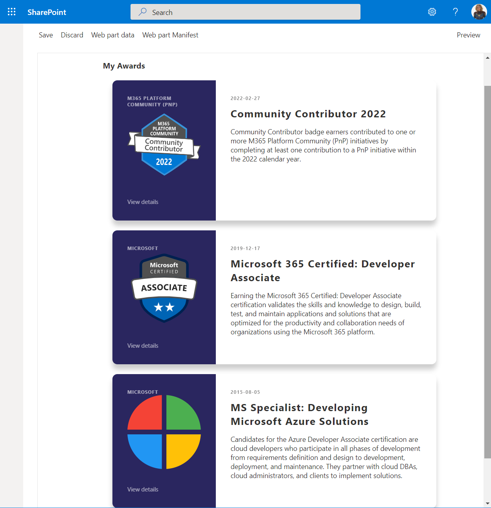

# My Awards

## Summary

This webpart is using the beta MS Graph Profile endpoint to list your awards. At the time of writing this sample (May 2022), this is a Beta endpoint, so it could change in the future. A future version of this webpart could include the ability to add new awards to your profile. 

In the meantime, you can add a new award using this request: [https://docs.microsoft.com/en-us/graph/api/profile-post-awards?view=graph-rest-beta&tabs=http](https://docs.microsoft.com/en-us/graph/api/profile-post-awards?view=graph-rest-beta&tabs=http) (You can use [Graph Explorer](https://developer.microsoft.com/en-us/graph/graph-explorer) tool to do so.)

## Used SharePoint Framework Version

## Applies to

- [SharePoint Framework](https://aka.ms/spfx)
- [Microsoft 365 tenant](https://docs.microsoft.com/en-us/sharepoint/dev/spfx/set-up-your-developer-tenant)

> Get your own free development tenant by subscribing to [Microsoft 365 developer program](http://aka.ms/o365devprogram)

## Prerequisites

> You need to grant any of these permissions to MS Graph API (from least to most privileged): _User.Read, User.ReadWrite, User.ReadBasic.All, User.Read.All, User.ReadWrite.All_

> Suggest you to use the [Microsoft 365 CLI](https://blog.mastykarz.nl/grant-api-permissions-office-365-cli/)

## Solution

| Solution    | Author(s)                                               |
| ----------- | ------------------------------------------------------- |
| react-graph-profile-awards | Luis Mañez (MVP, [ClearPeople](http://www.clearpeople.com), @luismanez) |

## Version history

| Version | Date             | Comments        |
| ------- | ---------------- | --------------- |
| 1.0     | May 23, 2022 | Initial release |

## Disclaimer

**THIS CODE IS PROVIDED _AS IS_ WITHOUT WARRANTY OF ANY KIND, EITHER EXPRESS OR IMPLIED, INCLUDING ANY IMPLIED WARRANTIES OF FITNESS FOR A PARTICULAR PURPOSE, MERCHANTABILITY, OR NON-INFRINGEMENT.**

---

## Minimal Path to Awesome

- Clone this repository
- Configure SharePoint permissions to Graph API (see Prerequisites). Suggest you to use the [Microsoft 365 CLI](https://blog.mastykarz.nl/grant-api-permissions-office-365-cli/)
- Ensure that you are at the solution folder
- in the command-line run:
  - **npm install**
  - **gulp serve**

## Features

This extension illustrates the following concepts:

- Using the MS Graph Profile Awards endpoint to list the awards of the current user
- Using ServiceScope and DI concept to get a _MSGraphClientFactory_

## References

- [Getting started with SharePoint Framework](https://docs.microsoft.com/en-us/sharepoint/dev/spfx/set-up-your-developer-tenant)
- [Building for Microsoft teams](https://docs.microsoft.com/en-us/sharepoint/dev/spfx/build-for-teams-overview)
- [Use Microsoft Graph in your solution](https://docs.microsoft.com/en-us/sharepoint/dev/spfx/web-parts/get-started/using-microsoft-graph-apis)
- [Publish SharePoint Framework applications to the Marketplace](https://docs.microsoft.com/en-us/sharepoint/dev/spfx/publish-to-marketplace-overview)
- [Microsoft 365 Patterns and Practices](https://aka.ms/m365pnp) - Guidance, tooling, samples and open-source controls for your Microsoft 365 development
