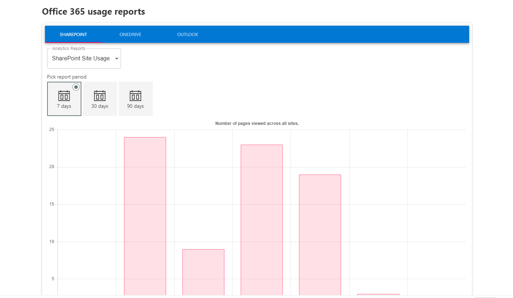
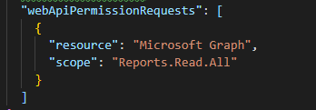

# Office 365 Usage Reports using Microsoft Graph

## Summary
This sample describe a SPFx application which retrieve an office 365 usage reports using Microsoft Graph API. This application also use chartjs library to generate graph.

## Compatibility

 
 

-Incompatible-red.svg "SharePoint Server 2016 Feature Pack 2 requires SPFx 1.1")

## Applies to

* [SharePoint Framework](https://docs.microsoft.com/sharepoint/dev/spfx/sharepoint-framework-overview)
* [Office 365 tenant](https://docs.microsoft.com/sharepoint/dev/spfx/set-up-your-development-environment)

## Prerequisites
 
> You need following set of permissions in order to retrieve office 365 usage reports. Find out more about consuming the [Microsoft Graph API in the SharePoint Framework](https://docs.microsoft.com/en-us/sharepoint/dev/spfx/use-aad-tutorial)   

## Solution

Solution|Author(s)
--------|---------
react-graph-reports | [Ejaz Hussain](https://github.com/ejazhussain)

## Version history

Version|Date|Comments
-------|----|--------
1.0|April 09, 2019|Initial release

## Minimal Path to Awesome

- Clone this repository
- in the command line run:
  - `npm install`
  - `gulp serve`

>  This sample can also be opened with [VS Code Remote Development](https://code.visualstudio.com/docs/remote/remote-overview). Visit https://aka.ms/spfx-devcontainer for further instructions.

If you have not previously granted the required Microsoft Graph permissions, you need to:

- Run `gulp bundle --ship`
- Run `gulp package-solution --ship`
- Install the `.sppkg` file (under `.\sharepoint\solution`) to the SP app catalog
- Approve the API permissions in the new SP admin center

## Features
Here are main features for this application

- Material UI Components (Tab)
- Microsoft Graph API to retrieve Office 365 Usage reports
- ChartJS integrations
- Dependency Injection in SPFx using Service Scope

## Help

We do not support samples, but this community is always willing to help, and we want to improve these samples. We use GitHub to track issues, which makes it easy for  community members to volunteer their time and help resolve issues.

If you're having issues building the solution, please run [spfx doctor](https://pnp.github.io/cli-microsoft365/cmd/spfx/spfx-doctor/) from within the solution folder to diagnose incompatibility issues with your environment.

You can try looking at [issues related to this sample](https://github.com/pnp/sp-dev-fx-webparts/issues?q=label%3A%22sample%3A%20react-graph-reports%22) to see if anybody else is having the same issues.

You can also try looking at [discussions related to this sample](https://github.com/pnp/sp-dev-fx-webparts/discussions?discussions_q=react-graph-reports) and see what the community is saying.

If you encounter any issues while using this sample, [create a new issue](https://github.com/pnp/sp-dev-fx-webparts/issues/new?assignees=&labels=Needs%3A+Triage+%3Amag%3A%2Ctype%3Abug-suspected%2Csample%3A%20react-graph-reports&template=bug-report.yml&sample=react-graph-reports&authors=@ejazhussain&title=react-graph-reports%20-%20).

For questions regarding this sample, [create a new question](https://github.com/pnp/sp-dev-fx-webparts/issues/new?assignees=&labels=Needs%3A+Triage+%3Amag%3A%2Ctype%3Aquestion%2Csample%3A%20react-graph-reports&template=question.yml&sample=react-graph-reports&authors=@ejazhussain&title=react-graph-reports%20-%20).

Finally, if you have an idea for improvement, [make a suggestion](https://github.com/pnp/sp-dev-fx-webparts/issues/new?assignees=&labels=Needs%3A+Triage+%3Amag%3A%2Ctype%3Aenhancement%2Csample%3A%20react-graph-reports&template=suggestion.yml&sample=react-graph-reports&authors=@ejazhussain&title=react-graph-reports%20-%20).

## Disclaimer

**THIS CODE IS PROVIDED *AS IS* WITHOUT WARRANTY OF ANY KIND, EITHER EXPRESS OR IMPLIED, INCLUDING ANY IMPLIED WARRANTIES OF FITNESS FOR A PARTICULAR PURPOSE, MERCHANTABILITY, OR NON-INFRINGEMENT.**

