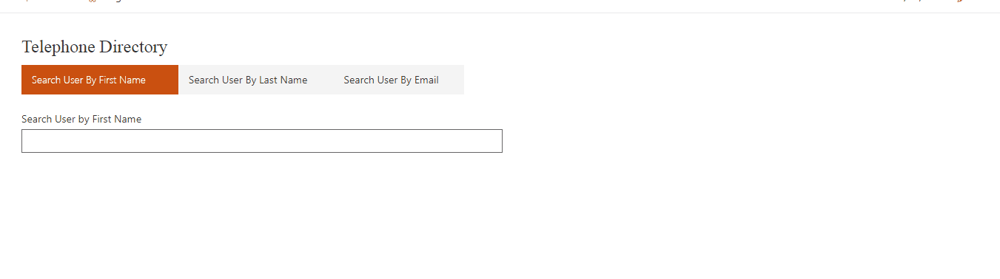
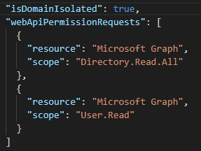

# Telephone Directory using React, Ms Graph and SPFx

## Summary
This is sample webpart using SPFx and MSGraph to fetch the users information based on First Name, Last Name and Email Address.
webpart will fetch data from directory using Graph API and display in details list.

## Used SharePoint Framework Version

## Applies to

* [SharePoint Framework](https://docs.microsoft.com/sharepoint/dev/spfx/sharepoint-framework-overview)
* [Office 365 tenant](https://docs.microsoft.com/sharepoint/dev/spfx/set-up-your-development-environment)
* [Microsoft Graph API](https://docs.microsoft.com/en-us/graph/overview)
* [Fluent UI](https://developer.microsoft.com/en-us/fluentui#/)
* [PnP Controls](https://pnp.github.io/sp-dev-fx-controls-react/)

## Prerequisites

> Define Graph API scope to Package-solution.json

## Solution

Solution|Author(s)
--------|---------
react-graph-telephonedirectory | [Dipen Shah](https://github.com/Dips365) ([@Dips_365](https://twitter.com/Dips_365))

## Version history

Version|Date|Comments
-------|----|--------
1.0|July 14,2020 | Initial Release

## Disclaimer

**THIS CODE IS PROVIDED *AS IS* WITHOUT WARRANTY OF ANY KIND, EITHER EXPRESS OR IMPLIED, INCLUDING ANY IMPLIED WARRANTIES OF FITNESS FOR A PARTICULAR PURPOSE, MERCHANTABILITY, OR NON-INFRINGEMENT.**

---

## Minimal Path to Awesome

* Clone this repository
* in the command line run:
  
  * `npm install`
  * `gulp build`
  * `gulp bundle`
  * `gulp package-solution`
  * [Upload .sppkg to appcatalog](https://www.slideshare.net/Dipen038/upload-sp-solution)
  * `Go to SharePoint Admin to grant access on graph API ` https://<Tenant>-admin.sharepoint.com/_layouts/15/online/AdminHome.aspx?source=sitecollections#/webApiPermissionManagement
  * `gulp serve`

## Features 

Demonstrates integration of SPFx and Graph API to search the organizational users information.

Description of the web part with possible additional details than in short summary. 
This Web Part illustrates the following concepts on top of the SharePoint Framework:

* Detail List control from Fluent UI
* Webpart Title control from PnP React
* Microsoft Graph API
* External API Integration with SharePoint Framework

