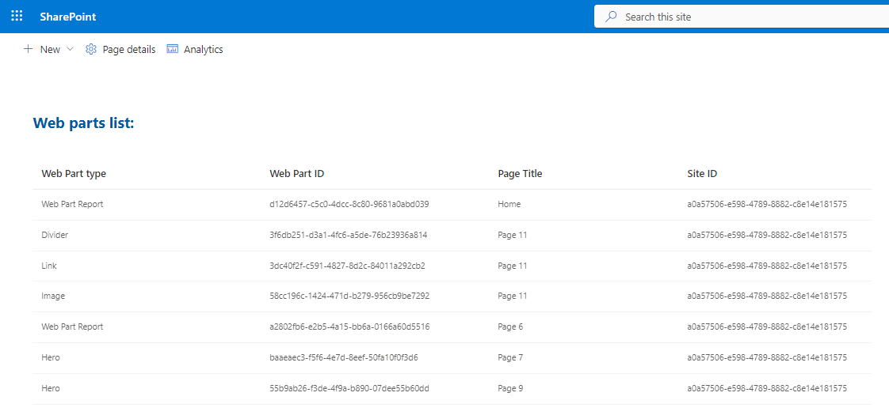
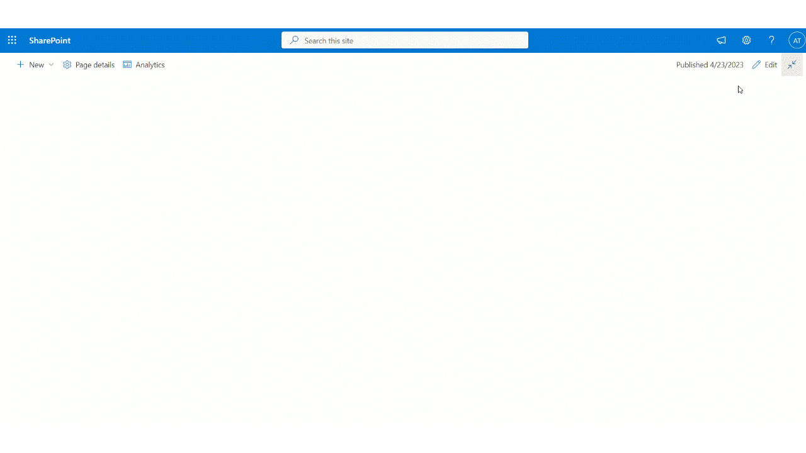

# Web Part Report

## Summary

This sample web part shows a report of the web parts used on the current site.

 Compatibility

| :warning: Important          |
|:---------------------------|
| Every SPFx version is optimally compatible with specific versions of Node.js. In order to be able to build this sample, you need to ensure that the version of Node on your workstation matches one of the versions listed in this section. This sample will not work on a different version of Node.|
|Refer to <https://aka.ms/spfx-matrix> for more information on SPFx compatibility.   |

This sample is optimally compatible with the following environment configuration:

-Incompatible-red.svg "SharePoint Server 2016 Feature Pack 2 requires SPFx 1.1")

## Applies to

* [SharePoint Framework](https://learn.microsoft.com/sharepoint/dev/spfx/sharepoint-framework-overview)
* [Microsoft 365 tenant](https://learn.microsoft.com/sharepoint/dev/spfx/set-up-your-development-environment)

> Get your own free development tenant by subscribing to [Microsoft 365 developer program](http://aka.ms/m365devprogram)

## Prerequisites

Microsoft Graph permission:

* Sites.Read.All

## Contributors

* [Aimery Thomas](https://github.com/a1mery) |

## Version history

| Version | Date             | Comments        |
| ------- | ---------------- | --------------- |
| 1.0     | March 23, 2023 | Initial release |
| 2.0     | July 11, 2023  | Add minor features|

## Minimal Path to Awesome

* Clone this repository (or [download this solution as a .ZIP file](https://pnp.github.io/download-partial/?url=https://github.com/pnp/sp-dev-fx-webparts/tree/main/samples/react-graph-webpart-report) then unzip it)
* From your command line, change your current directory to the directory containing this sample (`react-graph-webpart-report`, located under `samples`)
* in the command line run:
  * `npm install`
  - `gulp bundle`
  - `gulp package-solution`
- Deploy the package to your app catalog
- Approve the API permission request from the SharePoint admin
- Add the web part to a page
- In the command-line run:
  - `gulp serve --nobrowser`

## Features

This web part illustrates the following concepts:

- Consume the Microsoft Graph API from SPFx web part
- Use of the SharePoint Pages Microsoft Graph API
- Use of [@pnp/spfx-property-controls](https://pnp.github.io/sp-dev-fx-property-controls/) (ListView and CharControl)
- Use of Top Actions

## References

- [Getting started with SharePoint Framework](https://docs.microsoft.com/en-us/sharepoint/dev/spfx/set-up-your-developer-tenant)
- [Use Microsoft Graph in your solution](https://docs.microsoft.com/en-us/sharepoint/dev/spfx/web-parts/get-started/using-microsoft-graph-apis)
- [Adding support for web part Top Actions](https://learn.microsoft.com/en-us/sharepoint/dev/spfx/web-parts/guidance/getting-started-with-top-actions)
- [Microsoft 365 Patterns and Practices](https://aka.ms/m365pnp) - Guidance, tooling, samples and open-source controls for your Microsoft 365 development
- [@pnp/spfx-controls-react](https://pnp.github.io/sp-dev-fx-controls-react/)

## Help

We do not support samples, but this community is always willing to help, and we want to improve these samples. We use GitHub to track issues, which makes it easy for  community members to volunteer their time and help resolve issues.

If you're having issues building the solution, please run [spfx doctor](https://pnp.github.io/cli-microsoft365/cmd/spfx/spfx-doctor/) from within the solution folder to diagnose incompatibility issues with your environment.

You can try looking at [issues related to this sample](https://github.com/pnp/sp-dev-fx-webparts/issues?q=label%3A%22sample%3A%20react-graph-webpart-report%22) to see if anybody else is having the same issues.

You can also try looking at [discussions related to this sample](https://github.com/pnp/sp-dev-fx-webparts/discussions?discussions_q=react-graph-webpart-report) and see what the community is saying.

If you encounter any issues using this sample, [create a new issue](https://github.com/pnp/sp-dev-fx-webparts/issues/new?assignees=&labels=Needs%3A+Triage+%3Amag%3A%2Ctype%3Abug-suspected%2Csample%3A%20react-graph-webpart-report&template=bug-report.yml&sample=react-graph-webpart-report&authors=@a1mery&title=react-graph-webpart-report%20-%20).

For questions regarding this sample, [create a new question](https://github.com/pnp/sp-dev-fx-webparts/issues/new?assignees=&labels=Needs%3A+Triage+%3Amag%3A%2Ctype%3Aquestion%2Csample%3A%20react-graph-webpart-report&template=question.yml&sample=react-graph-webpart-report&authors=@a1mery&title=react-graph-webpart-report%20-%20).

Finally, if you have an idea for improvement, [make a suggestion](https://github.com/pnp/sp-dev-fx-webparts/issues/new?assignees=&labels=Needs%3A+Triage+%3Amag%3A%2Ctype%3Aenhancement%2Csample%3A%20react-graph-webpart-report&template=suggestion.yml&sample=react-graph-webpart-report&authors=@a1mery&title=react-graph-webpart-report%20-%20).

## Disclaimer

**THIS CODE IS PROVIDED *AS IS* WITHOUT WARRANTY OF ANY KIND, EITHER EXPRESS OR IMPLIED, INCLUDING ANY IMPLIED WARRANTIES OF FITNESS FOR A PARTICULAR PURPOSE, MERCHANTABILITY, OR NON-INFRINGEMENT.**

