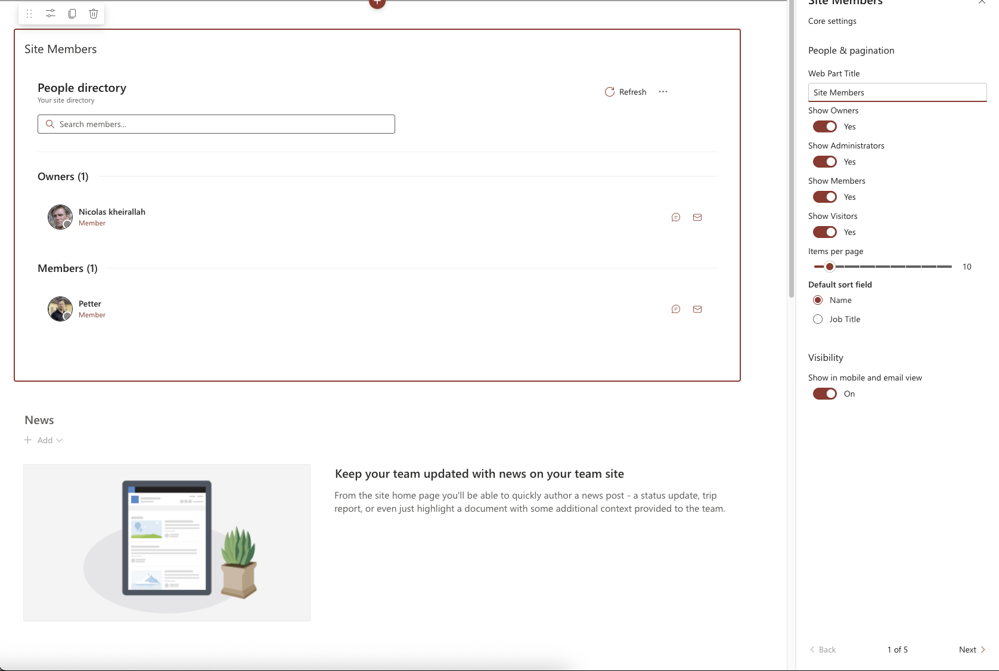

# Group Members Web Part – Microsoft 365 Group User Management

## Summary

The **Group Members Web Part** provides a comprehensive solution for displaying and managing Microsoft 365 group memberships within SharePoint. This web part leverages Microsoft Graph to fetch user data and presents it in an intuitive, responsive interface that supports filtering, search, and quick actions.



## Key Features

- **Role-Based Filtering**: Display users by role (Administrators, Members, Visitors)
- **Advanced User Search**: Filter users by name, title, or other attributes
- **Profile Photo Management**: Intelligent handling of user photos with fallbacks
- **Quick Action Buttons**: One-click access to chat and email capabilities
- **Presence Indicators**: Show real-time Teams presence status
- **Responsive Design**: Optimized for all screen sizes
- **Pagination Controls**: Simple navigation for large groups
- **Customizable Labels**: Rename roles to match your organization's terminology
- **Flexible Configuration**: Extensive property pane options for customization

## Used SharePoint Framework Version


## Applies to

- [SharePoint Framework](https://aka.ms/spfx)
- [Microsoft 365 tenant](https://docs.microsoft.com/en-us/sharepoint/dev/spfx/set-up-your-developer-tenant)
- [Microsoft Graph API](https://docs.microsoft.com/en-us/graph/overview)

> Get your own free development tenant by subscribing to the [Microsoft 365 developer program](http://aka.ms/o365devprogram).

## Prerequisites

- Node.js v18
- SharePoint Framework 1.20.2 or later
- SharePoint Online environment
- Microsoft 365 account with appropriate Graph API permissions

## Solution

| Solution     | Author(s)                                         |
| ------------ | ------------------------------------------------- |
| group-members-webpart | Nicolas Kheirallah |

## Version History

| Version | Date            | Comments                                        |
| ------- | --------------- | ----------------------------------------------- |
| 1.0.0   | 28 February 2025   | Initial release                                 |

## Disclaimer

**THIS CODE IS PROVIDED _AS IS_ WITHOUT WARRANTY OF ANY KIND, EITHER EXPRESS OR IMPLIED, INCLUDING ANY IMPLIED WARRANTIES OF FITNESS FOR A PARTICULAR PURPOSE, MERCHANTABILITY, OR NON-INFRINGEMENT.**

---

## Minimal Path to Awesome

- Clone this repository
- Navigate to the project directory
- In the command line, run:
  - **npm install**
  - **gulp serve** (for local testing)
  - **gulp bundle --ship && gulp package-solution --ship** (for production deployment)
- Upload the generated .sppkg file to your App Catalog
- Approve required Graph API permissions in the SharePoint Admin Center

## Technical Details

### Component Architecture

The web part follows a component-based approach with these key elements:

1. **GroupMembersWebPart**: Main web part that handles configuration and renders the core component
2. **GroupMembersContainer**: Container component that manages state and data fetching
3. **UserCard**: Individual user card component with profile details and actions
4. **SearchBox**: Reusable search component with filtering capabilities
5. **Pagination**: Navigation controls for large member lists
6. **Service Classes**:
   - **GraphService**: Handles all Microsoft Graph API requests
   - **ProfilePhotoService**: Manages user profile photo retrieval and caching
   - **PresenceService**: Retrieves real-time presence information from Teams

### Microsoft Graph Integration

The web part uses Microsoft Graph to retrieve:
- Group membership details
- User profile information
- Profile photos
- Presence status

### Data Flow

1. Web part initializes and determines current group context
2. GraphService fetches group members based on configured roles
3. User data is processed, sorted, and filtered based on web part properties
4. UI components render with appropriate data and action handlers
5. User interactions (search, pagination, etc.) trigger state updates

### Web Part Properties

| Property | Type | Description | Default | Required |
|----------|------|-------------|---------|----------|
| `roles` | Array of Strings | Roles to display (admin, member, visitor) | None | Yes |
| `itemsPerPage` | Number | Number of users per page | 10 | No |
| `sortField` | String | Sort users by 'name' or 'jobTitle' | 'name' | No |
| `showSearchBox` | Boolean | Enable/disable search functionality | true | No |
| `showPresenceIndicator` | Boolean | Show Microsoft Teams presence status | true | No |
| `adminLabel` | String | Custom label for administrators | 'Administrators' | No |
| `memberLabel` | String | Custom label for members | 'Members' | No |
| `visitorLabel` | String | Custom label for visitors | 'Visitors' | No |

### Usage Example

```typescript
// Web part configuration example
{
  roles: ['admin', 'member'],
  itemsPerPage: 15,
  sortField: 'jobTitle',
  showSearchBox: true,
  adminLabel: 'Leadership Team'
}
```

### Advanced Configuration Options

#### Profile Photo Settings

The web part implements sophisticated profile photo handling:

- **Fallback Mechanism**: If a user's profile photo isn't available, the web part generates an avatar with the user's initials
- **Lazy Loading**: Photos are loaded only when visible in the viewport
- **Caching**: Profile photos are cached to improve performance and reduce API calls

#### Search Functionality

The search component supports:

- **Multi-attribute Search**: Search by name, email, job title
- **Instant Results**: Real-time filtering as users type
- **Debounced Input**: Performance optimization for search queries

## Security and Permissions

### Required Microsoft Graph API Permissions

The following Microsoft Graph API permissions are required for full functionality:

| Permission Scope | Purpose | Type |
|-----------------|---------|------|
| `User.Read.All` | Read comprehensive user profiles | Application |
| `User.ReadBasic.All` | Read basic user profile information | Application |
| `Group.Read.All` | Read Microsoft 365 group details | Application |
| `GroupMember.Read.All` | Read group membership information | Application |
| `Presence.Read.All` | Read user presence status in Microsoft Teams | Application |

### Permission Request Process

1. Deploy the web part solution
2. Navigate to the SharePoint Admin Center
3. Go to "Advanced" > "API Access"
4. Approve the requested Microsoft Graph API permissions

### Security Considerations

- Users will only see group members they have permission to view
- Respects existing SharePoint and Microsoft 365 group access controls
- All data is retrieved via secure Graph API calls
- No data is stored locally beyond caching for performance

## Performance Optimizations

- **Incremental Loading**: Large groups load members in batches
- **Caching Strategy**: User data and photos are cached appropriately
- **Throttling Protection**: Implements retry and backoff for API limits
- **Render Optimization**: React memo and callback patterns for performance
- **Virtualized Lists**: For very large groups, only visible items render

## Accessibility Features

- **Keyboard Navigation**: Full keyboard support for all interactive elements
- **Screen Reader Support**: ARIA attributes for better accessibility
- **Focus Management**: Proper focus handling for better keyboard navigation
- **Color Contrast**: Meets WCAG standards for color contrast
- **Text Scaling**: Supports browser text scaling for vision impairments

## Current Limitations

- Presence indicators require additional Graph API permissions
- Performance may degrade with very large groups (1000+ members)
- Quick actions depend on appropriate client applications being installed
- Limited customization for user card appearance

## Troubleshooting

### Common Issues

1. **Missing Graph API Permissions**
   - Symptom: "Access Denied" errors in the console
   - Solution: Ensure API permissions are approved in SharePoint Admin Center

2. **No Users Displayed**
   - Symptom: Empty user list
   - Solution: Verify current page is in a group context or configure default group

3. **Profile Photos Not Loading**
   - Symptom: Initials displayed instead of photos
   - Solution: Check User.Read.All permission and verify user has Exchange Online license

4. **Performance Issues**
   - Symptom: Slow loading or unresponsive UI
   - Solution: Reduce items per page, disable presence indicators for large groups

## References

- [Getting started with SharePoint Framework](https://docs.microsoft.com/en-us/sharepoint/dev/spfx/set-up-your-developer-tenant)
- [Microsoft Graph JavaScript SDK](https://github.com/microsoftgraph/msgraph-sdk-javascript)
- [Microsoft Graph Documentation](https://docs.microsoft.com/en-us/graph/overview)
- [Microsoft 365 Patterns and Practices](https://aka.ms/m365pnp)
- [FluentUI React Components](https://developer.microsoft.com/en-us/fluentui#/controls/web)

