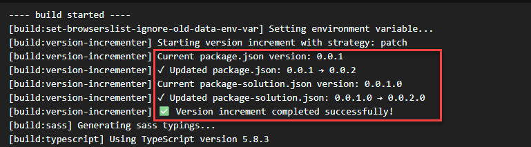

# Building Custom Heft Plugins for SharePoint Framework

## Summary

This sample demonstrates how to build and integrate custom Heft plugins into SharePoint Framework 1.22 projects. It includes a practical **Version Incrementer Plugin** that automatically manages version numbers during production builds.

With SPFx 1.22, Microsoft replaced the Gulp-based build system with Heft. Custom Heft plugins are the modern replacement for Gulp tasks, offering TypeScript support, JSON schema validation, and hook-based architecture.



## Compatibility

| :warning: Important |
|:---------------------------|
| Every SPFx version is optimally compatible with specific versions of Node.js. In order to be able to build this sample, you need to ensure that the version of Node on your workstation matches one of the versions listed in this section. This sample will not work on a different version of Node.|
|Refer to <https://aka.ms/spfx-matrix> for more information on SPFx compatibility. |

This sample is optimally compatible with the following environment configuration:


-Incompatible-red.svg "SharePoint Server 2016 Feature Pack 2 requires SPFx 1.1")


## Applies to

- [SharePoint Framework](https://aka.ms/spfx)
- [Microsoft 365 tenant](https://docs.microsoft.com/en-us/sharepoint/dev/spfx/set-up-your-developer-tenant)

> Get your own free development tenant by subscribing to [Microsoft 365 developer program](http://aka.ms/o365devprogram)

## Contributors

- [Ejaz Hussain](https://github.com/ejazhussain)

## Version history

| Version | Date             | Comments        |
| ------- | ---------------- | --------------- |
| 1.0     | January 15, 2026 | Initial release |

## Features

This sample illustrates the following concepts:

- **Custom Heft Plugin Development** - Build TypeScript-based plugins that integrate into the SPFx 1.22 build pipeline
- **Version Incrementer Plugin** - Automatically increment version numbers in both `package.json` and `package-solution.json`
- **Multiple Increment Strategies** - Support for major, minor, patch, and build-only version increments
- **Production-Only Execution** - Plugin runs only during production builds to avoid unnecessary version bumps during development
- **JSON Schema Validation** - Plugin options validated at runtime with clear error messages
- **Heft Lifecycle Hooks** - Demonstrates how to tap into Heft's build lifecycle

### Version Incrementer Plugin Options

| Option | Type | Default | Description |
|--------|------|---------|-------------|
| `strategy` | `major` \| `minor` \| `patch` \| `build` | `patch` | Version increment strategy |
| `productionOnly` | boolean | `true` | Only increment on production builds |
| `updatePackageSolution` | boolean | `true` | Update `config/package-solution.json` |

## Prerequisites

- Node.js v22.14.0 or compatible version
- Heft CLI installed globally: `npm install -g @rushstack/heft`

## Minimal Path to Awesome

1. Clone this repository

    ```bash
    git clone https://github.com/pnp/sp-dev-fx-webparts.git
    cd sp-dev-fx-webparts/samples/react-heft-plugin
    ```

2. Install dependencies

    ```bash    
    npm install
    ```

3. Build the custom Heft plugin

    The version incrementer plugin must be built before the SPFx project can use it:

    ```bash
    npm run prepare
    ```

    This command compiles the TypeScript plugin code and copies the schema file to the output directory.

4. Build the SPFx project

    ```bash
    npm run build
    ```

    This production build will automatically trigger the version incrementer plugin.

5. Run the development server

    ```bash
    heft start --clean
    ```
    ```

## Project Structure

```
react-heft-plugin/
├── config/
│   ├── heft.json                 # Heft configuration with plugin registration
│   └── webpack-patch/            # Webpack customizations
├── heft-plugins/
│   └── version-incrementer-plugin/
│       ├── src/
│       │   └── VersionIncrementerPlugin.ts
│       ├── lib/
│       ├── heft-plugin.json      # Plugin metadata
│       └── package.json
├── src/
│   └── webparts/
│       └── helloHeft/            # Sample web part
└── package.json                  # Workspace configuration
```

## References

- [Building Custom Heft Plugins for SPFx (Blog Post)](https://www.office365clinic.com/2026/01/13/understanding-heft-in-spfx-part2)
- [Heft Documentation](https://heft.rushstack.io/)
- [Rush Stack Node Core Library](https://rushstack.io/pages/node-core-library/overview/)
- [Getting started with SharePoint Framework](https://docs.microsoft.com/sharepoint/dev/spfx/set-up-your-developer-tenant)
- [Building for Microsoft Teams](https://docs.microsoft.com/sharepoint/dev/spfx/build-for-teams-overview)
- [Microsoft 365 Patterns and Practices](https://aka.ms/m365pnp)

## Help

We do not support samples, but this community is always willing to help, and we want to improve these samples. We use GitHub to track issues, which makes it easy for community members to volunteer their time and help resolve issues.

If you're having issues building the solution, please run [spfx doctor](https://pnp.github.io/cli-microsoft365/cmd/spfx/spfx-doctor/) from within the solution folder to diagnose incompatibility issues with your environment.

You can try looking at [issues related to this sample](https://github.com/pnp/sp-dev-fx-webparts/issues?q=label%3A%22sample%3A%20react-heft-plugin%22) to see if anybody else is having the same issues.

You can also try looking at [discussions related to this sample](https://github.com/pnp/sp-dev-fx-webparts/discussions?discussions_q=react-heft-plugin) and see what the community is saying.

## Disclaimer

**THIS CODE IS PROVIDED _AS IS_ WITHOUT WARRANTY OF ANY KIND, EITHER EXPRESS OR IMPLIED, INCLUDING ANY IMPLIED WARRANTIES OF FITNESS FOR A PARTICULAR PURPOSE, MERCHANTABILITY, OR NON-INFRINGEMENT.**


