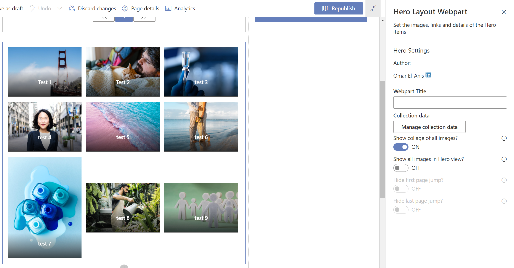

# Hero web part

## Summary

This solution creates a customisable Hero web part, it uses a stored collection from the PnP `PropertyFieldCollectionData` control 

## Compatibility

 

 

## Applies to

- [SharePoint Framework](https://aka.ms/spfx)
- [Microsoft 365 tenant](https://docs.microsoft.com/en-us/sharepoint/dev/spfx/set-up-your-developer-tenant)

> Get your own free development tenant by subscribing to [Microsoft 365 developer program](http://aka.ms/o365devprogram)

## Solution

Solution|Author(s)
--------|---------
hero-webpart | [Omar El-Anis](https://github.com/omarelanis) @ SP Bytes www.spbytes.com

## Version history

Version|Date|Comments
-------|----|--------
1.3|March 11, 2022|At the request of another user a option has been added to allow a collage of images to be shown in a flex grid layout Added in placeholder configuration screen Fixed webpart not loading the 5 temporary items on first adding webpart to new page in local workbench General maintenance to remove unused imports Updated CSS to add in collage feature
1.2|July 27, 2021|Updated to automatically detect how many items are being displayed and adjust the display layout based on this Updated design to show the title on all images Updated description area on hover Updated hover effect of image to show a zoom effect when hovering over an item General cleaning up of CSS and code
1.1|March 10, 2021|Update comment
1.0|January 29, 2021|Initial release

## Minimal Path to Awesome

* Clone this repository (or [download this solution as a .ZIP file](https://pnp.github.io/download-partial/?url=https://github.com/pnp/sp-dev-fx-webparts/tree/main/samples/react-hero-webpart) then unzip it)
* From your command line, change your current directory to the directory containing this sample (`react-hero-webpart`, located under `samples`)
* in the command line run:
  * `npm install`
  * `gulp serve`

>  This sample can also be opened with [VS Code Remote Development](https://code.visualstudio.com/docs/remote/remote-overview). Visit https://aka.ms/spfx-devcontainer for further instructions.

## Features

Description of the extension that expands upon high-level summary above.

This extension illustrates the following concepts:

- Store data (images) in a collection from property panel using the file picker module
- Load the data into a paginated list
- Display the data in a Hero style format 

## References

- [Getting started with SharePoint Framework](https://docs.microsoft.com/en-us/sharepoint/dev/spfx/set-up-your-developer-tenant)
- [Building for Microsoft teams](https://docs.microsoft.com/en-us/sharepoint/dev/spfx/build-for-teams-overview)
- [Use Microsoft Graph in your solution](https://docs.microsoft.com/en-us/sharepoint/dev/spfx/web-parts/get-started/using-microsoft-graph-apis)
- [Publish SharePoint Framework applications to the Marketplace](https://docs.microsoft.com/en-us/sharepoint/dev/spfx/publish-to-marketplace-overview)
- [Microsoft 365 Patterns and Practices](https://aka.ms/m365pnp) - Guidance, tooling, samples and open-source controls for your Microsoft 365 development

## Help

We do not support samples, but this community is always willing to help, and we want to improve these samples. We use GitHub to track issues, which makes it easy for  community members to volunteer their time and help resolve issues.

If you're having issues building the solution, please run [spfx doctor](https://pnp.github.io/cli-microsoft365/cmd/spfx/spfx-doctor/) from within the solution folder to diagnose incompatibility issues with your environment.

You can try looking at [issues related to this sample](https://github.com/pnp/sp-dev-fx-webparts/issues?q=label%3A%22sample%3A%20react-hero-webpart%22) to see if anybody else is having the same issues.

You can also try looking at [discussions related to this sample](https://github.com/pnp/sp-dev-fx-webparts/discussions?discussions_q=react-hero-webpart) and see what the community is saying.

If you encounter any issues while using this sample, [create a new issue](https://github.com/pnp/sp-dev-fx-webparts/issues/new?assignees=&labels=Needs%3A+Triage+%3Amag%3A%2Ctype%3Abug-suspected%2Csample%3A%20react-hero-webpart&template=bug-report.yml&sample=react-hero-webpart&authors=@omarelanis&title=react-hero-webpart%20-%20).

For questions regarding this sample, [create a new question](https://github.com/pnp/sp-dev-fx-webparts/issues/new?assignees=&labels=Needs%3A+Triage+%3Amag%3A%2Ctype%3Aquestion%2Csample%3A%20react-hero-webpart&template=question.yml&sample=react-hero-webpart&authors=@omarelanis&title=react-hero-webpart%20-%20).

Finally, if you have an idea for improvement, [make a suggestion](https://github.com/pnp/sp-dev-fx-webparts/issues/new?assignees=&labels=Needs%3A+Triage+%3Amag%3A%2Ctype%3Aenhancement%2Csample%3A%20react-hero-webpart&template=suggestion.yml&sample=react-hero-webpart&authors=@omarelanis&title=react-hero-webpart%20-%20).

## Disclaimer

**THIS CODE IS PROVIDED *AS IS* WITHOUT WARRANTY OF ANY KIND, EITHER EXPRESS OR IMPLIED, INCLUDING ANY IMPLIED WARRANTIES OF FITNESS FOR A PARTICULAR PURPOSE, MERCHANTABILITY, OR NON-INFRINGEMENT.**

