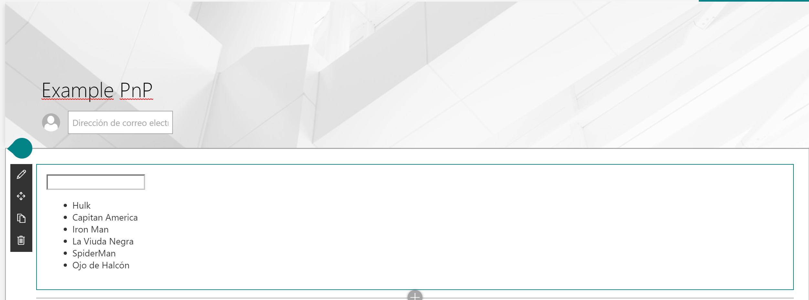

# React Hooks Form Web Part

## Summary
The `React Hooks web part` is an example of how to implement Hooks in SPFx. 
Hooks is a new feature included in React version 16.8, with the new version of **SharePoint Framework (SPFx) version 1.9.1**  we can use them in our developments. In this example we are going to see the different types of hooks that are available and with the comparison of how this implementation can be done without the Hooks to be able to observe the benefits of using it.

## Compatibility

 
 

-Incompatible-red.svg "SharePoint Server 2016 Feature Pack 2 requires SPFx 1.1")

## Applies to

* [SharePoint Framework](https://docs.microsoft.com/sharepoint/dev/spfx/sharepoint-framework-overview)
* [Office 365 tenant](https://docs.microsoft.com/sharepoint/dev/spfx/set-up-your-development-environment)

## Prerequisites
Existing list in tenant root site, with the Title "AvengersList"  and columns:

Column Internal Name|Type|Required|Comments
--------------------|----|--------|----------
Title| Text| true

## Solution

Solution|Author(s)
--------|---------
react-hooks|[Adrián Díaz](https://github.com/AdrianDiaz81) [@AdrianDiaz81](https://www.twitter.com/adriandiaz81)

## Version history

Version|Date|Comments
-------|----|--------
1.0.0|August 19, 2019|Initial release

## Minimal Path to Awesome

- Clone this repository
- in the command line run:
  - `npm install`
  - `gulp serve`

>  This sample can also be opened with [VS Code Remote Development](https://code.visualstudio.com/docs/remote/remote-overview). Visit https://aka.ms/spfx-devcontainer for further instructions.

## Features

This Web Part illustrates the following concepts on top of the SharePoint Framework:

- Using React Hooks for building SharePoint Framework client-side web parts.
- Using @PnP/PnPjs to read items ...

## Help

We do not support samples, but this community is always willing to help, and we want to improve these samples. We use GitHub to track issues, which makes it easy for  community members to volunteer their time and help resolve issues.

If you're having issues building the solution, please run [spfx doctor](https://pnp.github.io/cli-microsoft365/cmd/spfx/spfx-doctor/) from within the solution folder to diagnose incompatibility issues with your environment.

You can try looking at [issues related to this sample](https://github.com/pnp/sp-dev-fx-webparts/issues?q=label%3A%22sample%3A%20react-hooks%22) to see if anybody else is having the same issues.

You can also try looking at [discussions related to this sample](https://github.com/pnp/sp-dev-fx-webparts/discussions?discussions_q=react-hooks) and see what the community is saying.

If you encounter any issues while using this sample, [create a new issue](https://github.com/pnp/sp-dev-fx-webparts/issues/new?assignees=&labels=Needs%3A+Triage+%3Amag%3A%2Ctype%3Abug-suspected%2Csample%3A%20react-hooks&template=bug-report.yml&sample=react-hooks&authors=@AdrianDiaz81&title=react-hooks%20-%20).

For questions regarding this sample, [create a new question](https://github.com/pnp/sp-dev-fx-webparts/issues/new?assignees=&labels=Needs%3A+Triage+%3Amag%3A%2Ctype%3Aquestion%2Csample%3A%20react-hooks&template=question.yml&sample=react-hooks&authors=@AdrianDiaz81&title=react-hooks%20-%20).

Finally, if you have an idea for improvement, [make a suggestion](https://github.com/pnp/sp-dev-fx-webparts/issues/new?assignees=&labels=Needs%3A+Triage+%3Amag%3A%2Ctype%3Aenhancement%2Csample%3A%20react-hooks&template=suggestion.yml&sample=react-hooks&authors=@AdrianDiaz81&title=react-hooks%20-%20).

## Disclaimer

**THIS CODE IS PROVIDED *AS IS* WITHOUT WARRANTY OF ANY KIND, EITHER EXPRESS OR IMPLIED, INCLUDING ANY IMPLIED WARRANTIES OF FITNESS FOR A PARTICULAR PURPOSE, MERCHANTABILITY, OR NON-INFRINGEMENT.**

