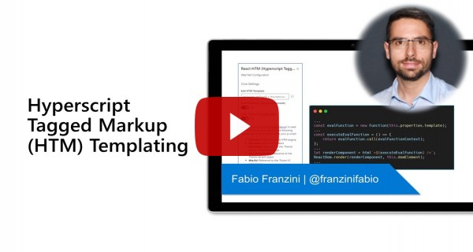

# React HTM (Hyperscript Tagged Markup) Templating

## Summary
This Web Part provides an example of how to create a dynamic template system (configurable via Web Part properties) that can not only render HTML but also React controls, such as Fluent UI, without the need to use Handlebars.js + Web Components.


## Compatibility


 


-Incompatible-red.svg "SharePoint Server 2016 Feature Pack 2 requires SPFx 1.1")


## Applies to

* [SharePoint Framework](https://docs.microsoft.com/sharepoint/dev/spfx/sharepoint-framework-overview)
* [Microsoft 365 tenant](https://docs.microsoft.com/sharepoint/dev/spfx/set-up-your-development-environment)

## Solution

Solution|Author(s)
--------|---------
react-htm-templating | [Fabio Franzini](https://www.linkedin.com/in/fabiofranzini/) ([@franzinifabio](https://twitter.com/franzinifabio)), fabiofranzini.com

## Version history

Version|Date|Comments
-------|----|--------
1.0|August 4, 2021|Initial release

## Minimal Path to Awesome

* Clone this repository
* in the command line run:
  * `npm install`
  * `gulp serve`

>  This sample can also be opened with [VS Code Remote Development](https://code.visualstudio.com/docs/remote/remote-overview). Visit https://aka.ms/spfx-devcontainer for further instructions.

## Features

This example born from the need to have a template system that can directly use the "Fluent UI" components (or other components) written in React, without the need to use any wrapper such as, for example, encapsulating the rendering of components via Web Components.

The web part uses a template system called [HTM (Hyperscript Tagged Markup)](https://github.com/developit/htm), whose meaning is: "htm is JSX-like syntax in plain JavaScript - no transpiler necessary".

Basically, the template is nothing more than the JS code, which is evaluated through the Function constructor.

```
...
const evalFunction = new Function(this.properties.template);
...
const executeEvalFunction = () => {
    return evalFunction.call(evalFunctionContext);
};
...
let renderComponent = html`<${executeEvalFunction} />`;
ReactDom.render(renderComponent, this.domElement);
```

The template must return the object generated by htm which is the component instance that you will have to render.

For HTM syntax please refer to the official [GitHub repo)](https://github.com/developit/htm).

The Web Part is configured to pass a context object to the template, with the following objects:
- `this.html`: Reference to the HTM engine.
- `this.react`: Reference to React.
- `this.theme`: Reference to the 'Theme' object of SharePoint Page.
- `this.themeVariant`: Reference to the Theme Variant object.
- `this.fui`: Reference to the 'Fluent UI' namespace.
- `this.fuiHooks`: Reference to the 'Fluent UI Hooks' namespace.
- `this.fuiSampleData`: Reference to the 'Fluent UI Sample Data' namespace.

## Video

[](https://www.youtube.com/watch?v=G8A_L3CC25E "Hyperscript Tagged Markup (HTM) Templating with SharePoint Framework")

## Help

We do not support samples, but this community is always willing to help, and we want to improve these samples. We use GitHub to track issues, which makes it easy for  community members to volunteer their time and help resolve issues.

If you're having issues building the solution, please run [spfx doctor](https://pnp.github.io/cli-microsoft365/cmd/spfx/spfx-doctor/) from within the solution folder to diagnose incompatibility issues with your environment.

You can try looking at [issues related to this sample](https://github.com/pnp/sp-dev-fx-webparts/issues?q=label%3A%22sample%3A%20react-htm-templating") to see if anybody else is having the same issues.

You can also try looking at [discussions related to this sample](https://github.com/pnp/sp-dev-fx-webparts/discussions?discussions_q=react-htm-templating) and see what the community is saying.
If you encounter any issues while using this sample, [create a new issue](https://github.com/pnp/sp-dev-fx-webparts/issues/new?assignees=&labels=Needs%3A+Triage+%3Amag%3A%2Ctype%3Abug-suspected%2Csample%3A%20react-htm-templating&template=bug-report.yml&sample=react-htm-templating&authors=@fabiofranzini&title=react-htm-templating%20-%20).

For questions regarding this sample, [create a new question](https://github.com/pnp/sp-dev-fx-webparts/issues/new?assignees=&labels=Needs%3A+Triage+%3Amag%3A%2Ctype%3Aquestion%2Csample%3A%20react-htm-templating&template=question.yml&sample=react-htm-templating&authors=@fabiofranzini&title=react-htm-templating%20-%20).

Finally, if you have an idea for improvement, [make a suggestion](https://github.com/pnp/sp-dev-fx-webparts/issues/new?assignees=&labels=Needs%3A+Triage+%3Amag%3A%2Ctype%3Aenhancement%2Csample%3A%20react-htm-templating&template=question.yml&sample=react-htm-templating&authors=@fabiofranzini&title=react-htm-templating%20-%20).

## Disclaimer

**THIS CODE IS PROVIDED *AS IS* WITHOUT WARRANTY OF ANY KIND, EITHER EXPRESS OR IMPLIED, INCLUDING ANY IMPLIED WARRANTIES OF FITNESS FOR A PARTICULAR PURPOSE, MERCHANTABILITY, OR NON-INFRINGEMENT.**


