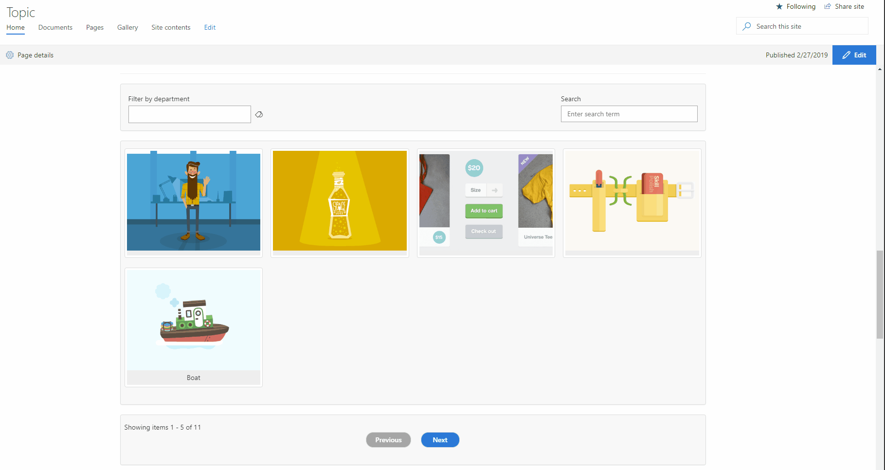

# Filterable Image Gallery Web Part

## Summary
This sample describes an SPFx application which implements an image gallery with taxonomy base filtering and typed search. This application also implements pagination.

## Used SharePoint Framework Version 

## Applies to

* [SharePoint Framework](https://docs.microsoft.com/sharepoint/dev/spfx/sharepoint-framework-overview)
* [Office 365 tenant](https://docs.microsoft.com/sharepoint/dev/spfx/set-up-your-development-environment)

## Solution

Solution|Author(s)
--------|---------
react-image-gallery | Ejaz Hussain

## Version history

Version|Date|Comments
-------|----|--------
1.0|March 01, 2019|Initial release

## Disclaimer
**THIS CODE IS PROVIDED *AS IS* WITHOUT WARRANTY OF ANY KIND, EITHER EXPRESS OR IMPLIED, INCLUDING ANY IMPLIED WARRANTIES OF FITNESS FOR A PARTICULAR PURPOSE, MERCHANTABILITY, OR NON-INFRINGEMENT.**

---

## Minimal Path to Awesome

- Clone this repository
- in the command line run:
  - `npm install`
  - `gulp serve`

- Create a Department Term set with associated child terms, for example, HR, Information Services, Sales, Marketing
- Create an Image Library and add some sample images
- Tag each image with Department Metadata Column
- Also fill in Title field for each image, this is require for typed search functionality

## Features
Here are the main features for this application

- Taxonomy-based filtering
- Typed Search
- Right-side popup panel
- Server-side pagination using REST API

