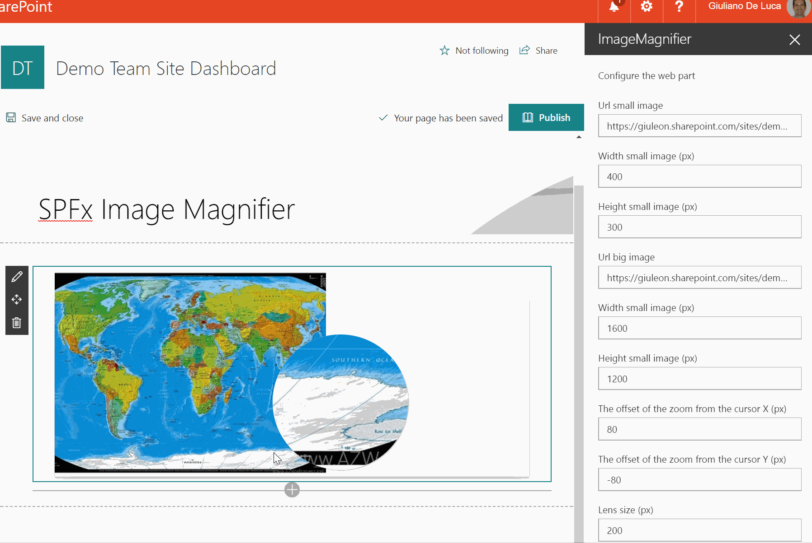

# Image Magnifier

## Summary
This web part allow to magnify an image, displaying a resolution more detailed through a lens.

## Used SharePoint Framework Version 

## Applies to

* [SharePoint Framework](https://docs.microsoft.com/sharepoint/dev/spfx/sharepoint-framework-overview)
* [Office 365 tenant](https://docs.microsoft.com/sharepoint/dev/spfx/set-up-your-development-environment)

## Prerequisites
 
> No pre-requisites

## Solution

Solution|Author(s)
--------|---------
react-image-magnifier|Giuliano De Luca ([@giuleon](https://twitter.com/giuleon) , [www.delucagiuliano.com](delucagiuliano.com))

## Version history

Version|Date|Comments
-------|----|--------
1.0|September 17, 2017|Initial release

## Disclaimer
**THIS CODE IS PROVIDED *AS IS* WITHOUT WARRANTY OF ANY KIND, EITHER EXPRESS OR IMPLIED, INCLUDING ANY IMPLIED WARRANTIES OF FITNESS FOR A PARTICULAR PURPOSE, MERCHANTABILITY, OR NON-INFRINGEMENT.**

---

## Minimal Path to Awesome

- Clone this repository
- in the command line run:
  - `npm install`
  - `gulp serve`

## Features
This Web Part illustrates the following concepts on top of the SharePoint Framework:

- Image Magnifier - How to obtain the best resolution from an image.
- How to leverage the capabilities of the property pane.

