# Instagram Feed

  Sample web part to showcase an Instagram feed. It is an upgraded version of the web part described in the blog post [Instagram Feed in SPFx Web Part](https://medium.com/arfitect/instagram-feed-in-spfx-web-part-61f76fe1ded4) by Buse Kara.

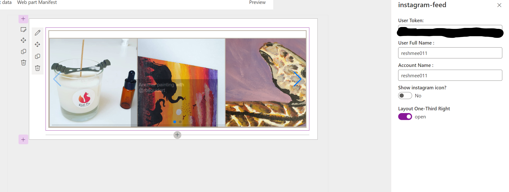

## Compatibility

| :warning: Important          |
|:---------------------------|
| Every SPFx version is only compatible with specific version(s) of Node.js. In order to be able to build this sample, please ensure that the version of Node on your workstation matches one of the versions listed in this section. This sample will not work on a different version of Node.|
|Refer to <https://aka.ms/spfx-matrix> for more information on SPFx compatibility.   |

-Incompatible-red.svg "SharePoint Server 2016 Feature Pack 2 requires SPFx 1.1")

## Applies to

* [SharePoint Framework](https://learn.microsoft.com/sharepoint/dev/spfx/sharepoint-framework-overview)
* [Office 365 developer tenant](https://learn.microsoft.com/sharepoint/dev/spfx/set-up-your-developer-tenant)

## Contributors

* [Reshmee Auckloo](https://github.com/reshmee011)

## Version history

Version|Date|Comments
-------|----|--------
1.0|March 12, 2023|Initial release

## Prerequisites

This web part needs an Instagram user token. An Instagram developer account is required to generate an access token, and using that token to fetch the feed data from [Instagram's Basic Display API](https://developers.facebook.com/docs/instagram-basic-display-api/overview#instagram-user-access-tokens) environment.

Follow the steps to generate your user access token.

### Step 1

Go to developers.facebook.com and sign in to your Facebook account. Click on the "My Apps" button on the top right.
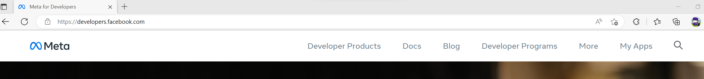

### Step 2

Click on the "Create App" button.

### Step 3

Select either "Consumer" or "None" as your application type.
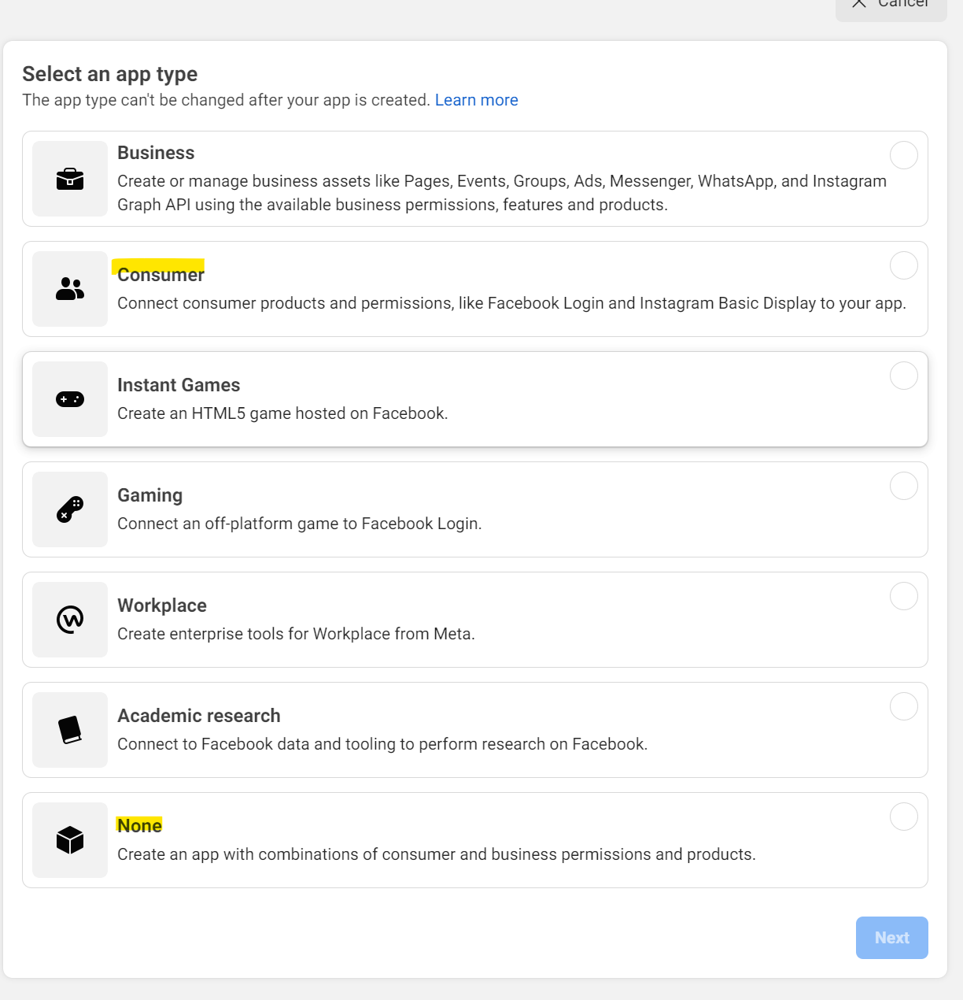

### Step 4

Give your application a name, enter your contact email, and create your app.
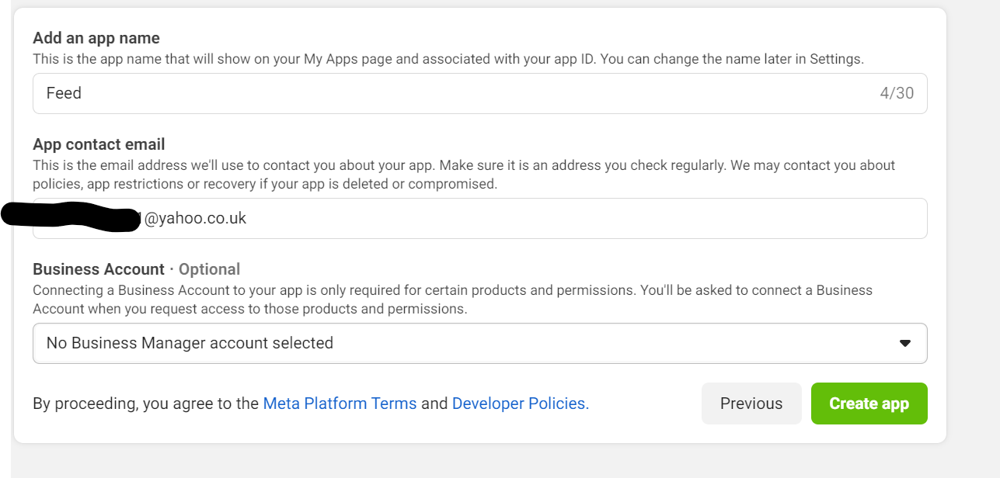

### Step 5

Re-enter your Facebook account password
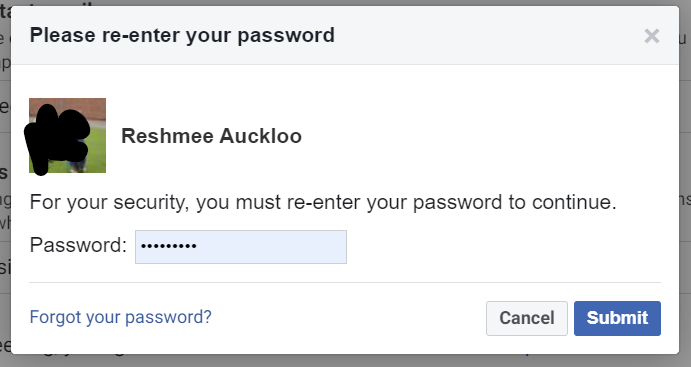

### Step 6

Click on the "Set Up" button in the "Instagram Basic Display" box.
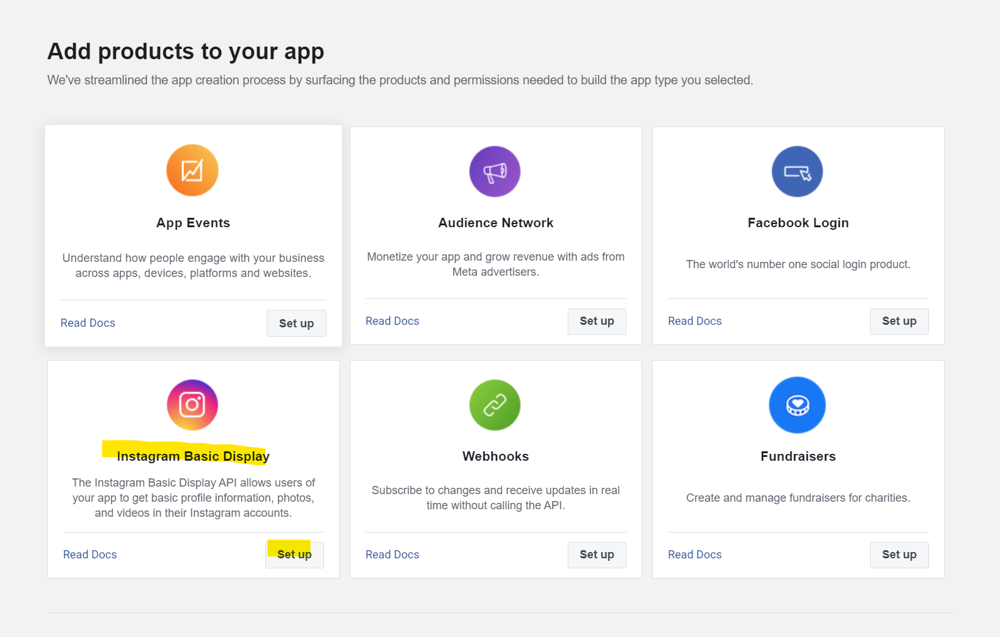

### Step 7

Click on "Create New App" and click on "Create App" from the pop up to create a new instagram app id.
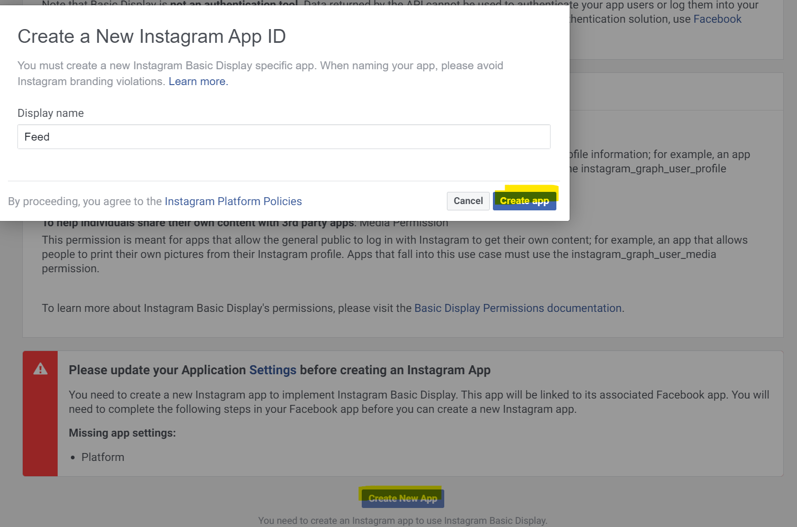

### Step 8

Save your changes. In the "User Token Generator" section, click on the "Add or Remove Instagram Testers" button, and follow the instructions.
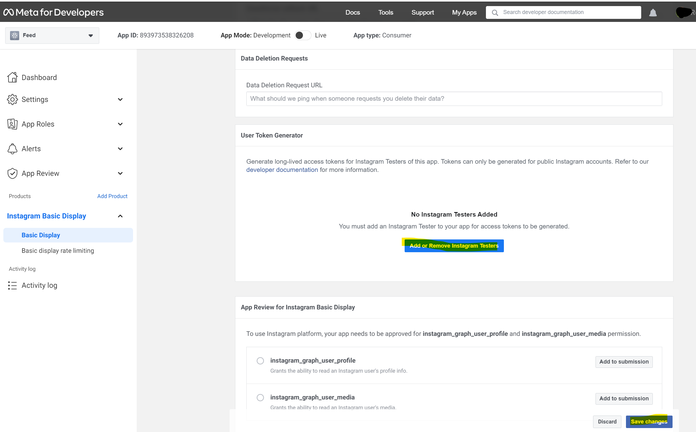

### Step 9

Click on the link "apps and websites" link to manage instagram tester invitations and click on accept.
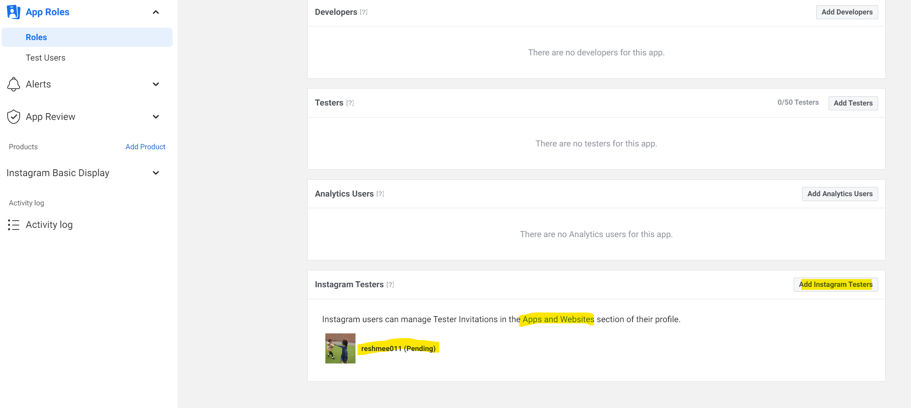
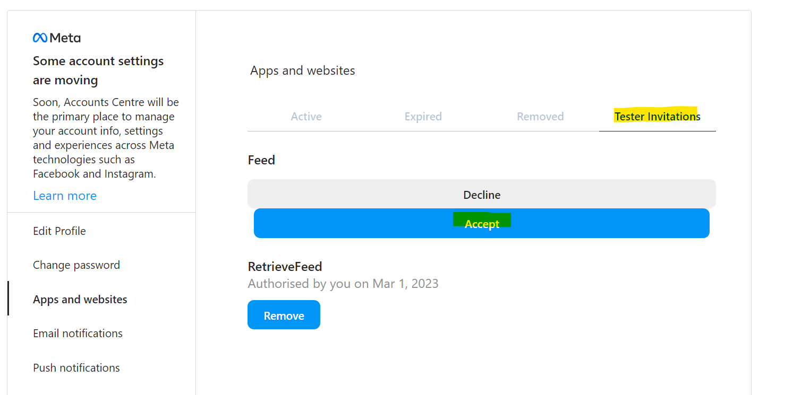

### Step 11

Click on "Basic Display", click on "Generate Token" under "User Token Generator" and from the pop up click on "continue as <testername>".
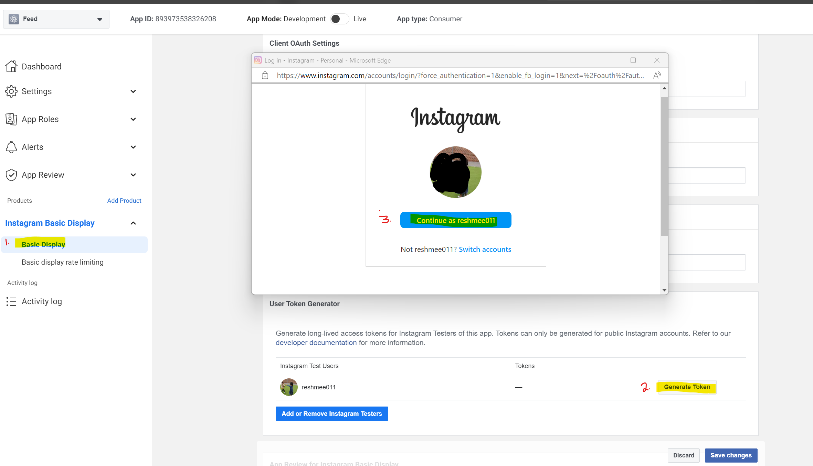

### Step 12

Click on "Allow" from the pop up to authorise the app to retrieve profile and media information about the instagram user.
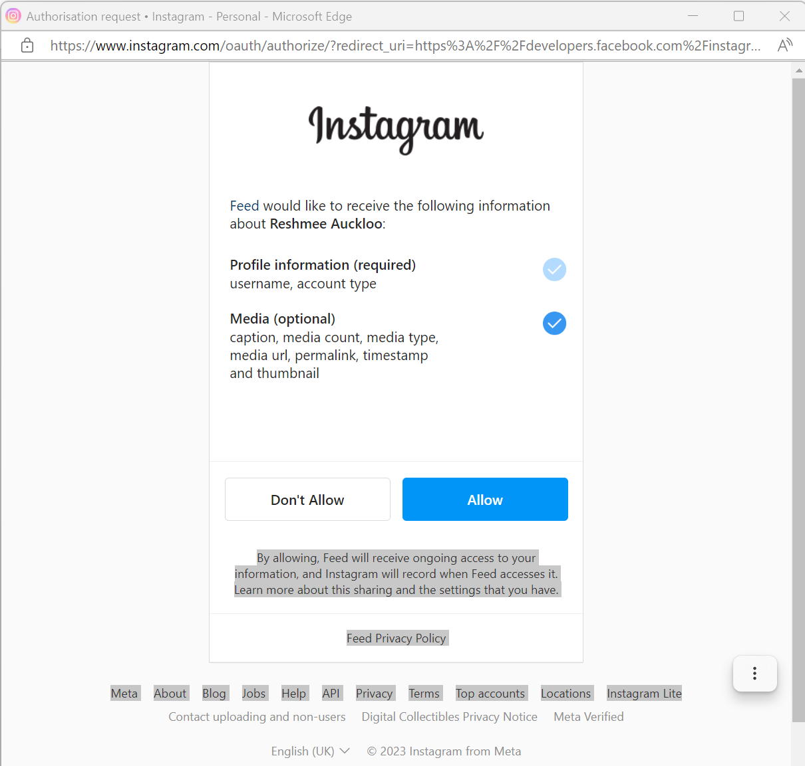

### Step 13

Copy the user token to be used on the webpart.
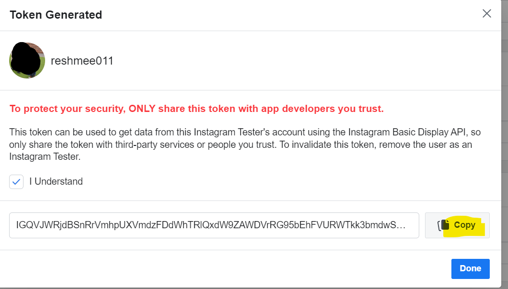

You must then enter this user token in the web part properties to display the instagram feeds from the user.

## Minimal Path to Awesome

* Clone this repo
* From your command line, change your current directory to the directory containing this sample (`react-instagrame`, located under `samples`)
* in the command line run:
  * `npm install`
  * `gulp bundle --ship`
  * `gulp package-solution --ship`
* from the _sharepoint/solution_ folder, deploy the `.sppkg` file to the App catalog in your tenant
* in the site where you want to test this solution
  * add the app named _react-instagram-client-side-solution_
  * edit a page
  * add _Instagram Feed_ web part
  * configure web part

> This sample can also be opened with [VS Code Remote Development](https://code.visualstudio.com/docs/remote/remote-overview). Visit <https://aka.ms/spfx-devcontainer> for further instructions.

## Features

This sample illustrates how to use [Instagram Basic Display API](https://developers.facebook.com/docs/instagram-basic-display-api) to display instagram posts of specific profile. Ajax (Asynchronous JavaScript and XML) is being used to authenticate with the Instagram API and retrieve the user's feed.
It also uses [swiper](https://www.npmjs.com/package/swiper). The Swiper library is used to create a carousel effect for the Instagram feed, allowing users to swipe left or right to view the different posts.

## Help

We do not support samples, but we this community is always willing to help, and we want to improve these samples. We use GitHub to track issues, which makes it easy for  community members to volunteer their time and help resolve issues.

If you're having issues building the solution, please run [spfx doctor](https://pnp.github.io/cli-microsoft365/cmd/spfx/spfx-doctor/) from within the solution folder to diagnose incompatibility issues with your environment.

You can try looking at [issues related to this sample](https://github.com/pnp/sp-dev-fx-webparts/issues?q=label%3A%22sample%3A%20react-instagram") to see if anybody else is having the same issues.

You can also try looking at [discussions related to this sample](https://github.com/pnp/sp-dev-fx-webparts/discussions?discussions_q=react-instagram) and see what the community is saying.

If you encounter any issues while using this sample, [create a new issue](https://github.com/pnp/sp-dev-fx-webparts/issues/new?assignees=&labels=Needs%3A+Triage+%3Amag%3A%2Ctype%3Abug-suspected%2Csample%3A%20react-instagram&template=bug-report.yml&sample=react-instagram&authors=@AJIXuMuK&title=react-instagram%20-%20).

For questions regarding this sample, [create a new question](https://github.com/pnp/sp-dev-fx-webparts/issues/new?assignees=&labels=Needs%3A+Triage+%3Amag%3A%2Ctype%3Aquestion%2Csample%3A%20react-instagram&template=question.yml&sample=react-instagram&authors=@AJIXuMuK&title=react-instagram%20-%20).

Finally, if you have an idea for improvement, [make a suggestion](https://github.com/pnp/sp-dev-fx-webparts/issues/new?assignees=&labels=Needs%3A+Triage+%3Amag%3A%2Ctype%3Aenhancement%2Csample%3A%20react-instagram&template=question.yml&sample=react-instagram&authors=@AJIXuMuK&title=react-instagram%20-%20).

## Disclaimer

**THIS CODE IS PROVIDED _AS IS_ WITHOUT WARRANTY OF ANY KIND, EITHER EXPRESS OR IMPLIED, INCLUDING ANY IMPLIED WARRANTIES OF FITNESS FOR A PARTICULAR PURPOSE, MERCHANTABILITY, OR NON-INFRINGEMENT.**

