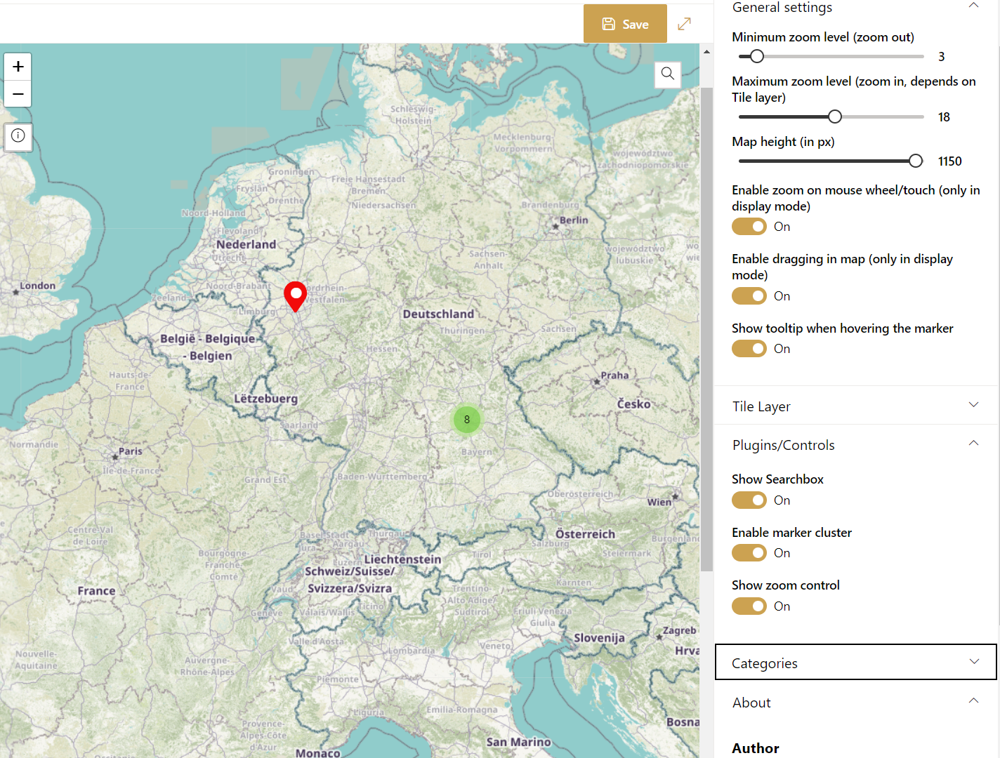

# Interactive Map

## Summary

This web parts displays a (world) map. An editor can set custom markers directly in the map. Each marker can configured individually. It is possible to determine the color of the pin, the icon in the pin or what should happen when the pin is clicked. It is even possible to change the tile layer in the web part properties.

### Create new marker

### Preview

## Compatibility

| :warning: Important          |
|:---------------------------|
| Every SPFx version is only compatible with specific version(s) of Node.js. In order to be able to build this sample, please ensure that the version of Node on your workstation matches one of the versions listed in this section. This sample will not work on a different version of Node.|
|Refer to <https://aka.ms/spfx-matrix> for more information on SPFx compatibility.   |

-Incompatible-red.svg "SharePoint Server 2016 Feature Pack 2 requires SPFx 1.1")

## Applies to

* [SharePoint Framework](https://docs.microsoft.com/sharepoint/dev/spfx/sharepoint-framework-overview)
* [Microsoft 365 tenant](https://docs.microsoft.com/sharepoint/dev/spfx/set-up-your-development-environment)

> Get your own free development tenant by subscribing to [Microsoft 365 developer program](http://aka.ms/m365devprogram)

## Contributors

* [Sergej Schwabauer](https://github.com/SPFxAppDev)

## Version history

Version|Date|Comments
-------|----|--------
1.0|January 19, 2023|Initial release

## Minimal path to awesome

* Clone this repository (or [download this solution as a .ZIP file](https://pnp.github.io/download-partial/?url=https://github.com/pnp/sp-dev-fx-webparts/tree/main/samples/react-interactive-map) then unzip it)
* From your command line, change your current directory to the directory containing this sample (`react-interactive-map`, located under `samples`)
* in the command line run:
  * `npm install`
  * `gulp serve`

> This sample can also be opened with [VS Code Remote Development](https://code.visualstudio.com/docs/remote/remote-overview). Visit <https://aka.ms/spfx-devcontainer> for further instructions.

## Features

This Web Part illustrates the following concepts on top of the SharePoint Framework:

* [Fluent UI React Controls](https://developer.microsoft.com/en-us/fluentui#/controls/web)
* [OpenStreetMap](https://www.openstreetmap.org/)
* [LeafletJS](https://leafletjs.com/) and the [react-leaflet](https://react-leaflet.js.org/) wrapper
* [Leaflet Plugin "Marker cluster"](https://github.com/Leaflet/Leaflet.markercluster) ant the [react-leaflet-markercluster](https://www.npmjs.com/package/react-leaflet-markercluster) wrapper

## Help

We do not support samples, but this community is always willing to help, and we want to improve these samples. We use GitHub to track issues, which makes it easy for  community members to volunteer their time and help resolve issues.

If you're having issues building the solution, please run [spfx doctor](https://pnp.github.io/cli-microsoft365/cmd/spfx/spfx-doctor/) from within the solution folder to diagnose incompatibility issues with your environment.

You can try looking at [issues related to this sample](https://github.com/pnp/sp-dev-fx-webparts/issues?q=label%3A%22sample%3A%20react-interactive-map%22) to see if anybody else is having the same issues.

You can also try looking at [discussions related to this sample](https://github.com/pnp/sp-dev-fx-webparts/discussions?discussions_q=react-interactive-map) and see what the community is saying.

If you encounter any issues using this sample, [create a new issue](https://github.com/pnp/sp-dev-fx-webparts/issues/new?assignees=&labels=Needs%3A+Triage+%3Amag%3A%2Ctype%3Abug-suspected%2Csample%3A%20react-interactive-map&template=bug-report.yml&sample=react-interactive-map&authors=@SPFxAppDev&title=react-interactive-map%20-%20).

For questions regarding this sample, [create a new question](https://github.com/pnp/sp-dev-fx-webparts/issues/new?assignees=&labels=Needs%3A+Triage+%3Amag%3A%2Ctype%3Aquestion%2Csample%3A%20react-interactive-map&template=question.yml&sample=react-interactive-map&authors=@SPFxAppDev&title=react-interactive-map%20-%20).

Finally, if you have an idea for improvement, [make a suggestion](https://github.com/pnp/sp-dev-fx-webparts/issues/new?assignees=&labels=Needs%3A+Triage+%3Amag%3A%2Ctype%3Aenhancement%2Csample%3A%20react-interactive-map&template=suggestion.yml&sample=react-interactive-map&authors=@SPFxAppDev&title=react-interactive-map%20-%20).

## Disclaimer

**THIS CODE IS PROVIDED *AS IS* WITHOUT WARRANTY OF ANY KIND, EITHER EXPRESS OR IMPLIED, INCLUDING ANY IMPLIED WARRANTIES OF FITNESS FOR A PARTICULAR PURPOSE, MERCHANTABILITY, OR NON-INFRINGEMENT.**

