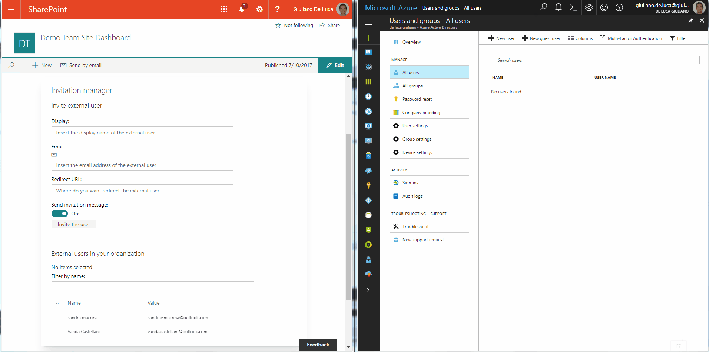

# Azure Active Directory invitation manager Graph API samples

## Summary

Sample SharePoint Framework web parts built using React illustrating the possibility to use Graph API to invite external users into the Azure Active Directory.

### Invitation manager

Sample SharePoint Framework client-side web part built using React showing how to invite the external user using the Microsoft Graph.

NB. I'm waiting the GA of HttpGraphClient(a bit limited in terms of permission) to use it in this scenario.
Look at this to go deep:
* [HttpGraphClient](https://docs.microsoft.com/sharepoint/dev/spfx/web-parts/guidance/call-microsoft-graph-from-your-web-part)

## Used SharePoint Framework Version 

## Applies to

* [SharePoint Framework](https://docs.microsoft.com/sharepoint/dev/spfx/sharepoint-framework-overview)
* [Office 365 developer tenant](https://docs.microsoft.com/sharepoint/dev/spfx/set-up-your-developer-tenant)

## Solution

Solution|Author(s)
--------|---------
react-invitation-manager|Giuliano De Luca ([@giuleon](https://twitter.com/giuleon) , [www.delucagiuliano.com](http://www.delucagiuliano.com))

## Version history

Version|Date|Comments
-------|----|--------
1.0.0|July 14, 2017|Initial release
1.0.1|October 09, 2017|Updated to version 1.3.0

## Disclaimer
**THIS CODE IS PROVIDED *AS IS* WITHOUT WARRANTY OF ANY KIND, EITHER EXPRESS OR IMPLIED, INCLUDING ANY IMPLIED WARRANTIES OF FITNESS FOR A PARTICULAR PURPOSE, MERCHANTABILITY, OR NON-INFRINGEMENT.**

---

## Prerequisites

- Office 365 subscription with SharePoint Online and Exchange

## Minimal Path to Awesome

- clone this repo
- in the Azure Active Directory corresponding to your Office 365 tenant register a new Web Application:
  - as the **Sign-on URL** enter the URL of the hosted version of SharePoint workbench, eg. *https://contoso.sharepoint.com/_layouts/15/workbench.aspx*
  - enable OAuth implicit flow
  - grant the application the **Microsoft Graph/Read and write directory data** permission
  - copy the application's ID
- in the **src/webparts/invitationManager/AdalConfig.ts** file in the **clientId** property enter the application ID registered in Azure
- in the command line execute
  - `npm i`
  - `gulp serve --nobrowser`
- navigate to the hosted version of the SharePoint workbench
- add the **Invitation manager** web part

## Features

Sample web part in this solution illustrates the following concepts on top of the SharePoint Framework:

- using React for building SharePoint Framework client-side web parts
- using Office UI Fabric React styles for building user experience consistent with SharePoint and Office
- on-demand authentication with the Azure Active Directory using the ADAL JS library
- communicating with the Microsoft Graph using its REST API
- using the ADAL JS library with SharePoint Framework web parts built using React

