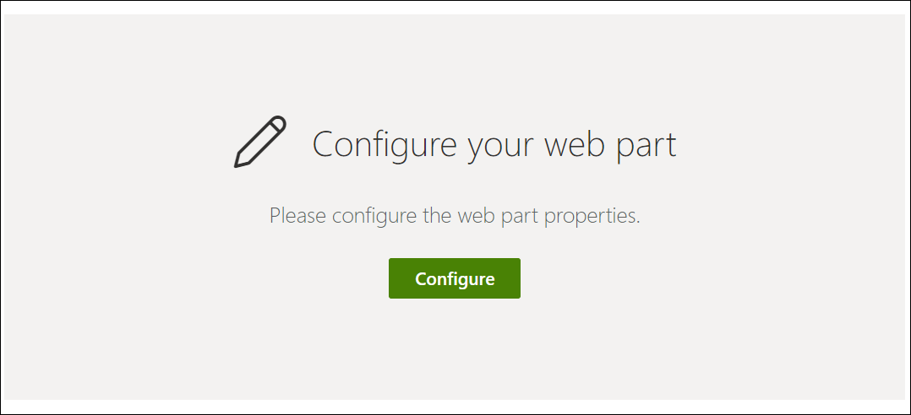
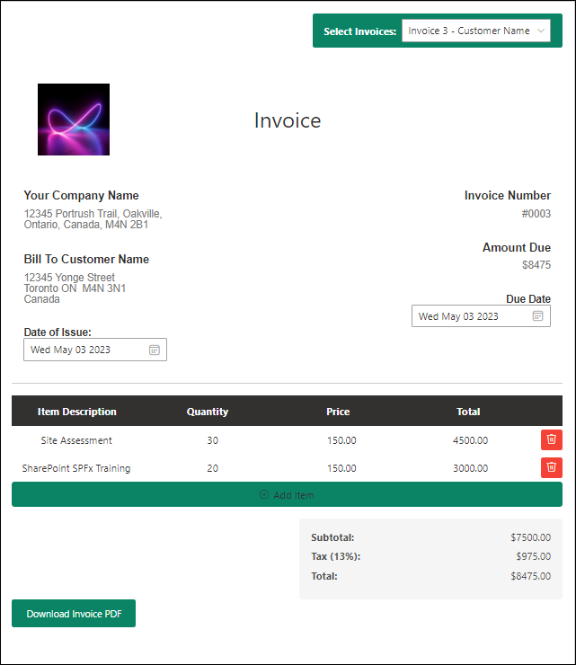
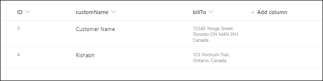

# Invoice Generator

## Summary

SPFx Invoice Generator Web part using PnP JS allows users to create invoices for different clients or customers. Users can add items to the invoice using add item button, and the application calculates the subtotal, tax, and total amount. The application also generates PDF versions of the invoices. To obtain customer names and addresses, the application retrieve data from a SharePoint list and present them in dropdown menus for use in the application. The user interface components are designed and implemented using the Fluent UI library. Additionally, the @react-pdf/renderer library is utilized to generate the PDF versions of the invoices. Company Logo, Company Name, Address and Tax rate can be updated using web part properties.

List needed to configure to make the app work

PDF generated using Download Invoice PDF button

## Compatibility

| :warning: Important          |
|:---------------------------|
| Every SPFx version is only compatible with specific version(s) of Node.js. In order to be able to build this sample, please ensure that the version of Node on your workstation matches one of the versions listed in this section. This sample will not work on a different version of Node.|
|Refer to <https://aka.ms/spfx-matrix> for more information on SPFx compatibility.   |

-Incompatible-red.svg "SharePoint Server 2016 Feature Pack 2 requires SPFx 1.1")

## Applies to

* [SharePoint Framework](https://learn.microsoft.com/sharepoint/dev/spfx/sharepoint-framework-overview)
* [Office 365 developer tenant](https://learn.microsoft.com/sharepoint/dev/spfx/set-up-your-developer-tenant)

## Prerequisites

 To use the SPFX Invoice Generator app, you will need:

A custom list on the current SharePoint site with the following columns:

* Title (single line of text) renamed to customerName in the screenshot. Internal Name - Title
* billTo (multiple lines of text)

## Contributors

* [Rishabh Shukla](https://github.com/rishabhshukla12)

## Version history

| Version | Date             | Comments        |
| ------- | ---------------- | --------------- |
| 1.0     | May 25, 2023 | Initial release |

## Minimal Path to Awesome

* Clone this repository
* Ensure that you are at the solution folder
* in the command-line run:
* `npm install`
* `gulp serve`

## References

* [Getting started with SharePoint Framework](https://docs.microsoft.com/sharepoint/dev/spfx/set-up-your-developer-tenant)
* [Microsoft 365 Patterns and Practices](https://aka.ms/m365pnp) - Guidance, tooling, samples and open-source controls for your Microsoft 365 development

## Help

We do not support samples, but we this community is always willing to help, and we want to improve these samples. We use GitHub to track issues, which makes it easy for  community members to volunteer their time and help resolve issues.

If you're having issues building the solution, please run [spfx doctor](https://pnp.github.io/cli-microsoft365/cmd/spfx/spfx-doctor/) from within the solution folder to diagnose incompatibility issues with your environment.

If you encounter any issues while using this sample, [create a new issue](https://github.com/pnp/sp-dev-fx-webparts/issues/new?assignees=&labels=Needs%3A+Triage+%3Amag%3A%2Ctype%3Abug-suspected%2Csample%3A%20react-invoice-generator&template=bug-report.yml&sample=react-invoice-generator&authors=@rishabhshukla12&title=react-invoice-generator%20-%20).

For questions regarding this sample, [create a new question](https://github.com/pnp/sp-dev-fx-webparts/issues/new?assignees=&labels=Needs%3A+Triage+%3Amag%3A%2Ctype%3Aquestion%2Csample%3A%20react-invoice-generator&template=question.yml&sample=react-invoice-generator&authors=@rishabhshukla12&title=react-invoice-generator%20-%20).

Finally, if you have an idea for improvement, [make a suggestion](https://github.com/pnp/sp-dev-fx-webparts/issues/new?assignees=&labels=Needs%3A+Triage+%3Amag%3A%2Ctype%3Aenhancement%2Csample%3A%20react-invoice-generator&template=question.yml&sample=react-invoice-generator&authors=@rishabhshukla12&title=react-invoice-generator%20-%20).

**THIS CODE IS PROVIDED _AS IS_ WITHOUT WARRANTY OF ANY KIND, EITHER EXPRESS OR IMPLIED, INCLUDING ANY IMPLIED WARRANTIES OF FITNESS FOR A PARTICULAR PURPOSE, MERCHANTABILITY, OR NON-INFRINGEMENT.**

