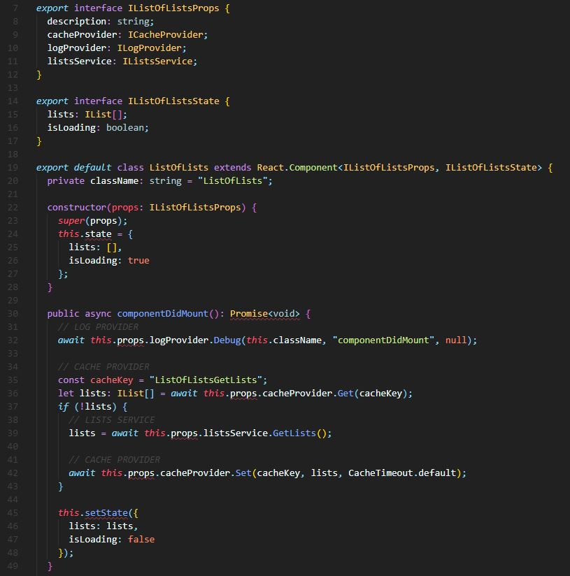

# React Inversion Of Control Web Part with Unit Tests using Jest and Enzyme

## Summary
This web part is provided as an example of implementing an IoC (Inversion of Control) pattern, primarily to enable unit testing, in the context of a SharePoint Framework web part.

Following this pattern greatly improves the modularity, maintainability, and testability of the code.

The example includes 100% test coverage, using Jest and Enzyme, of .ts and .tsx files, excluding *WebPart.ts files. A dependency resolver class specific to a web part class is used to map web part properties to component properties and create any dependent services/providers. 

This pattern is implemented to separate testable logic from the untestable *WebPart.ts file and hence ensure that all relevant web part logic is tested. To this end, a Service class is paired with a ServiceExecutor class which should extract the actual service requests from other service logic ensuring that the Service class remains fully testable. *Executor classes are excluded from test coverage as they cannot be unit tested by design - as they are points integration.

Included in the coverage is a cache and logger class, along with a service class that fetches data asynchronously using @pnp/sp 2.x

The example also includes a pipeline definition .yaml file for Azure DevOps CI build pipeline (/pipelines/) which includes the build, running tests, and posting the test coverage results.

## Used SharePoint Framework Version 

## Applies to

* [SharePoint Framework](https://docs.microsoft.com/sharepoint/dev/spfx/sharepoint-framework-overview)
* [Office 365 tenant](https://docs.microsoft.com/sharepoint/dev/spfx/set-up-your-development-environment)

## Solution

Solution|Author(s)
--------|---------
react-ioc-tests | Paul Ryan

## Version history

Version|Date|Comments
-------|----|--------
1.0|March 20, 2019|Initial release

## Disclaimer 
**THIS CODE IS PROVIDED *AS IS* WITHOUT WARRANTY OF ANY KIND, EITHER EXPRESS OR IMPLIED, INCLUDING ANY IMPLIED WARRANTIES OF FITNESS FOR A PARTICULAR PURPOSE, MERCHANTABILITY, OR NON-INFRINGEMENT.**

---

## Minimal Path to Awesome

- Clone this repository
- in the command line run:
  - `npm install`
  - `npm bundle`
  - *`npm test`*
  - `gulp serve`

## Features
This web part is provided as an example of implementing an IoC (Inversion of Control) pattern in the context of a SharePoint Framework web part for maximising testability.
This Web Part illustrates the following concepts on top of the SharePoint Framework:

- Inversion of Control pattern
- Unit testing with Jest and Enzyme
- Azure DevOps CI Build Pipeline yaml definition file, includes running tests and checking code coverage

## References

https://github.com/SharePoint/sp-dev-fx-webparts/tree/master/samples/react-jest-testing

https://blog.velingeorgiev.com/unit-test-your-sharepoint-framework-solution-with-jest

https://www.eliostruyf.com/sharepoint-framework-unit-tests-with-jest/

https://github.com/estruyf/spfx-testing-jest

