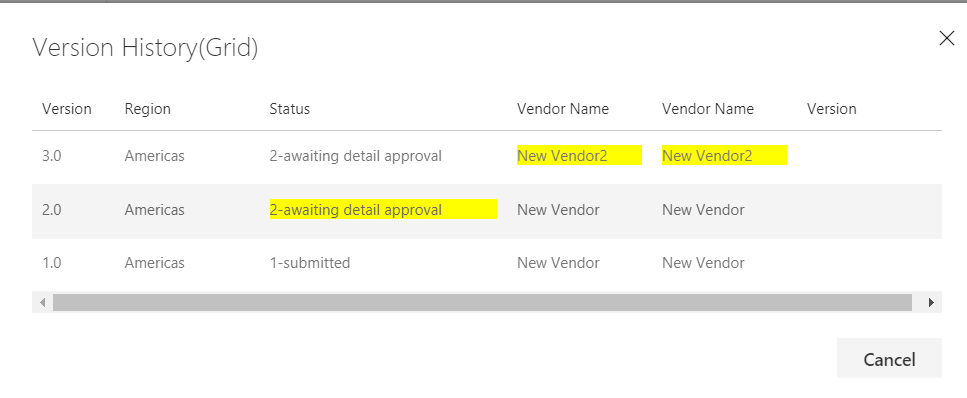

## react-item-history

## Summary
This listview command is used to show the past versions of the selected list item in a grid.



## Used SharePoint Framework Version 


## Applies to

* [SharePoint Framework](https://docs.microsoft.com/sharepoint/dev/spfx/sharepoint-framework-overview)
* [Office 365 tenant](https://docs.microsoft.com/sharepoint/dev/spfx/set-up-your-development-environment)

## Prerequisites
 
> No pre-requisites

## Solution

Solution|Author(s)
--------|---------
react-item-History|Russell Gove


## Version history

Version|Date|Comments
-------|----|--------
1.0|June 15, 2018|Initial release

## Disclaimer
**THIS CODE IS PROVIDED *AS IS* WITHOUT WARRANTY OF ANY KIND, EITHER EXPRESS OR IMPLIED, INCLUDING ANY IMPLIED WARRANTIES OF FITNESS FOR A PARTICULAR PURPOSE, MERCHANTABILITY, OR NON-INFRINGEMENT.**

---

## Minimal Path to Awesome

- Clone this repository
- in the command line run:
  - `npm install`
  - `gulp serve`

## Features
This listview command is used to show the past versions of the selected list item in a grid.
```bash
Add-PnPCustomAction
    -Name 'Item History(GRID)' 
    -Title 'Item History(GRID)' 
    -Location 'ClientSideExtension.ListViewCommandSet.CommandBar' 
    -ClientSideComponentId "f6b9bab2-00a1-4ff1-8bc2-04fea3d64fed"  
    -RegistrationType List 
    -RegistrationId "101" 
    -ClientSideComponentProperties "{}"
```

